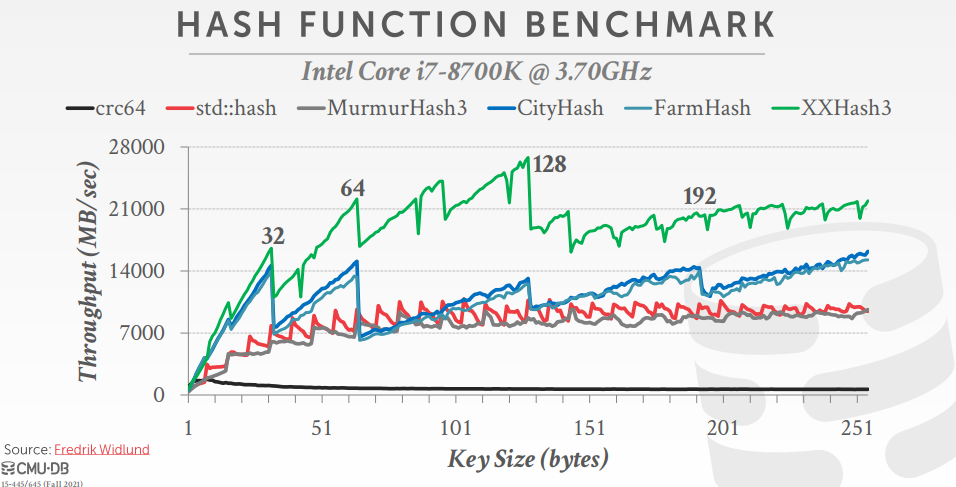
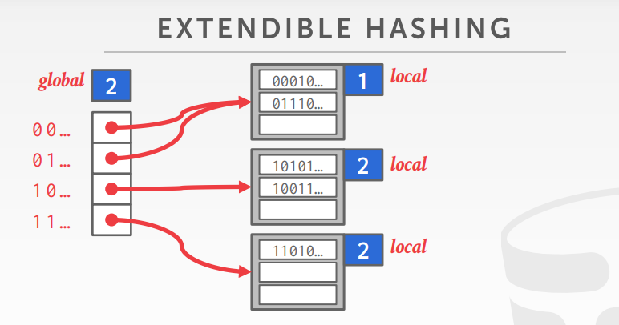
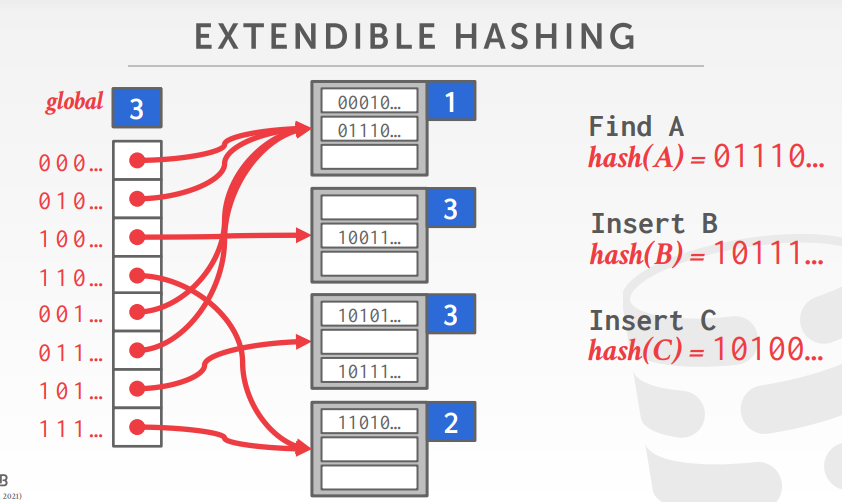
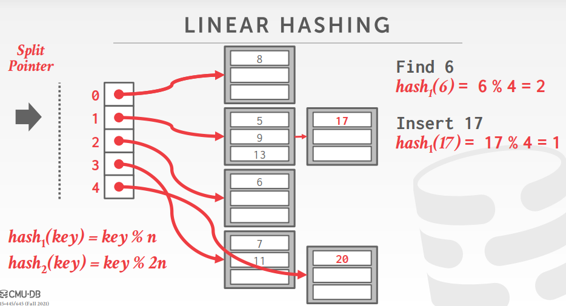
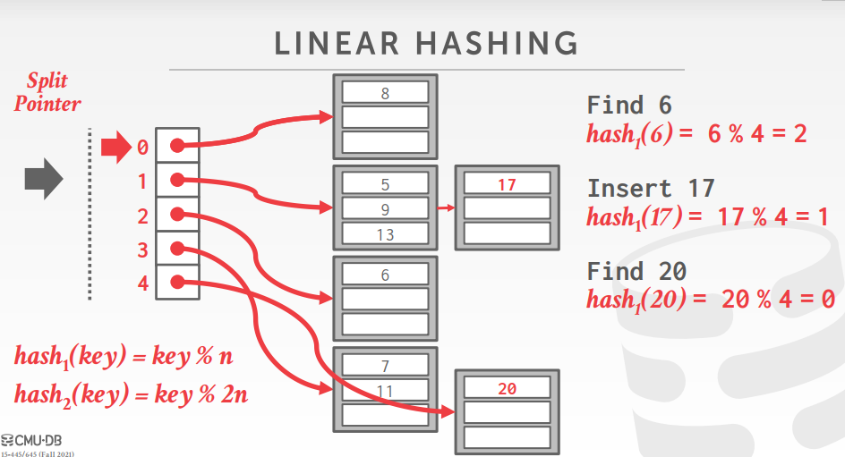

<!-- wp:paragraph -->

数据库系统中记录被保存在页中，为了能找到某条记录保存在那一页，需要一些数据结构保存两者之间的映射关系。常用的数据结构有<strong>哈希表</strong>和<strong>树</strong>。

<!-- /wp:paragraph -->

<!-- wp:paragraph -->

哈希表由<strong>哈希函数</strong>以及<strong>哈希布局</strong>两方面组成，哈希函数负责计算哈希值，哈希布局规定数据在表中如何被存取。

<!-- /wp:paragraph -->

<!-- wp:heading -->
<h2 id="hash-function">Hash Function</h2>
<!-- /wp:heading -->

<!-- wp:paragraph -->

哈希表是一种key到value的无序映射。以key为参数，通过哈希函数计算出的哈希值作为存储位置，在对应的位置对value进行存取。

<!-- /wp:paragraph -->

<!-- wp:paragraph -->

空间复杂度: <code>O(n)</code> 时间复杂度: → 平均: <code>O(1)</code> → 最坏: <code>O(n)</code>

<!-- /wp:paragraph -->

<!-- wp:heading {"level":3} -->
<h3 id="常用哈希函数">常用哈希函数</h3>
<!-- /wp:heading -->

<!-- wp:heading {"level":4} -->
<h4 id="crc32-1975">CRC32（1975）</h4>
<!-- /wp:heading -->

<!-- wp:paragraph -->

常用于差错检测。

<!-- /wp:paragraph -->

<!-- wp:heading {"level":4} -->
<h4 id="murmur-hash-2008">Murmur Hash（2008）</h4>
<!-- /wp:heading -->

<!-- wp:paragraph -->

一个快速通用的哈希函数，是目前最常用的哈希函数之一。

<!-- /wp:paragraph -->

<!-- wp:heading {"level":4} -->
<h4 id="google-cityhash-2011">Google CityHash（2011）</h4>
<!-- /wp:heading -->

<!-- wp:paragraph -->

对于短key(< 64bytes)速度更快。

<!-- /wp:paragraph -->

<!-- wp:heading {"level":4} -->
<h4 id="facebook-xxhash-2012">Facebook XXHash（2012）</h4>
<!-- /wp:heading -->

<!-- wp:paragraph -->

是四种哈希函数中最高效的。

<!-- /wp:paragraph -->

<!-- wp:heading {"level":4} -->
<h4 id="google-farmhash-2014">Google FarmHash（2014）</h4>
<!-- /wp:heading -->

<!-- wp:paragraph -->

CityHash的改进版，碰撞率更低。

<!-- /wp:paragraph -->

<!-- wp:paragraph -->

 

<!-- /wp:paragraph -->

<!-- wp:heading -->
<h2 id="hash-scheme">Hash Scheme</h2>
<!-- /wp:heading -->

<!-- wp:paragraph -->

哈希布局分为静态哈希和动态哈希。静态哈希在进行扩容或缩容时，需要对整个哈希表重新进行映射；动态哈希可以动态扩充哈希表的容量，而不用重新映射。

<!-- /wp:paragraph -->

<!-- wp:heading {"level":3} -->
<h3 id="静态哈希">静态哈希</h3>
<!-- /wp:heading -->

<!-- wp:heading {"level":4} -->
<h4 id="linear-probe-hashing">Linear Probe Hashing</h4>
<!-- /wp:heading -->

<!-- wp:paragraph -->

即开放定址法。

<!-- /wp:paragraph -->

<!-- wp:heading {"level":4} -->
<h4 id="robin-hood-hashing">Robin Hood Hashing</h4>
<!-- /wp:heading -->

<!-- wp:paragraph -->

<strong>Robin Hood Hashing</strong>借鉴了罗宾汉劫富济贫的思想。每个条目保存当前保存位置到最初哈希位置的距离，一个元素距离初始哈希位置越近就越“富”，越远则越“穷”，穷人遇到富人可以抢占他住的地方，使所有位置产生冲突的次数基本均衡。

<!-- /wp:paragraph -->

<!-- wp:paragraph -->

假设现在需要插入一个<code>key</code>，计算出它的哈希值，将插入元素到初始位置的距离<code>d1</code>记为<code>0</code>，发生冲突时向后进行线性查找。如果当前查找位置仍然存在冲突，比较该位置上保存的距离<code>d2</code>。若<code>d1</code><=<code>d2</code>，继续向后查找；若<code>d1</code>><code>d2</code>，则新元素被插入到该位置，之后的所有元素被向后移动一个单位。

<!-- /wp:paragraph -->

<!-- wp:paragraph -->

这种方法使所有<code>key</code>发生冲突后向后查找步数基本平均，但带来了更多读写操作，频繁的后移会使Cache命中率下降（因为内存地址改变了），可能带来整体效率的下降。因此实际应用不如开放定址法广泛。

<!-- /wp:paragraph -->

<!-- wp:heading {"level":4} -->
<h4 id="cuckoo-hashing">Cuckoo Hashing</h4>
<!-- /wp:heading -->

<!-- wp:paragraph -->

<strong>Cuckoo Hashing</strong>很像布谷鸟在别人的巢穴下蛋的行为。这种方法建立两张哈希表，分别记为<code>TableA</code>和<code>TableB</code>。对给定的哈希函数分别传入不同的<code>seed</code>，使其能为同一个<code>key</code>产生不同的哈希值，将产生的两个哈希函数分别记为<code>HashA</code>和<code>HashB</code>。

<!-- /wp:paragraph -->

<!-- wp:list {"ordered":true} -->
<ol><li><code>HashA</code>和<code>HashB</code>计算出的哈希值都不存在冲突，则随机选择<code>TableA</code>或<code>TableB</code>进行插入；</li><li>其中一个哈希值存在冲突，另一个没有冲突，则插入到没有冲突的表；</li><li>两个哈希值都冲突，则随机选择一个表，将表中冲突的元素挤出，被挤出的元素重新计算哈希值，按照同样的规则被插入到一个新位置。</li></ol>
<!-- /wp:list -->

<!-- wp:paragraph -->

注意按照上面冲突处理方式，是有可能产生无限循环的。因为有可能在步骤三轮了一圈下来，最开始挤走别人的那个元素又被挤下来了，这样就进入了循环。因此需要记录最开始的那个元素，如果它再次被挤，说明需要对哈希表进行扩容了。

<!-- /wp:paragraph -->

<!-- wp:heading {"level":3} -->
<h3 id="动态哈希">动态哈希</h3>
<!-- /wp:heading -->

<!-- wp:heading {"level":4} -->
<h4 id="chained-hashing">Chained Hashing</h4>
<!-- /wp:heading -->

<!-- wp:paragraph -->

即链表法。

<!-- /wp:paragraph -->

<!-- wp:heading {"level":4} -->
<h4 id="可扩展哈希extendible-hashing">可扩展哈希Extendible Hashing</h4>
<!-- /wp:heading -->

<!-- wp:paragraph -->

如果不对链表法中的链表长度加以限制，某条链表就有可能无限增长下去，这将造成极大的查询开销。为了解决链表无限增长的问题，引入可扩展哈希。

<!-- /wp:paragraph -->

<!-- wp:paragraph -->

可扩展哈希和链表法哈希一样，由保存链表指针的Slot数组以及多个链表组成。slot数组拥有一个global计数位，每个链表拥有一个local计数位，计数位为n则表示进行哈希时取key的二进制码的前n位作为哈希值。

<!-- /wp:paragraph -->

<!-- wp:heading {"level":5} -->
<h5 id="查找">查找</h5>
<!-- /wp:heading -->

<!-- wp:image -->
<figure class="wp-block-image"></figure>
<!-- /wp:image -->

<!-- wp:paragraph -->

例如在上图的哈希表中对二进制码前缀为<code>00010...</code>的元素进行搜索，由于global计数位为2，得到哈希值<code>00</code>，得到第一个bucket的指针。第一个bucket的local计数为1，说明这个bucket中所有记录的第一位都是相同的。对bucket进行线性搜索即可找到想要的值。

<!-- /wp:paragraph -->

<!-- wp:heading {"level":5} -->
<h5 id="插入">插入</h5>
<!-- /wp:heading -->

<!-- wp:image -->
<figure class="wp-block-image"></figure>
<!-- /wp:image -->

<!-- wp:paragraph -->

对一个元素进行插入时，如果插入的bucket还未满，则可以直接插入。如果桶满了，就需要进行分裂。

<!-- /wp:paragraph -->

<!-- wp:paragraph -->

 例如上图的哈希表中，第二个bucket已经有三个元素。现在想插入元素C，它的前缀是<code>10100...</code>。现在global值为2，得到<code>10</code>，找到对应的slot后，得到第二个bucket的指针。当我想对元素进行插入时，发现bucket已经满了，因此需要进行分裂。分裂时slot数组将会被扩容到原来的两倍，并且global计数器加1，同时被分裂的桶的local计数器也加1。slot数组扩容后，新增加的slot从原slot数组对应位置拷贝指针。例如下图中<code>000...</code>与<code>001...</code>对应，<code>001...</code>就从<code>000...</code>处拷贝。而<code>101...</code>对应的slot指向一个被分裂的桶，因此<code>101...</code>指向分裂出来的新桶。对被分裂的桶进行重排，就可以得到新的哈希表。

<!-- /wp:paragraph -->

<!-- wp:heading {"level":4} -->
<h4 id="线性哈希-linear-hashing">线性哈希 Linear Hashing</h4>
<!-- /wp:heading -->

<!-- wp:paragraph -->

线性哈希使用与可扩展哈希不同的分裂策略。线性哈希表中，不管哪个链表发生溢出，都会按照固定顺序对一个桶进行分裂。由一个Split指针指示下一个应该被分裂的桶。

<!-- /wp:paragraph -->

<!-- wp:heading {"level":5} -->
<h5 id="插入">插入</h5>
<!-- /wp:heading -->

<!-- wp:paragraph -->

 假设现在需要插入元素17，现在有哈希函数<code>hash1(key) = key%n</code>，对17进行取模得到插入位置是1。然而位置1指向的桶已经装满了，于是将17放入一个新的桶并链接到原来的链表末尾。

<!-- /wp:paragraph -->

<!-- wp:paragraph -->

 接着对slot数组进行扩容，增加一个slot4。然后找到Split指针，对split指针指向的桶进行分裂，对被分裂的桶以2n为模数进行哈希并分配到对应的桶，链接到新增加的slot4。分裂完毕后Split指针指向下一个slot。

<!-- /wp:paragraph -->

<!-- wp:paragraph -->

然而现在slot总数改变了，原来的哈希函数<code>hash1</code>不能指向新的slot，于是将模数扩充为原来的两倍，产生第二个哈希函数<code>hash2</code>。

<!-- /wp:paragraph -->

<!-- wp:paragraph -->

当Split指针到达最后一个slot，删除<code>hash1</code>函数，然后重新移回第一个slot。

<!-- /wp:paragraph -->

<!-- wp:heading {"level":5} -->
<h5 id="查找">查找</h5>
<!-- /wp:heading -->

<!-- wp:paragraph -->

现在新的哈希表中有两个哈希函数，在查找时如何知道应该使用哪个？

<!-- /wp:paragraph -->

<!-- wp:paragraph -->

 假设现在要搜索元素<code>20</code>，用<code>hash1</code>计算哈希值，得到<code>0</code>。检查Split指针后发现<code>0</code>在指针指向位置的上方，说明这个桶已经被分裂过，因此使用<code>hash2</code>重新进行计算，得到<code>4</code>。找到slot4指向的桶，进行线性扫描即可。

<!-- /wp:paragraph -->

<!-- wp:paragraph -->

如果第一次哈希得到的位置位于Split指针指向的位置，或者该位置的下方，则无需再次哈希。

<!-- /wp:paragraph -->

<!-- wp:heading -->
<h2 id="总结">总结</h2>
<!-- /wp:heading -->

<!-- wp:paragraph -->

哈希作为一种高效的查找方法，在数据库系统中有很多应用。对于<code>select * from table where a=b</code>这类精确查找，哈希可以以<code>O(1)</code>的平均复杂度查找到目标。但对于涉及范围的查询，如<code>select * from table where a>b</code>，哈希需要搜索整个表，效率退化为线性查找。因此在实际应用中树状索引，特别是B+树的使用其实更加广泛。

<!-- /wp:paragraph -->

<!-- wp:heading -->
<h2 id="参考资料">参考资料</h2>
<!-- /wp:heading -->

<!-- wp:paragraph -->

<a href="https://15445.courses.cs.cmu.edu/fall2021/">https://15445.courses.cs.cmu.edu/fall2021/</a>

<!-- /wp:paragraph -->
