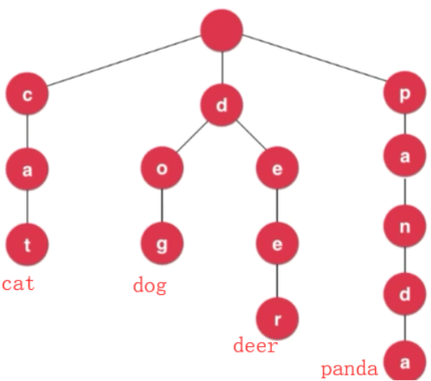
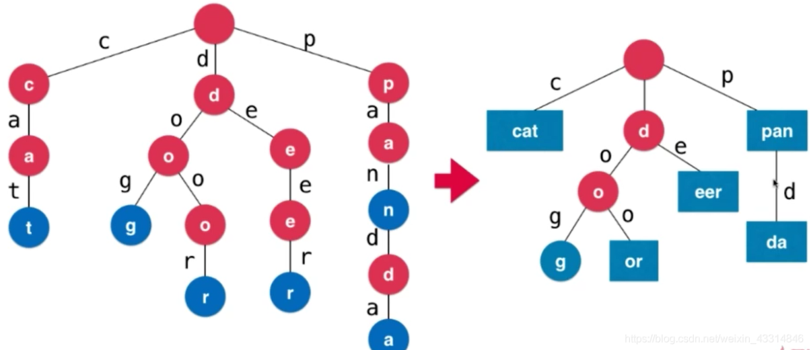
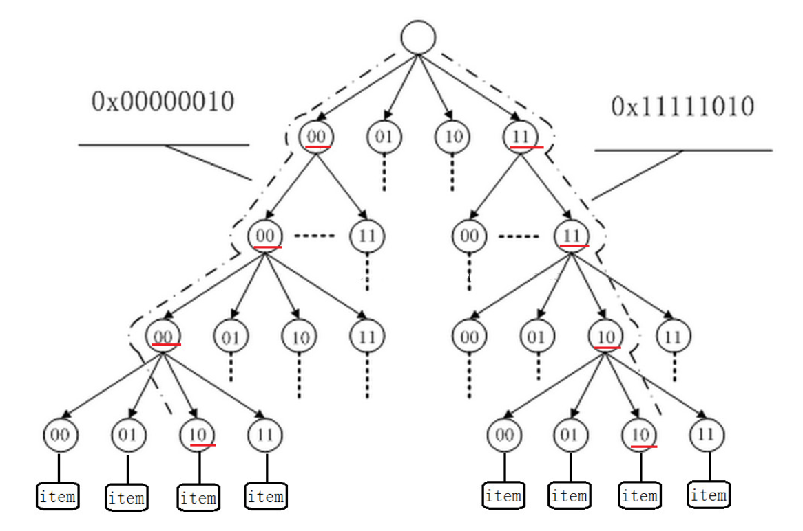

<!-- wp:paragraph -->

数据库中树状索引结构是常用的索引结构。

<!-- /wp:paragraph -->

<!-- wp:heading -->
<h2>B-Tree Family</h2>
<!-- /wp:heading -->

<!-- wp:paragraph -->

B-Tree家族中使用最广泛的成员是B+Tree. 原始B-Tree的内部结点可以保存value；而B+Tree内部结点只保存指向下一层的page_id，value保存在叶子结点中。在B+Tree中删除某个value后，内部结点中仍然保留该value对应的key，以避免频繁的重构，这一点带来了一些空间浪费。

<!-- /wp:paragraph -->

<!-- wp:paragraph -->

但另一方面，由于内部结点保存了实际的数据，B-Tree在并发执行时，对内部结点的修改会同时影响上层结点和下层结点，因此需要在两个方向上加锁，效率低下。而B+Tree只需要对叶结点中的数据进行修改，然后向上逐级传播，在并发执行下效率更高。

<!-- /wp:paragraph -->

<!-- wp:heading {"level":3} -->
<h3>B+Tree</h3>
<!-- /wp:heading -->

<!-- wp:paragraph -->

<strong>由于B+Tree在很多数据结构书都有详细介绍，这里就不再赘述。笔记的重点主要放在B+Tree作为数据库索引，有哪些设计取舍和优化策略。</strong>

<!-- /wp:paragraph -->

<!-- wp:paragraph -->

实现时，内部结点中key和value分为两个数组存放，因为两者数据长度不一致。分开存放可以更好地利用CPU缓存。 

<!-- /wp:paragraph -->

<!-- wp:paragraph -->

叶结点中可以有两个种方式存储值：一是以Record_id的方式存储，即指向元组存储位置的指针；二是存储实际的元组数据，数据与对应的键一同保存在叶结点中。PostgreSQL, SQL Server, DB2采用的是第一种方法；SQL Lite, MySQL采用第二种方法。

<!-- /wp:paragraph -->

<!-- wp:heading {"level":4} -->
<h4>设计取舍</h4>
<!-- /wp:heading -->

<!-- wp:heading {"level":5} -->
<h5>结点大小</h5>
<!-- /wp:heading -->

<!-- wp:paragraph -->

对于不同存储容量的设备，最佳结点大小也不同。通常来说，速度越慢的设备最佳结点大小越大：

<!-- /wp:paragraph -->

<!-- wp:list -->
<ul><li>HDD: ~1MB</li><li>SSD: ~10KB</li><li>In-Memory: ~512B</li></ul>
<!-- /wp:list -->

<!-- wp:heading {"level":5} -->
<h5>归并阈值</h5>
<!-- /wp:heading -->

<!-- wp:paragraph -->

有些DBMS在结点只有一半满的时候不会进行归并操作，归并操作的延迟可以减少重构的次数。让小结点保留下来，然后定期重建整棵树也许效果更好。

<!-- /wp:paragraph -->

<!-- wp:heading {"level":5} -->
<h5>长度可变的键</h5>
<!-- /wp:heading -->

<!-- wp:paragraph -->

有四种方法将可变长度的键保存在结点中：

<!-- /wp:paragraph -->

<!-- wp:list {"ordered":true} -->
<ol><li>在结点中保存指向元组中作为键的属性的指针。</li><li>令结点长度可变，需要仔细地进行内存管理。</li><li>将所有长度较短的键填充至最大长度。</li><li>嵌入一个指针数组，指针指向对应的键值对。</li></ol>
<!-- /wp:list -->

<!-- wp:heading {"level":4} -->
<h4>B+树索引优化</h4>
<!-- /wp:heading -->

<!-- wp:heading {"level":5} -->
<h5>前缀压缩</h5>
<!-- /wp:heading -->

<!-- wp:paragraph -->

B+Tree结点内部对value进行排序，因此相邻的几个元素很有可能存在相似性。对于字符串数据，如果几个数据具有相同的前缀，就可以将重叠的前缀抽取出来单独保存。

<!-- /wp:paragraph -->

<!-- wp:heading {"level":5} -->
<h5>后缀截断</h5>
<!-- /wp:heading -->

<!-- wp:paragraph -->

在内部结点中进行查询的时候，可能只需要看key的前半截就知道应该往左搜索还是往右搜索。在存储的时候就可以直接将后缀截断，只保存前缀。

<!-- /wp:paragraph -->

<!-- wp:heading {"level":4} -->
<h4>批量载入</h4>
<!-- /wp:heading -->

<!-- wp:paragraph -->

当数据库一开始就已经存在一批数据时，就不需要再以逐个插入的方法自顶向下地构建B+Tree。批量载入的做法是对所有数据进行排序，填充到叶子结点，然后对叶子结点进行分割，逐级向上构建。

<!-- /wp:paragraph -->

<!-- wp:heading {"level":4} -->
<h4>Pointer Swizzling</h4>
<!-- /wp:heading -->

<!-- wp:paragraph -->

B+Tree中以页号的形式保存其他结点的位置，这样我们在查找其他结点时就需要向下层Buffer Pool请求这个结点所在的页，造成额外的开销。对于一些已经被读入到内存，并且被固定（Pin）的页，可以直接将它们的内存地址保存到内部结点中，代替页号，提升一些查询效率。通常树索引的前几层会被频繁访问，因此可以将上层节点固定在内存中。

<!-- /wp:paragraph -->

<!-- wp:heading {"level":4} -->
<h4>重复键存储</h4>
<!-- /wp:heading -->

<!-- wp:paragraph -->

数据库中有时候需要存储多个与同一个键关联的值。一种方法是在键的后面加上记录的record_id（page_id+offset，即该记录所在物理位置的唯一标识)，将它们变成不同的键；另外一种方法是在叶子结点上加入溢出结点，溢出结点以链表形式链接，当需要插入重复键时，就将这个记录插入到溢出结点。溢出结点中元素存储可以是无序的，因此查找时需要进行线性搜索。

<!-- /wp:paragraph -->

<!-- wp:paragraph -->

能不能通过插入时的时间戳来区分重复键？答案是不能。原因一：如果使用物理时间作为时间戳，有可能机器时间实际时间更快，如果运行途中对机器时间进行了校准，同一秒就有可能出现两次。原因二：如果有多台机器同时向服务器提交新的值，也无法区分他们提交的重复键。

<!-- /wp:paragraph -->

<!-- wp:heading -->
<h2>聚簇索引</h2>
<!-- /wp:heading -->

<!-- wp:paragraph -->

数据库按照记录插入的顺序在磁盘上存储，这样使得搜索时就无法使用二分查找。聚簇索引强制数据库对磁盘上的记录重新按照索引布局进行排序。PostgresSQL中可以使用CLUSTER命令对记录进行聚簇。[1]

<!-- /wp:paragraph -->

<!-- wp:heading -->
<h2>Trie Index</h2>
<!-- /wp:heading -->

<!-- wp:paragraph -->

Trie又称字典树、前缀树，是一种专门为字符串存储和查询而设计的索引结构。查找时从字符串每次读一位，如果树结点存在该字符对应的子树，则继续向后查找，否则树中不存在结果。对前缀树进行插入和查找的时间复杂度都是<code>O(k)</code>，<code>k</code>是操作的字符串的长度。 

<!-- /wp:paragraph -->

<!-- wp:paragraph -->

压缩是常见的字典树优化方法。当从某一个内部结点开始，一直到叶结点都不存在分支，就可以将这条路径压缩为一个结点。 

<!-- /wp:paragraph -->

<!-- wp:heading -->
<h2>Radix Tree</h2>
<!-- /wp:heading -->

<!-- wp:paragraph -->

Radix Tree又称基数树，通过元素的二进制位进行查找。若每一层检查n位，则产生2n路子树。如下图每一层检查2位，产生4路子树。Radix Tree可以看作前缀树的变种。[2]

<!-- /wp:paragraph -->

<!-- wp:image -->
<figure class="wp-block-image"></figure>
<!-- /wp:image -->

<!-- wp:heading -->
<h2>参考资料</h2>
<!-- /wp:heading -->

<!-- wp:paragraph -->

[1]https://blog.csdn.net/chuckchen1222/article/details/85630528 [2]https://www.cnblogs.com/wgwyanfs/p/6887889.html

<!-- /wp:paragraph -->
