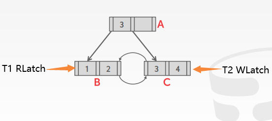

<!-- wp:paragraph -->

并发控制协议在数据库中保证对共享的对象进行并行操作的结果正确性。正确性包括：

<!-- /wp:paragraph -->

<!-- wp:list -->
<ul><li>逻辑正确性：一个线程看到的数据是否正确。</li><li>物理正确性：对象的内部表示是否可靠。</li></ul>
<!-- /wp:list -->

<!-- wp:heading -->
<h2>Lock vs Latch</h2>
<!-- /wp:heading -->

<!-- wp:paragraph -->

Lock和Latch都是为了同步并发执行而引入的数据结构，两者本质上相同，但有一些细小的差别。实际应用中常常会将两者的称呼2混用。

<!-- /wp:paragraph -->

<!-- wp:heading {"level":3} -->
<h3>Locks</h3>
<!-- /wp:heading -->

<!-- wp:list -->
<ul><li>保护数据库保存的数据不受其他事务影响。</li><li>在事务执行过程中一直占有。</li><li>支持回滚操作。</li></ul>
<!-- /wp:list -->

<!-- wp:heading {"level":3} -->
<h3>Latch</h3>
<!-- /wp:heading -->

<!-- wp:list -->
<ul><li>保护包含DBMS内部数据结构的重要程序段不受其他线程影响。</li><li>在操作期间持有。</li><li>不需要支持回滚。</li></ul>
<!-- /wp:list -->

<!-- wp:image -->
<figure class="wp-block-image"></figure>
<!-- /wp:image -->

<!-- wp:paragraph -->

数据库索引属于内部数据结构，多个线程可能并发地对其进行访问。因此本节主要介绍如何使用Latch对索引进行并发控制。

<!-- /wp:paragraph -->

<!-- wp:heading {"level":4} -->
<h4>Latch Modes</h4>
<!-- /wp:heading -->

<!-- wp:paragraph -->

Latch有读和写两种模式。

<!-- /wp:paragraph -->

<!-- wp:heading {"level":5} -->
<h5>Read</h5>
<!-- /wp:heading -->

<!-- wp:list -->
<ul><li>多个线程可以同时对同一个对象进行读操作。</li><li>另一个线程占有读锁时，仍然可以获得该对象的读锁。</li></ul>
<!-- /wp:list -->

<!-- wp:heading {"level":5} -->
<h5>Write</h5>
<!-- /wp:heading -->

<!-- wp:list -->
<ul><li>同一时间只有一个线程可以对对象进行写操作。</li><li>只有对象没有被持有任何锁时，才可以获得它的写锁。</li></ul>
<!-- /wp:list -->

<!-- wp:heading {"level":4} -->
<h4>Latch的实现</h4>
<!-- /wp:heading -->

<!-- wp:paragraph -->

Latch的实现有三种方法：Blocking OS Mutex, Test-and-Set Spin Latch, Reader-Writer Latches

<!-- /wp:paragraph -->

<!-- wp:heading {"level":5} -->
<h5>OS Mutex</h5>
<!-- /wp:heading -->

<!-- wp:paragraph -->

使用OS提供的mutex，如Linux底层的futex. 这种实现最为简单，但对数据库系统来说，因为将调度交给了操作系统，这种实现会极大地降低效率（每次调用lock/unlock会花费25ns）。

<!-- /wp:paragraph -->

<!-- wp:heading {"level":5} -->
<h5>Test-and-Set Spin Latch(TAS)</h5>
<!-- /wp:heading -->

<!-- wp:paragraph -->

申请自旋锁的线程会使用CAS操作尝试对内存中的某块区域进行更新，当尝试失败时数据库系统可以决定下一步应该做什么，而不是直接被操作系统阻塞。c++中std::atomic提供这种实现。

<!-- /wp:paragraph -->

<!-- wp:paragraph -->

TAS的缺点是多个线程会频繁进行CAS操作，做很多无用功。由于线程对其他CPU上的缓存行进行轮询，因此会导致缓存一致性问题。

<!-- /wp:paragraph -->

<!-- wp:heading {"level":5} -->
<h5>Reader-Writer Latches</h5>
<!-- /wp:heading -->

<!-- wp:paragraph -->

Mutex和自旋锁都不对读写操作进行区分，DBMS无法对同一个资源进行并发读取。

<!-- /wp:paragraph -->

<!-- wp:paragraph -->

RWLatch是Latch可以区分读和写两种状态。它记录了有多少个线程持有该Latch，并在每种模式下等待获取Latch。RWLatch使用Mutex或自旋锁作为底层原语，添加额外的逻辑来维护读者-写者队列。不同的DBMS使用不同的策略。

<!-- /wp:paragraph -->

<!-- wp:heading {"level":4} -->
<h4>对Hash Table加锁</h4>
<!-- /wp:heading -->

<!-- wp:paragraph -->

哈希表的访问是从上到下，只有一个方向，因此不可能发生死锁。根据粒度不同有两种不同的上锁方法。

<!-- /wp:paragraph -->

<!-- wp:heading {"level":5} -->
<h5>Page Latch</h5>
<!-- /wp:heading -->

<!-- wp:paragraph -->

以Page为单位获取RWLatch，线程在访问一个页面之前获得一个RLatch或WLatch。这种方法降低了并行性，因为可能一次只有一个线程可以访问页面，但是需要访问页面中的多个slot时的效率非常高，因为只需要获取一个Latch。

<!-- /wp:paragraph -->

<!-- wp:heading {"level":5} -->
<h5>Slot Latch</h5>
<!-- /wp:heading -->

<!-- wp:paragraph -->

以slot为单位获取RWLatch，这种方法使多个线程可以同时访问同一个Page的不同slot，增加了并行性。但同时由于需要为每个slot保存锁的状态，增加了存储和计算开销。

<!-- /wp:paragraph -->

<!-- wp:heading {"level":4} -->
<h4>对B+Tree加锁</h4>
<!-- /wp:heading -->

<!-- wp:paragraph -->

主要解决以下两个问题：

<!-- /wp:paragraph -->

<!-- wp:list -->
<ul><li>多个线程试图对同一个节点进行修改。</li><li>一个线程正在对树进行遍历，另一个线程试图对树进行分裂或合并。</li></ul>
<!-- /wp:list -->

<!-- wp:paragraph -->

保证所有修改都是从一个方向遍历过来的。当遇到冲突时，最好的方法是从头开始执行。对B+Tree进行操作最常用的方法是Latch Crabbing/Coupling Protocol.

<!-- /wp:paragraph -->

<!-- wp:heading {"level":5} -->
<h5>Basic Latch Crabbing/Coupling Protocol</h5>
<!-- /wp:heading -->

<!-- wp:list -->
<ul><li><strong>Search</strong>：从根开始从上至下进行搜索，拥有当前结点的Latch后尝试获取下一个结点的Latch，成功后释放当前结点Latch移动到下一结点。</li><li><strong>Insert/Delete</strong>：与搜索一样尝试获取子结点的latch，但是只有判断子结点是安全的情况下，才会释放父结点latch. 所谓安全是指确定子结点不会被分裂和合并。否则一直持有遍历路径上祖先结点的latch.</li></ul>
<!-- /wp:list -->

<!-- wp:heading {"level":5} -->
<h5>Improved Latch Crabbing/Coupling Protocol</h5>
<!-- /wp:heading -->

<!-- wp:paragraph -->

原始版本的Latch Crabbing/coupling Protocol的缺点是访问每一个结点都要获得完整的读写权限，程序的并发性会有所降低，因此产生了一个改进版本。

<!-- /wp:paragraph -->

<!-- wp:paragraph -->

改进版本对修改操作持“乐观”态度，即认为分裂和合并操作是少数情况。大部分情况下只需要获得非叶结点的RLatch即可。遍历到叶子结点时进行检查，如果发现实际需要分裂或合并，则将当前任务中断重新到根结点查找，并请求获得WLatch.

<!-- /wp:paragraph -->

<!-- wp:heading {"level":4} -->
<h4>死锁问题</h4>
<!-- /wp:heading -->

<!-- wp:paragraph -->

 使用以上两种策略对B+Tree进行并发控制，如果仅仅是从上到下的访问，是不会产生死锁的。但是当在叶子结点中进行搜索时，由于可能有两个线程从左右两个方向进行访问，就会产生死锁问题。

<!-- /wp:paragraph -->

<!-- wp:paragraph -->

索引latch不支持死锁检测或避免，因此在叶结点上尝试获取锁而没有成功时，会直接将当前操作中止，重新执行整个流程。

<!-- /wp:paragraph -->

<!-- wp:heading {"level":4} -->
<h4>延迟更新父结点</h4>
<!-- /wp:heading -->

<!-- wp:paragraph -->

插入元素时如果需要分裂，会重新遍历一遍以获取父结点的WLatch，这样就带来了性能上的损失。延迟更新父结点策略将插入的结点连接到子结点，然后在一个全局表中记录该节点的父结点需要更新。当下次另一个插入或删除操作搜索到该结点，从全局表中知道这个结点需要修改，就直接获取它的WLatch，并对结点进行更新。

<!-- /wp:paragraph -->
