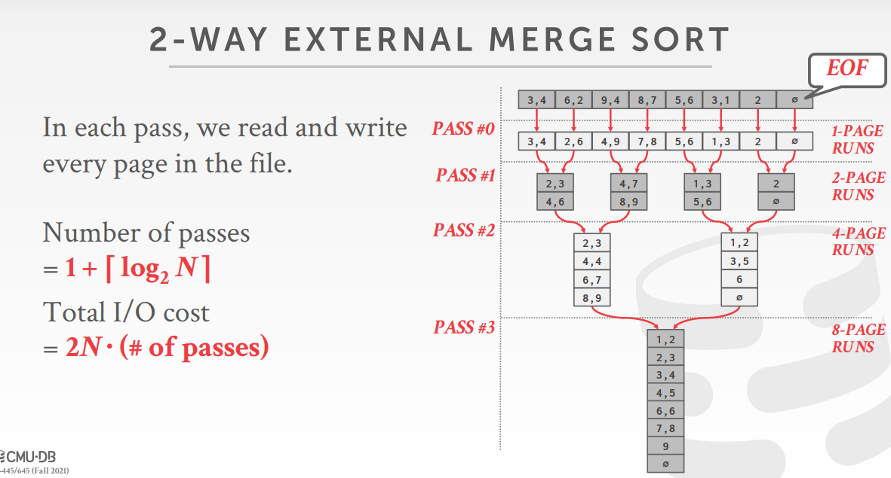
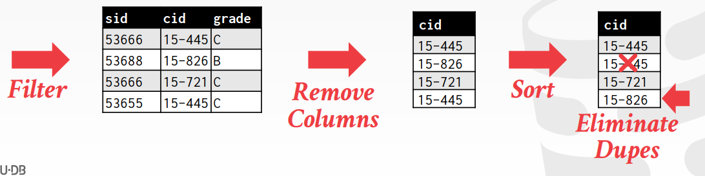

<!-- wp:paragraph -->

关系模型没有对数据的实际存储顺序进行限定，有时候查询可能对结果排序有所要求(ORDER BY)，并且在一些特定的操作中(DISTINCT, GROUP BY，批量载入元组并建立B+树索引)，排序后执行效率更高。

<!-- /wp:paragraph -->

<!-- wp:heading -->
<h2>外部排序</h2>
<!-- /wp:heading -->

<!-- wp:paragraph -->

如果数据可以放进内存，可以直接使用快排之类的内存排序算法。否则需要借助外部存储，这种情况需要考虑外部I/O带来的开销。

<!-- /wp:paragraph -->

<!-- wp:paragraph -->

外部排序通常采用分治策略，将K/V对划分为可以装入内存的分段。每个K/V对中的值可能保存了实际的元组数据（Early Materialization），也可能保存了指向数据存储位置的指针（Late Materialization）。递归地对分段进行归并，得到最终结果。

<!-- /wp:paragraph -->

<!-- wp:image -->
<figure class="wp-block-image"></figure>
<!-- /wp:image -->

<!-- wp:heading {"level":4} -->
<h4>优化措施</h4>
<!-- /wp:heading -->

<!-- wp:paragraph -->

二路归并排序在内存中只需使用三个帧。读入其中一页进行排序时，可以新开一个线程将另一个页读入内存，即以一种异步I/O的方式进行读写。

<!-- /wp:paragraph -->

<!-- wp:heading {"level":3} -->
<h3>多路归并排序</h3>
<!-- /wp:heading -->

<!-- wp:paragraph -->

假设有<code>B</code>个可使用的内存页，第一趟将数据集划分为<code>B</code>个大小为<code>N / B</code>的分段。之后每一趟对<code>B-1</code>段进行归并，剩余的一页作为临时结果的缓冲区。每趟归并每一页都会被读和写一次。因此：

<!-- /wp:paragraph -->

<!-- wp:paragraph -->

在B页可用的内存中进行多路归并的趟数 = 1 + [logB-1[N/B]]

<!-- /wp:paragraph -->

<!-- wp:paragraph -->

总I/O次数 = 2N·趟数

<!-- /wp:paragraph -->

<!-- wp:paragraph -->

（注：公式中的<code>[]</code>表示向上取整）

<!-- /wp:paragraph -->

<!-- wp:heading {"level":3} -->
<h3>通过B+树对外部排序进行优化</h3>
<!-- /wp:heading -->

<!-- wp:paragraph -->

如果在排序的key上已经建立了B+树索引，可以利用索引对排序进行加速。存在以下两种情况：

<!-- /wp:paragraph -->

<!-- wp:heading {"level":4} -->
<h4>聚簇B+Tree</h4>
<!-- /wp:heading -->

<!-- wp:paragraph -->

聚簇B+Tree叶结点中记录按照顺序存储，因此直接进行顺序扫描即可。这种情况下不存在计算开销，并且磁盘访问次数是线性的。

<!-- /wp:paragraph -->

<!-- wp:heading {"level":4} -->
<h4>非聚簇B+Tree</h4>
<!-- /wp:heading -->

<!-- wp:paragraph -->

这种情况下需要通过指针逐个对数据进行访问。

<!-- /wp:paragraph -->

<!-- wp:heading -->
<h2>聚合</h2>
<!-- /wp:heading -->

<!-- wp:paragraph -->

聚合是将某个属性的多个值合并成一个值。可以通过排序或哈希两种方式实现。

<!-- /wp:paragraph -->

<!-- wp:paragraph -->

当输出结果不要求有序时，例如我只需要进行<code>GROUP BY</code>或<code>DISTINCT</code>操作，选择哈希方法实现的计算成本更低。

<!-- /wp:paragraph -->

<!-- wp:heading {"level":3} -->
<h3>排序聚合</h3>
<!-- /wp:heading -->

<!-- wp:image -->
<figure class="wp-block-image"></figure>
<!-- /wp:image -->

<!-- wp:paragraph -->

<code>DISTINCE</code>操作时先对所有元组进行排序，然后逐个扫描排序后的元组，如果当前元素与上一个元素相同，则直接丢弃。

<!-- /wp:paragraph -->

<!-- wp:heading {"level":3} -->
<h3>哈希聚合</h3>
<!-- /wp:heading -->

<!-- wp:paragraph -->

第一阶段：根据哈希值将元组划分到不同的桶中，桶装满了以后换出到磁盘。同一个哈希值的桶对应相同分区。Key相同的记录必定在同一个分区。

<!-- /wp:paragraph -->

<!-- wp:paragraph -->

第二阶段：对每一个分区建立内存哈希表，并对同一个分区的记录重新进行哈希。当在哈希表中找到当前的key，就对表中的中间结果进行更新，否则插入一个新的记录。该分区所有记录被遍历完后，将哈希表中的记录输出。

<!-- /wp:paragraph -->
