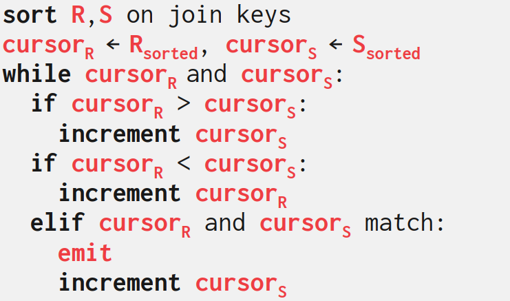
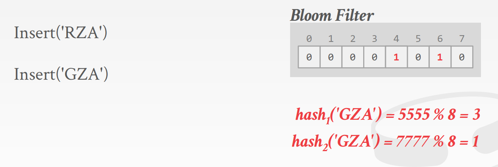
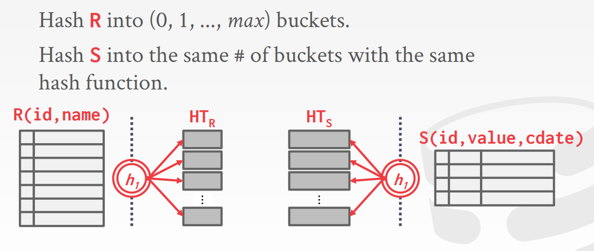
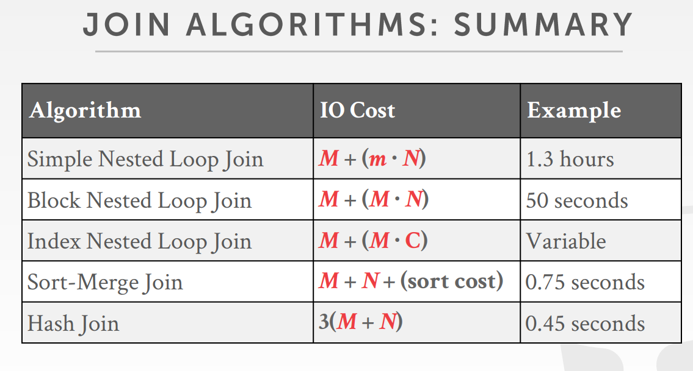

<!-- wp:paragraph -->

Join操作符将指定属性相等的两个表中元素拼接起来，以计算过程中IO次数作为开销度量。

<!-- /wp:paragraph -->

<!-- wp:heading -->
<h2>Early Materializetion</h2>
<!-- /wp:heading -->

<!-- wp:paragraph -->

进行Join操作时将两个完整的元组合并到一起。这样做的好处是后续的操作不需要再向底层请求数据。

<!-- /wp:paragraph -->

<!-- wp:heading -->
<h2>Late Materialization</h2>
<!-- /wp:heading -->

<!-- wp:paragraph -->

进行操作时只拷贝key和元组的存储位置。列式存储的数据库更适合采用该种方法，查询时无需读取不相关的属性。

<!-- /wp:paragraph -->

<!-- wp:heading -->
<h2>Nested Loop Join</h2>
<!-- /wp:heading -->

<!-- wp:paragraph -->

通过两个for循环逐个比对所有元组，外层循环遍历的表称为outer table，另外一个作为inner table。

<!-- /wp:paragraph -->

<!-- wp:paragraph -->

后面将假设Outer table页数为M、有m条元组，inner table页数为N、有n条元组。

<!-- /wp:paragraph -->

<!-- wp:heading {"level":3} -->
<h3>Simple Nested Loop Join</h3>
<!-- /wp:heading -->

<!-- wp:paragraph -->

 最简单的Nested Loop Join每次循环只读取一个元组。I/O次数=<code>M+(m*N)</code>。

<!-- /wp:paragraph -->

<!-- wp:heading {"level":3} -->
<h3>BLOCK NESTED LOOP JOIN</h3>
<!-- /wp:heading -->

<!-- wp:paragraph -->

 内外表以块为单位进行合并，带来更少的磁盘访问开销。I/O次数=<code>M+(M*N)</code>。

<!-- /wp:paragraph -->

<!-- wp:heading {"level":3} -->
<h3>Index Nested Loop Join</h3>
<!-- /wp:heading -->

<!-- wp:paragraph -->

在上面的几种Loop方法中，每一个外表元组通过线性扫描方法找到内表中匹配的元组。如果内表上建立了索引，可以通过索引避免线性扫描带来的开销。

<!-- /wp:paragraph -->

<!-- wp:heading {"level":3} -->
<h3>总结</h3>
<!-- /wp:heading -->

<!-- wp:paragraph -->

Nested Loop Join优化方式就是：1.将元组更少的表作为外表。2.每次循环尽可能一次性读取更多元组。3.使用索引减少内表的访问次数。

<!-- /wp:paragraph -->

<!-- wp:heading -->
<h2>Sort-Merge Join</h2>
<!-- /wp:heading -->

<!-- wp:paragraph -->

第一阶段根据Join key对内外表进行排序，通常需要使用外部排序算法。第二阶段对两个有序表通过游标进行归并，归并过程中可能需要回溯。 

<!-- /wp:paragraph -->

<!-- wp:paragraph -->

最坏情况下所有join属性的值都相同，merge阶段就退化为Nested Loop，而且排序还有额外的开销。

<!-- /wp:paragraph -->

<!-- wp:paragraph -->

以下情况适合采用Sort-Merge Join:

<!-- /wp:paragraph -->

<!-- wp:list -->
<ul><li>至少一个表已经排好序</li><li>输出需要在Join Key上排序</li></ul>
<!-- /wp:list -->

<!-- wp:heading -->
<h2>Hash Join</h2>
<!-- /wp:heading -->

<!-- wp:paragraph -->

如果两个表中的元素满足join条件，那么它们在该属性上的值一定相等。因此可以使用哈希方法将两个表的元组划分到某个区域，然后只对比落在对应区域中的元组。

<!-- /wp:paragraph -->

<!-- wp:paragraph -->

哈希表中的值可以存储实际元组，也可以存储元组的保存位置。后者更适用于列存储数据库。

<!-- /wp:paragraph -->

<!-- wp:heading {"level":3} -->
<h3>Bloom Filter</h3>
<!-- /wp:heading -->

<!-- wp:paragraph -->

Bloom Filter是一种基于概率的位图，可以用来快速判定一个元组是否有可能存在。有可能存在假阳性，但不会出现假阴性。Bloom Fiter占用内存较小，可以作为哈希查找阶段的辅助数据结构。

<!-- /wp:paragraph -->

<!-- wp:image -->
<figure class="wp-block-image"></figure>
<!-- /wp:image -->

<!-- wp:paragraph -->

假设要插入<code>RZA</code>，使用两个哈希函数计算它的哈希值，将对应两个位设置为1。当需要查找一个字符串是否存在时，同样计算两个哈希值，去对应位中看，如果两位都是1，说明有可能存在。如果至少一位上是0，则必不可能存在。

<!-- /wp:paragraph -->

<!-- wp:heading {"level":3} -->
<h3>Grace Hash Join</h3>
<!-- /wp:heading -->

<!-- wp:paragraph -->

为了解决哈希表无法入内存，搜索时需要随机I/O的问题。出现了Grace Hash Join。使用相同的哈希函数，分别将内外表划分为两个哈希表，搜索时只需要读取编号相同的bucket。

<!-- /wp:paragraph -->

<!-- wp:image -->
<figure class="wp-block-image"></figure>
<!-- /wp:image -->

<!-- wp:paragraph -->

如果出现Bucket也放不下内存的情况，则递归地对其进行划分。

<!-- /wp:paragraph -->

<!-- wp:paragraph -->

Grace Hash Join划分阶段对表进行一次读一次写，开销为<code>2(M+N)</code>；搜索阶段进行一次读，开销为<code>M+N</code>；因此总开销为<code>3(M+N)</code>

<!-- /wp:paragraph -->

<!-- wp:paragraph -->

当数据库系统知道外表的大小时，可以使用静态哈希表，计算和搜索复杂度会更小。如果不知道大小，则必须使用动态哈希表，或者使用溢出页。

<!-- /wp:paragraph -->

<!-- wp:heading -->
<h2>总结</h2>
<!-- /wp:heading -->

<!-- wp:image -->
<figure class="wp-block-image"></figure>
<!-- /wp:image -->

<!-- wp:paragraph -->

哈希方法绝大部分情况下比排序方法更高效。排序只有在数据分布均匀或者结果需要有序的情况下具有较好的表现。好的数据库两者都会使用。

<!-- /wp:paragraph -->
