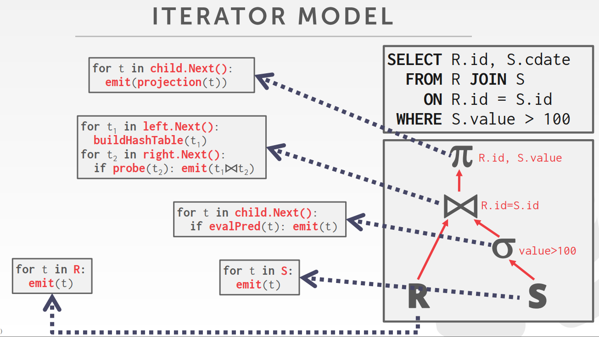
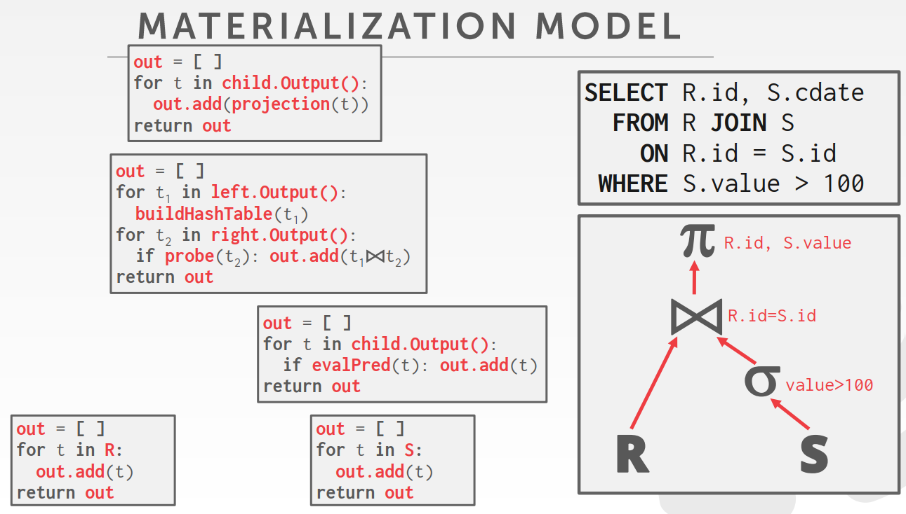
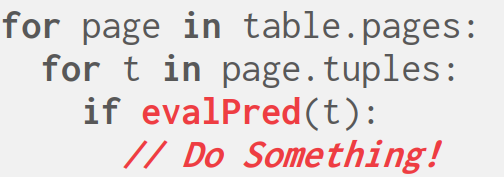
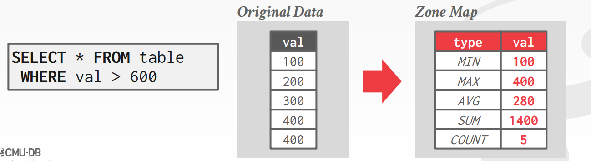
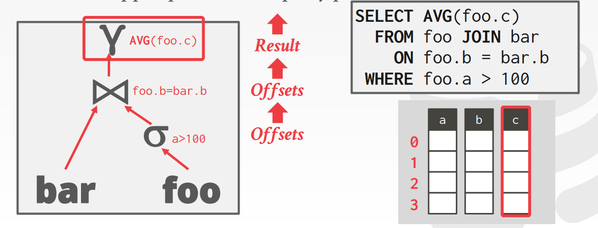
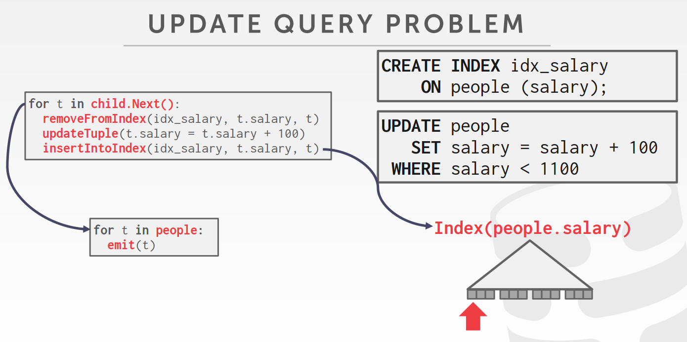
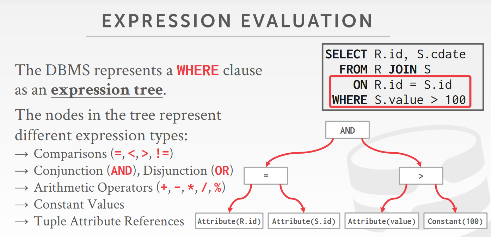
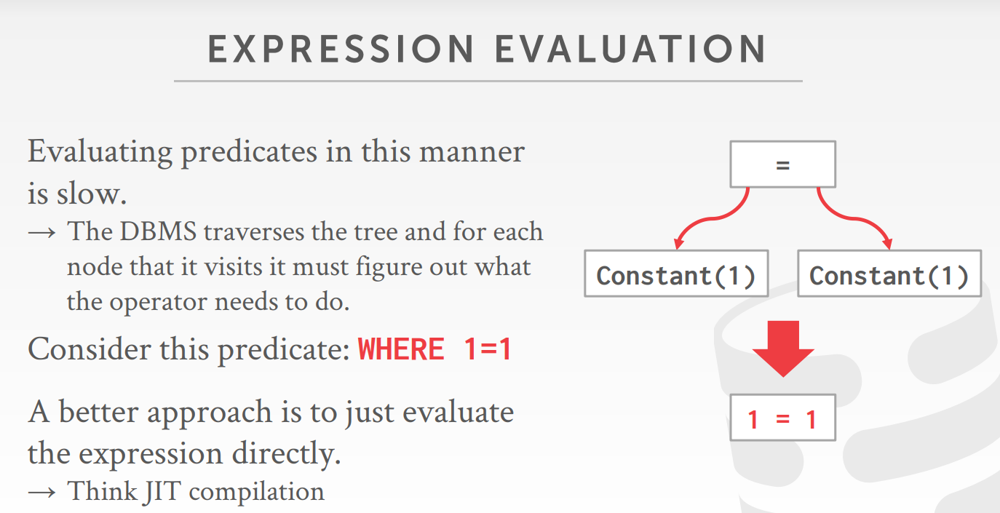

<!-- wp:paragraph -->

<strong>查询计划</strong>：DBMS将查询需要做的操作排列成一棵树，数据从叶结点流向根结点，最后作为结果输出。

<!-- /wp:paragraph -->

<!-- wp:heading -->
<h2>处理模型</h2>
<!-- /wp:heading -->

<!-- wp:paragraph -->

DBMS处理模型负责决定如何对查询计划进行处理。

<!-- /wp:paragraph -->

<!-- wp:heading {"level":3} -->
<h3>Iterator Model</h3>
<!-- /wp:heading -->

<!-- wp:paragraph -->

每个操作符都需要实现<code>Next()</code>函数，每次调用这个函数都会返回一个元组或<code>null</code>。父结点通过循环从子结点获得所有需要处理的数据。又称为<code>Volcano</code>或者<code>Pipeline</code>模型。

<!-- /wp:paragraph -->

<!-- wp:image -->
<figure class="wp-block-image"></figure>
<!-- /wp:image -->

<!-- wp:paragraph -->

迭代器模型几乎用于所有DBMS，支持对元组进行流水线操作。查询处理过程中，有一些操作需要获得所有数据才能继续往下进行，无法按照流水线的方式处理。这些操作称为pipeline breaker，例如<code>order by</code>, 子查询, <code>join</code>, <code>limit</code>等。

<!-- /wp:paragraph -->

<!-- wp:heading {"level":3} -->
<h3>Materialization Model</h3>
<!-- /wp:heading -->

<!-- wp:paragraph -->

操作符一次读取所有输入进行处理，然后将所有结果一次性输出。DBMS可以设定阈值来避免一次性扫描太多元组的问题。输出可以是整个元组(NSM)或列的子集(DSM)。

<!-- /wp:paragraph -->

<!-- wp:image -->
<figure class="wp-block-image"></figure>
<!-- /wp:image -->

<!-- wp:paragraph -->

实体化模型适合OLTP类型的任务，因为大部分时候只需要访问少量数据。只需要花费很少的执行开销和函数调用。但不适合OLAP，因为存在大量中间结果。

<!-- /wp:paragraph -->

<!-- wp:heading {"level":3} -->
<h3>Vectorized/batch Model</h3>
<!-- /wp:heading -->

<!-- wp:paragraph -->

操作符每次输出一批元组，批次的大小取决于硬件和查询参数。

<!-- /wp:paragraph -->

<!-- wp:paragraph -->

 · 适合OLAP，因为减少了每个操作符上的调用次数，而且方便使用向量指令处理数据。大部分主流数据仓库都使用该模型。

<!-- /wp:paragraph -->

<!-- wp:heading -->
<h2>计划处理方向</h2>
<!-- /wp:heading -->

<!-- wp:heading {"level":3} -->
<h3>从上到下</h3>
<!-- /wp:heading -->

<!-- wp:paragraph -->

从根出发调用子结点的函数，得到需要处理的数据。

<!-- /wp:paragraph -->

<!-- wp:heading {"level":3} -->
<h3>从下到上</h3>
<!-- /wp:heading -->

<!-- wp:paragraph -->

叶子结点向父结点推送数据。向上传递数据时，如果能确保所处理的数据能够放在CPU缓存和寄存器中，这种方法更合适。但实现上有较大难度。

<!-- /wp:paragraph -->

<!-- wp:heading -->
<h2>访问方法</h2>
<!-- /wp:heading -->

<!-- wp:paragraph -->

访问方法是DBMS访问存储在表中数据的方法。

<!-- /wp:paragraph -->

<!-- wp:heading {"level":3} -->
<h3>线性扫描</h3>
<!-- /wp:heading -->

<!-- wp:paragraph -->

 顺序读取表格的每一页，以及每一页中的每个元组。

<!-- /wp:paragraph -->

<!-- wp:heading {"level":4} -->
<h4>优化方法</h4>
<!-- /wp:heading -->

<!-- wp:heading {"level":5} -->
<h5>Zone Page</h5>
<!-- /wp:heading -->

<!-- wp:paragraph -->

 在页中保存数据的统计信息，如最大值最小值等，在查询时DBMS就可以通过这些统计信息确定是否需要查找该页。OLTP系统中需要频繁更新Zone Page，因此在OLAP系统中使用更多。

<!-- /wp:paragraph -->

<!-- wp:heading {"level":5} -->
<h5>Late Materialization</h5>
<!-- /wp:heading -->

<!-- wp:paragraph -->

 DSM DBMS尽可能地延迟取得整个元组的时间，减少操作符之间的数据传输量。列式存储模型中，只需要传递数据的位移量即可。

<!-- /wp:paragraph -->

<!-- wp:heading {"level":3} -->
<h3>Index Scan</h3>
<!-- /wp:heading -->

<!-- wp:paragraph -->

查询优化器需要知道数据的分布情况，从而选择更适合的索引进行查询。

<!-- /wp:paragraph -->

<!-- wp:paragraph -->

如果数据库中大部分值都是符合输出条件的，那么使用索引扫描还需要花费额外的索引查找时间，不如直接从头开始进行顺序搜索。选择索引还是顺序搜索是通过数据库系统中查询优化器里的成本模型决定的。

<!-- /wp:paragraph -->

<!-- wp:heading {"level":4} -->
<h4>Index Scan Page Sorting</h4>
<!-- /wp:heading -->

<!-- wp:paragraph -->

如果是在一个非聚簇索引中对数据进行检索，为了避免频繁的随机I/O，会先通过索引找到所有结果的存储位置，然后按照页号对它们进行排序，再逐页读取。

<!-- /wp:paragraph -->

<!-- wp:heading {"level":3} -->
<h3>Multi-index Scan</h3>
<!-- /wp:heading -->

<!-- wp:paragraph -->

如果数据库中建立了多个索引，那么可以同时使用多个索引进行搜索，然后将搜索结果合并起来。比如如果查询条件中使用了<code>and</code>/<code>or</code>，那么可以在查询时分别使用两个索引对<code>and</code>/<code>or</code>左右的字段值进行搜索，然后将两边搜索出来的结果取交集/并集。

<!-- /wp:paragraph -->

<!-- wp:paragraph -->

pg中该种方法称为Bitmap Scan。

<!-- /wp:paragraph -->

<!-- wp:heading -->
<h2>修改可能造成的问题</h2>
<!-- /wp:heading -->

<!-- wp:paragraph -->

<code>INSERT</code>, <code>UPDATE</code>, <code>DELETE</code>这类对数据库进行修改的操作需要负责检查约束性保证以及更新索引。

<!-- /wp:paragraph -->

<!-- wp:image -->
<figure class="wp-block-image"></figure>
<!-- /wp:image -->

<!-- wp:paragraph -->

假设现在在<code>salary</code>上建立了聚簇索引，并执行一个将所有<code>salary<1100</code>的人工资增加<code>100</code>块，就会出现这样的问题：<code>999</code>增加<code>100</code>后变为<code>1099</code>。将<code>1099</code>插入到索引中后，会被指针第二次遍历到。如果不记录之前已经处理过的元组有哪些，就会被额外增加一次<code>100</code>。这种由于更新操作导致扫描重复访问同一个元组的问题称为<a href="https://en.wikipedia.org/wiki/Halloween_Problem">Halloween Problem</a>

<!-- /wp:paragraph -->

<!-- wp:heading -->
<h2>Expression Evaluation</h2>
<!-- /wp:heading -->

<!-- wp:paragraph -->

DBMS将<code>WHERE</code>子句表示成一棵表达式树。

<!-- /wp:paragraph -->

<!-- wp:image -->
<figure class="wp-block-image"></figure>
<!-- /wp:image -->

<!-- wp:paragraph -->

对于每一个元组，DBMS都需要对操作式树进行遍历，这样将会使执行速度变慢。一个更好的方法是类似于JIT编译那样，直接计算表达式。

<!-- /wp:paragraph -->

<!-- wp:image -->
<figure class="wp-block-image"></figure>
<!-- /wp:image -->
