<!-- wp:paragraph -->

本节介绍任意个节点下的并行执行模型。

<!-- /wp:paragraph -->

<!-- wp:heading -->
<h2>并行vs分布式</h2>
<!-- /wp:heading -->

<!-- wp:paragraph -->

两者都是将数据库分散到不同的资源上，以改进不同方面的性能。在物理层面无论以何种方式组织，逻辑层面上对上层都应该是透明的，即单节点下得到的结果和并行/分布式下得到的结果应该是一致的。

<!-- /wp:paragraph -->

<!-- wp:paragraph -->

并行DBMS：

<!-- /wp:paragraph -->

<!-- wp:list -->
<ul><li>资源在物理层面上紧密联系</li><li>通过高速总线连接</li><li>连接可以被认为是低成本和可靠的</li></ul>
<!-- /wp:list -->

<!-- wp:paragraph -->

分布式DBMS：

<!-- /wp:paragraph -->

<!-- wp:list -->
<ul><li>资源相互距离比较远</li><li>通过低速信道连接</li><li>存在成本和可靠性问题</li></ul>
<!-- /wp:list -->

<!-- wp:heading -->
<h2>查询执行</h2>
<!-- /wp:heading -->

<!-- wp:paragraph -->

DBMS中的处理模型定义了如何组织系统以实现多个worker处理并发请求。worker是指DMBS中可以执行某项任务的组件，可以是进程也可以是线程。

<!-- /wp:paragraph -->

<!-- wp:heading {"level":3} -->
<h3>Process per DBMS Worker</h3>
<!-- /wp:heading -->

<!-- wp:paragraph -->

数据库每次收到请求，由任务分发器<code>Dispatcher</code>创建新的Worker进程负责处理该请求。由于每个请求都具有自己的地址空间，可能会造成同一页在多个进程中拥有重复副本，可以通过共享内存避免重复副本。同时，这种模型不会因为一个worker崩溃而导致其他worker崩溃。

<!-- /wp:paragraph -->

<!-- wp:paragraph -->

老式数据库大多采用这种模型，例如postgresSQL。

<!-- /wp:paragraph -->

<!-- wp:image -->
<figure class="wp-block-image">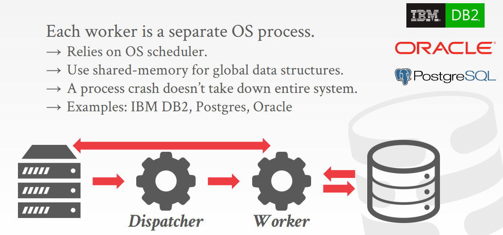</figure>
<!-- /wp:image -->

<!-- wp:heading {"level":3} -->
<h3>Process Pool</h3>
<!-- /wp:heading -->

<!-- wp:paragraph -->

为了减少频繁的进程创建，可以采用进程池技术。进程池中有多余进程时，可以将一部分繁重的任务交由多个进程并行处理，即<code>work-stealing</code>技术。

<!-- /wp:paragraph -->

<!-- wp:image -->
<figure class="wp-block-image">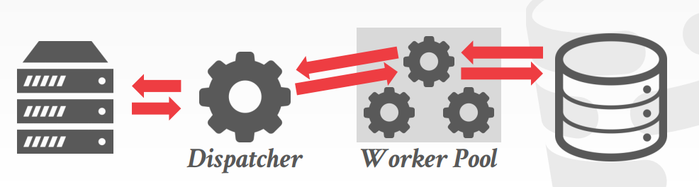</figure>
<!-- /wp:image -->

<!-- wp:heading {"level":3} -->
<h3>Thread per DBMS Worker</h3>
<!-- /wp:heading -->

<!-- wp:paragraph -->

新型数据库大多采用这种模型，如DB2, MySQL, MSSQL。由数据库系统管理自身线程调度。使用这种处理模型的好处是上下文切换成本更低，而且无需管理共享内存。但某个线程出错可能会导致整个系统崩溃。

<!-- /wp:paragraph -->

<!-- wp:paragraph -->

注意：使用多线程模型不代表DBMS支持<code>intra-query parallelism</code>

<!-- /wp:paragraph -->

<!-- wp:image -->
<figure class="wp-block-image">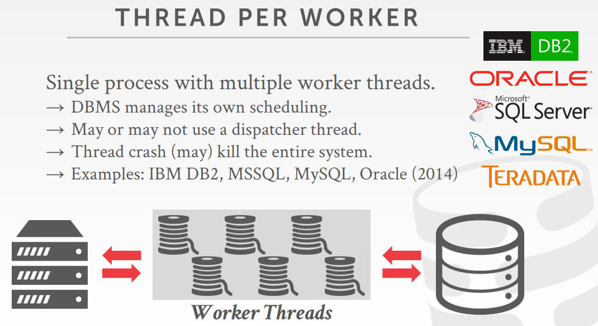</figure>
<!-- /wp:image -->

<!-- wp:heading -->
<h2>调度</h2>
<!-- /wp:heading -->

<!-- wp:paragraph -->

DBMS对拥有的线程进行调度：

<!-- /wp:paragraph -->

<!-- wp:list -->
<ul><li>需要多少个worker</li><li>需要使用多少个CPU核心</li><li>指定任务运行在哪个CPU</li><li>什么时候存储输出</li></ul>
<!-- /wp:list -->

<!-- wp:paragraph -->

DBMS在任何时候都要比操作系统知道更多信息。

<!-- /wp:paragraph -->

<!-- wp:heading -->
<h2>并行查询</h2>
<!-- /wp:heading -->

<!-- wp:heading {"level":3} -->
<h3>Inter-Query Parallelism</h3>
<!-- /wp:heading -->

<!-- wp:paragraph -->

指同一时间可以同时执行多个不同的查询。可以增加吞吐量，减少延迟，使总体性能得到提升。

<!-- /wp:paragraph -->

<!-- wp:paragraph -->

如果任务以读取为主，这种模型只需要少量的同步操作。在需要频繁更新数据库的情况下，难以保证执行的正确性。

<!-- /wp:paragraph -->

<!-- wp:heading {"level":3} -->
<h3>Intra-Query Parallelism</h3>
<!-- /wp:heading -->

<!-- wp:paragraph -->

将一个查询拆分成多个子任务或片段，然后在不同的资源上同时并行执行这些任务。可以减少需要单个查询的延迟。

<!-- /wp:paragraph -->

<!-- wp:paragraph -->

比如进行<code>Join</code>操作时，多条线程可以同时构建Hash Table或对表进行搜索。对从查询树下方得到的数据进行分区，使用多个线程分别进行处理。

<!-- /wp:paragraph -->

<!-- wp:paragraph -->

将一个任务拆分成多个任务并执行完毕后，需要将执行结果合并。可以通过三种方式实现，这三种实现方法在同一个数据库系统中可以根据系统环境和查询组合使用。

<!-- /wp:paragraph -->

<!-- wp:heading {"level":4} -->
<h4>Intra-Operator(Horizontal)</h4>
<!-- /wp:heading -->

<!-- wp:paragraph -->

将一个任务（操作符）划分成多个独立的分段，由多个线程分别处理。DBMS会在查询计划中插入一个<code>exchange</code>操作，将执行完的分段合并起来。

<!-- /wp:paragraph -->

<!-- wp:image -->
<figure class="wp-block-image">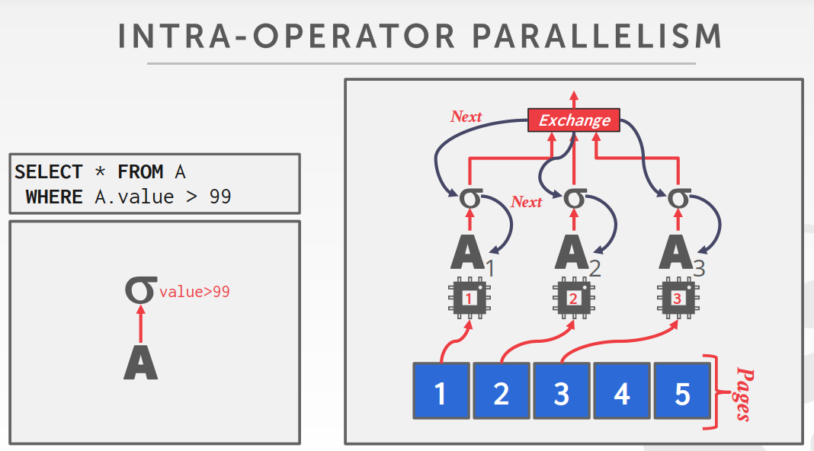</figure>
<!-- /wp:image -->

<!-- wp:heading {"level":5} -->
<h5>Exchange操作符</h5>
<!-- /wp:heading -->

<!-- wp:paragraph -->

<a href="https://docs.microsoft.com/zh-cn/archive/blogs/craigfr/the-parallelism-operator-aka-exchange">参考资料</a>

<!-- /wp:paragraph -->

<!-- wp:paragraph -->

Exchange操作符有三种类型：Gather, Repartition, Distribute

<!-- /wp:paragraph -->

<!-- wp:list -->
<ul><li>Gather将从多个worker处得到的结果合并起来。</li><li>Repartition得到的结果重新划分为多个输出流。</li><li>Distribute将单个输入流划分为多个输出流。</li></ul>
<!-- /wp:list -->

<!-- wp:image -->
<figure class="wp-block-image">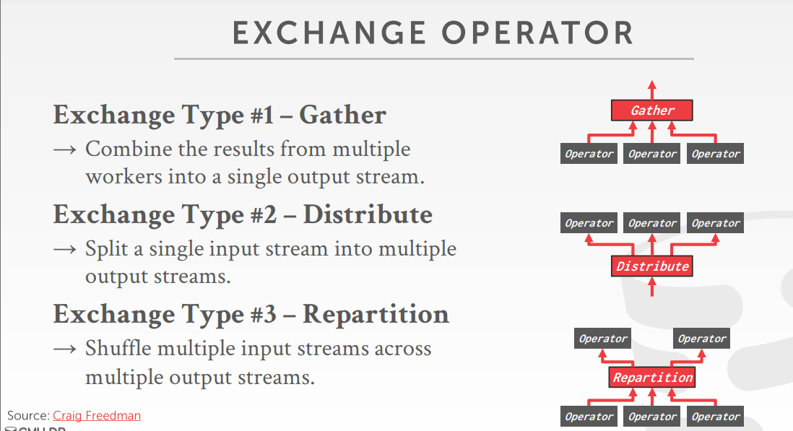</figure>
<!-- /wp:image -->

<!-- wp:image -->
<figure class="wp-block-image">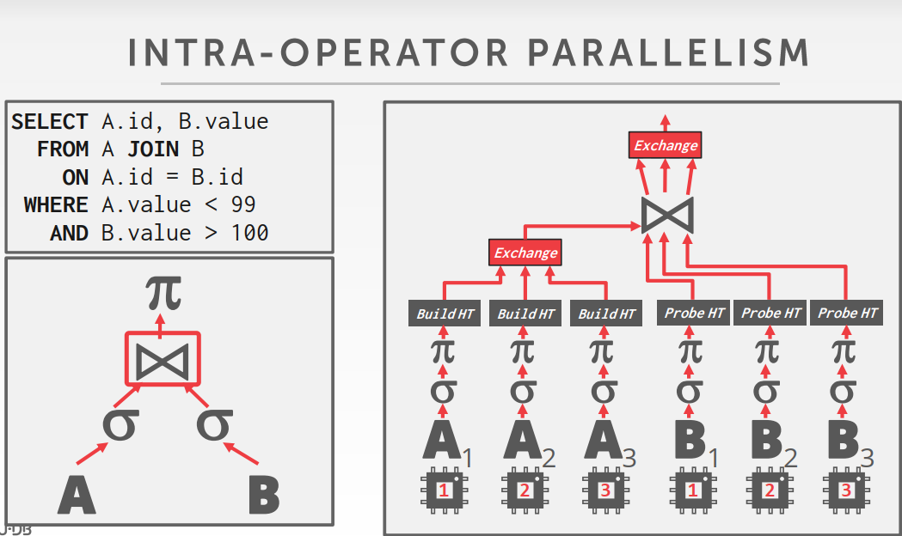</figure>
<!-- /wp:image -->

<!-- wp:heading {"level":4} -->
<h4>Inter-Operator(Vertical)</h4>
<!-- /wp:heading -->

<!-- wp:paragraph -->

多个不同的线程并发执行不同的操作符。但可能造成资源等待。

<!-- /wp:paragraph -->

<!-- wp:image -->
<figure class="wp-block-image">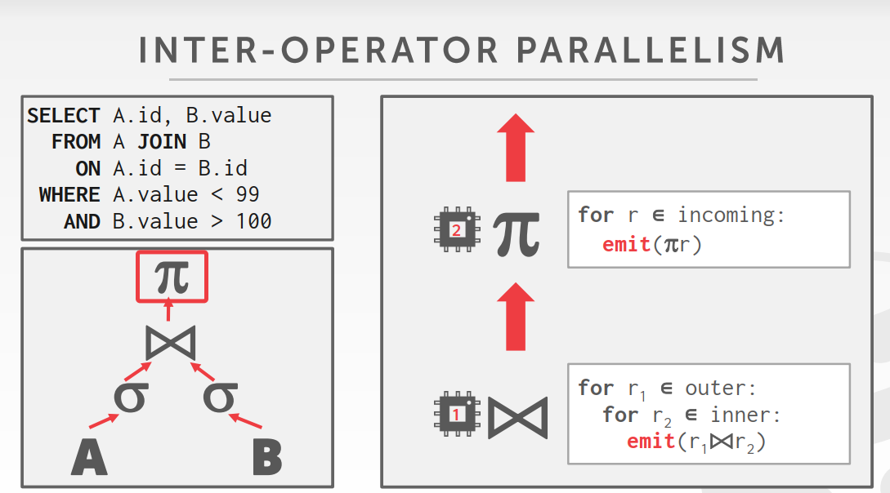</figure>
<!-- /wp:image -->

<!-- wp:paragraph -->

垂直并发和水平并发可以同时使用。

<!-- /wp:paragraph -->

<!-- wp:heading {"level":4} -->
<h4>Bushy Parallelism</h4>
<!-- /wp:heading -->

<!-- wp:paragraph -->

将查询计划分为几个部分，交由不同的worker并发执行，最后进行Exchange。类似于上述两种并行方式的混合。

<!-- /wp:paragraph -->

<!-- wp:image -->
<figure class="wp-block-image">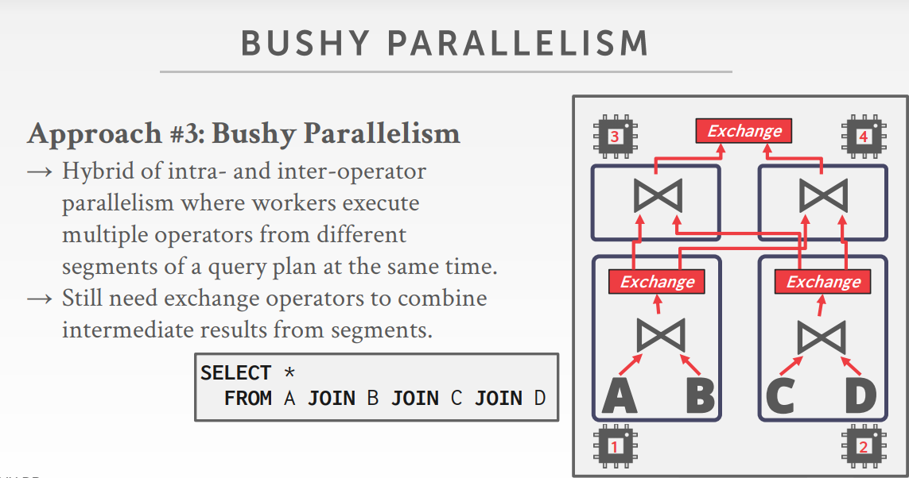</figure>
<!-- /wp:image -->

<!-- wp:heading -->
<h2>I/O Parallelism</h2>
<!-- /wp:heading -->

<!-- wp:paragraph -->

如果存储设备的I/O速度很慢，所有worker都被阻塞，那么并行就会变得没有意义。I/O并行尝试让多个存储设备以单个逻辑设备的形式来为数据库系统提供服务。

<!-- /wp:paragraph -->

<!-- wp:image -->
<figure class="wp-block-image">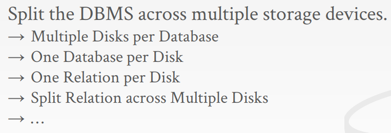</figure>
<!-- /wp:image -->

<!-- wp:heading {"level":3} -->
<h3>Multi-disk Parallelism</h3>
<!-- /wp:heading -->

<!-- wp:heading {"level":4} -->
<h4>RAID0</h4>
<!-- /wp:heading -->

<!-- wp:paragraph -->

器在多个磁盘中存取数据，RAID控制中保存元数据，告诉某一页位于哪个磁盘中。

<!-- /wp:paragraph -->

<!-- wp:image -->
<figure class="wp-block-image">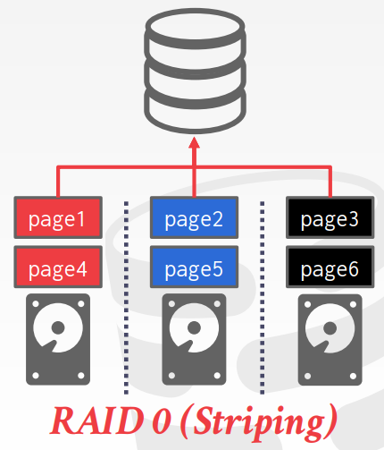</figure>
<!-- /wp:image -->

<!-- wp:heading {"level":4} -->
<h4>RAID1</h4>
<!-- /wp:heading -->

<!-- wp:paragraph -->

所有磁盘都保存同样的信息，实现冗余备份。

<!-- /wp:paragraph -->

<!-- wp:image -->
<figure class="wp-block-image">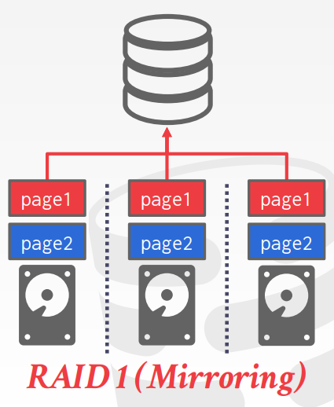</figure>
<!-- /wp:image -->

<!-- wp:heading {"level":3} -->
<h3>Database Partitioning</h3>
<!-- /wp:heading -->

<!-- wp:paragraph -->

将数据库中的数据拆分为不相交的集合，然后将它们分配给离散的磁盘。DBMS可以指定每个数据库在磁盘上的存储位置。

<!-- /wp:paragraph -->

<!-- wp:paragraph -->

在文件系统层面上，只要DBMS将各个数据库保存在不同目录中就可以实现。但如果一个事务可以同时更新多个数据库，可能仍然需要共享恢复日志文件。

<!-- /wp:paragraph -->

<!-- wp:heading {"level":4} -->
<h4>Partitioning</h4>
<!-- /wp:heading -->

<!-- wp:paragraph -->

将单个逻辑表划分为不相交的物理段，以便分开存储。这种划分最好是对应用透明的。

<!-- /wp:paragraph -->

<!-- wp:heading {"level":5} -->
<h5>垂直划分</h5>
<!-- /wp:heading -->

<!-- wp:paragraph -->

将表的属性分割开保存到不同位置，需要保存元组信息以便重构原来的记录。

<!-- /wp:paragraph -->

<!-- wp:image -->
<figure class="wp-block-image">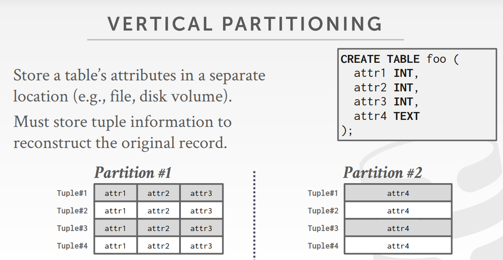</figure>
<!-- /wp:image -->

<!-- wp:heading {"level":5} -->
<h5>水平划分</h5>
<!-- /wp:heading -->

<!-- wp:paragraph -->

根据某个键上的值对表格中的元组划分。

<!-- /wp:paragraph -->

<!-- wp:image -->
<figure class="wp-block-image">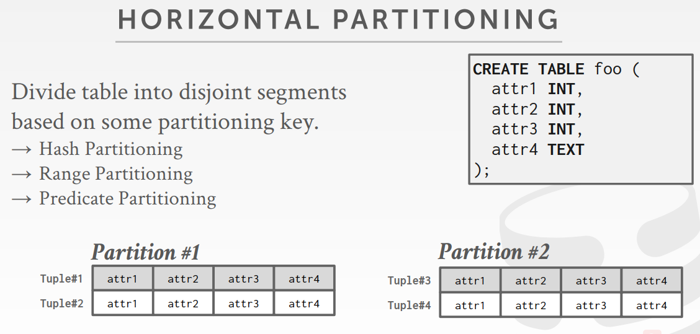</figure>
<!-- /wp:image -->
