<!-- wp:heading -->
<h2>Query Optimization</h2>
<!-- /wp:heading -->

<!-- wp:paragraph -->

查询优化主要有两种策略可以使用：

<!-- /wp:paragraph -->

<!-- wp:heading {"level":4} -->
<h4>Heuristics / Rules</h4>
<!-- /wp:heading -->

<!-- wp:list -->
<ul><li>查询优化器中制订一些规则，当查询触发某个规则时重写查询计划，将愚蠢和低效率的东西（例如<code>0=1</code>）去除。</li><li>可能需要扫描catalog，即数据保存的格式，但不需要检查实际的数据。</li></ul>
<!-- /wp:list -->

<!-- wp:heading {"level":4} -->
<h4>Cost-based Search</h4>
<!-- /wp:heading -->

<!-- wp:list -->
<ul><li>使用一个模型来估算执行计划的开销</li><li>为同一个查询枚举多个查询计划，估算各个计划的开销，然后通过某种智能的方式选择开销最小的。</li></ul>
<!-- /wp:list -->

<!-- wp:paragraph -->

要进行准确的估算，有很大的难度。枚举所有查询计划同样非常困难，因为对于一个执行时间很短的查询，没有必要花费大量时间枚举它的查询计划。

<!-- /wp:paragraph -->

<!-- wp:heading -->
<h2>Architecture</h2>
<!-- /wp:heading -->

<!-- wp:image -->
<figure class="wp-block-image">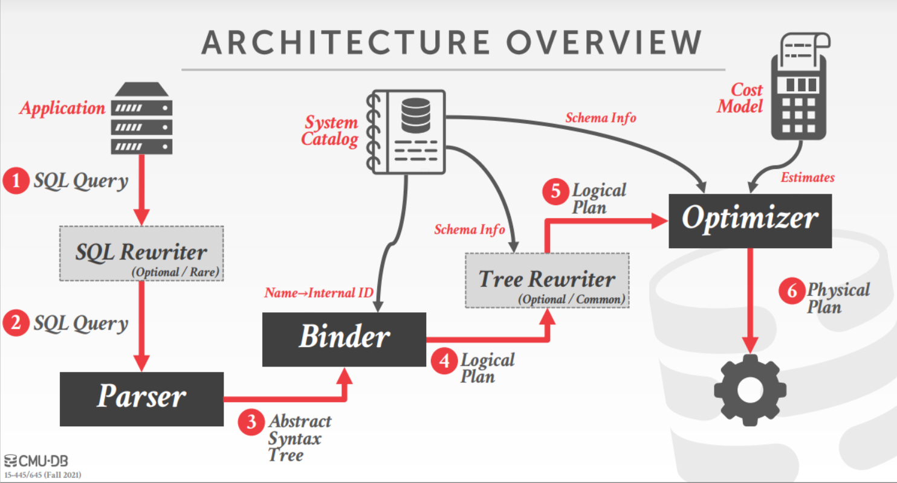</figure>
<!-- /wp:image -->

<!-- wp:heading {"level":4} -->
<h4>SQL Rewriter(Optional)</h4>
<!-- /wp:heading -->

<!-- wp:paragraph -->

对应用给出的SQL语句进行重写，只在分布式数据库系统中比较常见。例如SQL中给出一个名，重写器在表名上加上一些标记，包括该表存储在哪个结点之类的信息。

<!-- /wp:paragraph -->

<!-- wp:heading {"level":4} -->
<h4>SQL Parser</h4>
<!-- /wp:heading -->

<!-- wp:paragraph -->

将SQL字符串转换为抽象语法树。

<!-- /wp:paragraph -->

<!-- wp:heading {"level":4} -->
<h4>Binder</h4>
<!-- /wp:heading -->

<!-- wp:paragraph -->

将SQL查询中引用的明明对象转换为某种内部标识符。这种绑定可以通过查找Catalog实现。Binder输出逻辑计划。逻辑计划是在高级层面指定如何执行查询，例如搜索哪张表、对哪两张表进行Join，但不会指定具体的搜索算法和Join算法。

<!-- /wp:paragraph -->

<!-- wp:heading {"level":4} -->
<h4>Tree Rewriter(Optional)</h4>
<!-- /wp:heading -->

<!-- wp:paragraph -->

制定一些静态规则对逻辑计划的语法树进行重写。这一步同样需要查找catalog。

<!-- /wp:paragraph -->

<!-- wp:heading {"level":4} -->
<h4>Optimizer</h4>
<!-- /wp:heading -->

<!-- wp:paragraph -->

优化器中使用模型对逻辑计划进行评估，并生成物理计划，即数据库实际执行查询的计划。

<!-- /wp:paragraph -->

<!-- wp:heading -->
<h2>Heuristics</h2>
<!-- /wp:heading -->

<!-- wp:paragraph -->

查询优化是数据库系统中最难的部分，是NP-Hard问题。目前有人开始尝试使用机器学习来改进优化器的准确率的效率。在2000年DB2已经开始尝试将基于机器学习的查询优化器集成到商业系统，称为Leo，但性能非常差。更多细节会在721中介绍。

<!-- /wp:paragraph -->

<!-- wp:heading {"level":3} -->
<h3>关系代数等价式</h3>
<!-- /wp:heading -->

<!-- wp:paragraph -->

如果两个关系代数式产生两个相同的元组集合，则称这两个关系代数式是等价的。通过调整关系代数式中操作的顺序产生更高效的查询计划，这一步通常在<code>query rewriting</code>中完成。

<!-- /wp:paragraph -->

<!-- wp:list -->
<ul><li>尽早进行过滤操作</li><li>对选择条件重新排序，先执行排除率高的操作</li><li>将复杂的条件分解为多个条件，并尽可能降成本低的操作下移</li><li>简化条件，例如(X=Y AND Y=3)可以替换为(X=3 AND Y=3)</li></ul>
<!-- /wp:list -->

<!-- wp:heading {"level":4} -->
<h4>操作下移</h4>
<!-- /wp:heading -->

<!-- wp:paragraph -->

常见的优化方式是将过滤操作放到Join操作之前，过滤后参与到Join中的元组数量更少，效率更高。但有时候过滤操作成本很高，在Join后产生的少量数据上作过滤效率更好，这时候是否下需要移由成本模型决定。大部分情况下都可以将过滤操作下移。

<!-- /wp:paragraph -->

<!-- wp:image -->
<figure class="wp-block-image">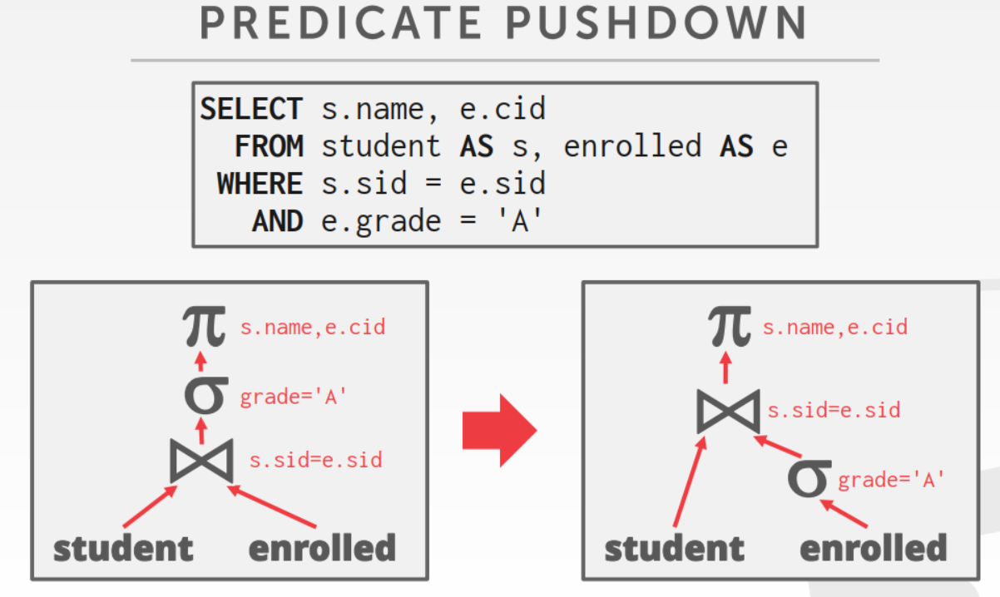</figure>
<!-- /wp:image -->

<!-- wp:image -->
<figure class="wp-block-image">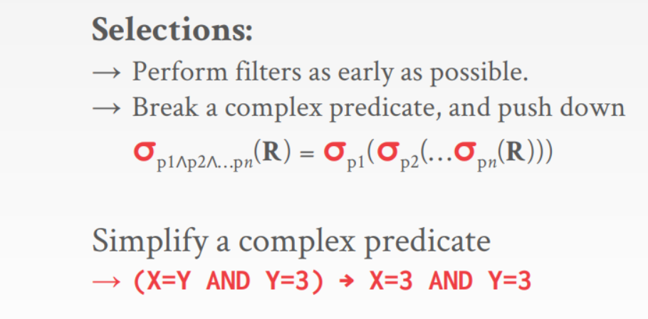</figure>
<!-- /wp:image -->

<!-- wp:image -->
<figure class="wp-block-image">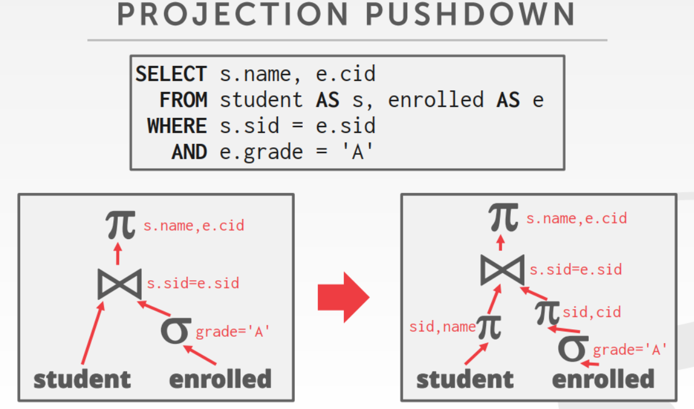</figure>
<!-- /wp:image -->

<!-- wp:heading {"level":3} -->
<h3>逻辑计划优化</h3>
<!-- /wp:heading -->

<!-- wp:heading {"level":4} -->
<h4>分解复杂条件</h4>
<!-- /wp:heading -->

<!-- wp:paragraph -->

当一个操作条件非常复杂时，不利于优化器将操作符下移。因此考虑将复杂的条件分解为简单条件，然后将操作移向下层。 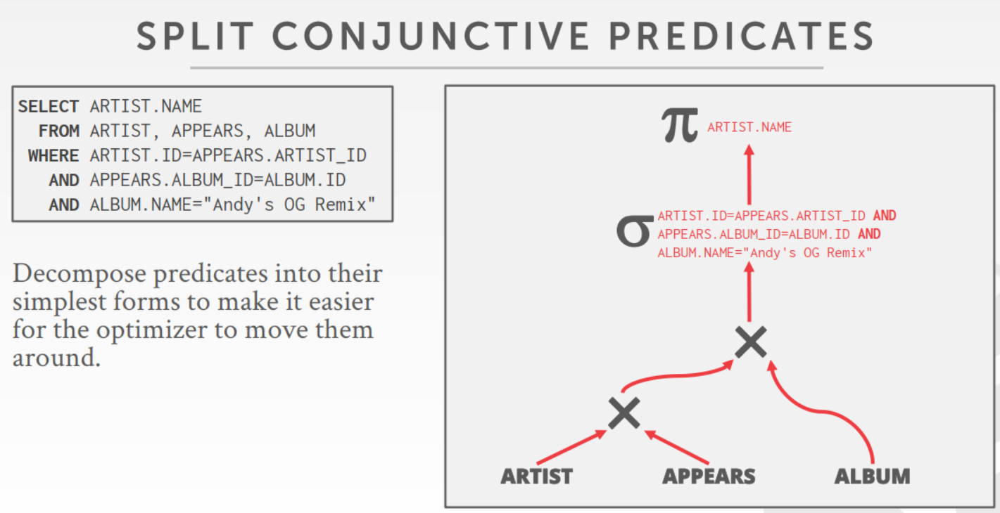 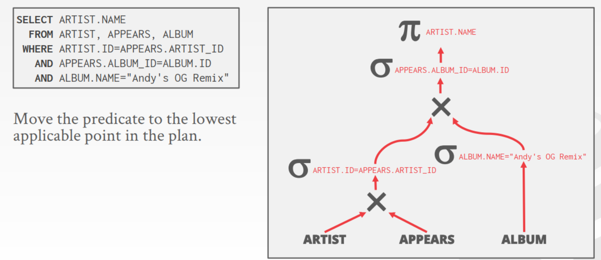

<!-- /wp:paragraph -->

<!-- wp:heading {"level":4} -->
<h4>替换笛卡尔积</h4>
<!-- /wp:heading -->

<!-- wp:paragraph -->

当笛卡尔积操作之后有过滤操作时，可以考虑将笛卡尔积和过滤替换为等价的<code>inner join</code> 。 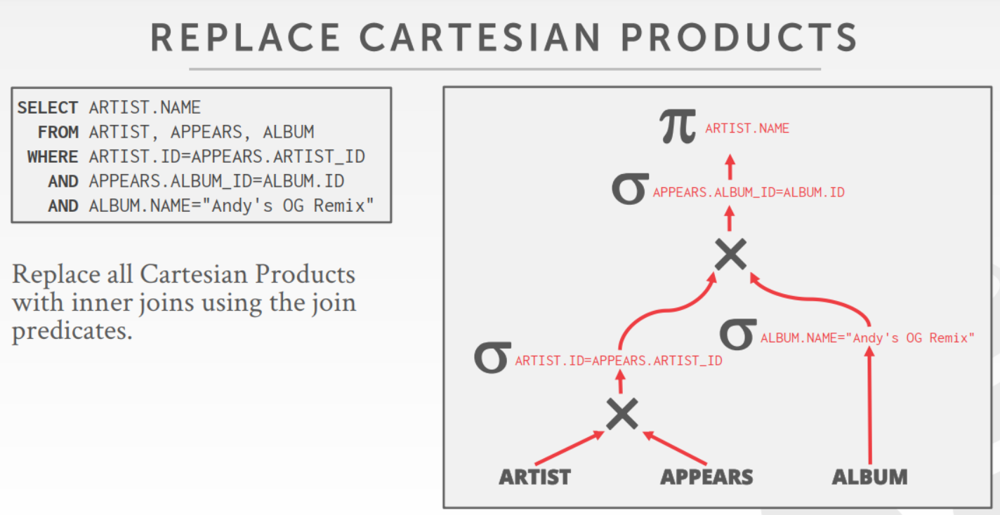

<!-- /wp:paragraph -->

<!-- wp:image -->
<figure class="wp-block-image">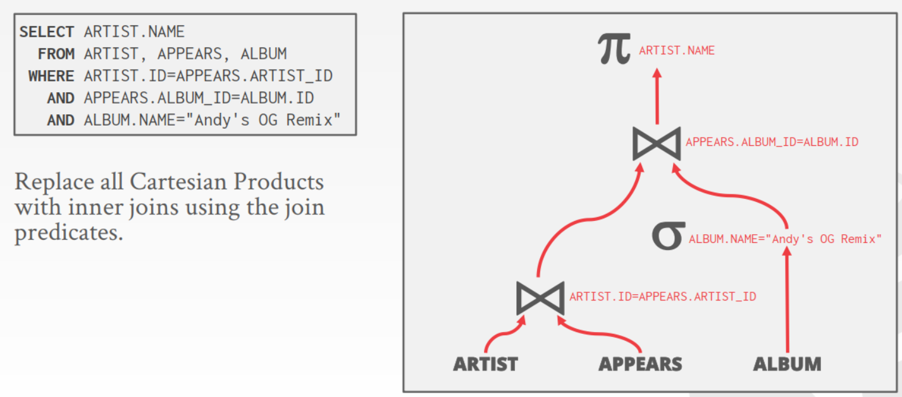</figure>
<!-- /wp:image -->

<!-- wp:heading {"level":4} -->
<h4>投影下移</h4>
<!-- /wp:heading -->

<!-- wp:paragraph -->

下层向上层传递数据时，有些属性可能是没用的。因此可以通过添加投影操作，过滤掉上层不需要的属性。 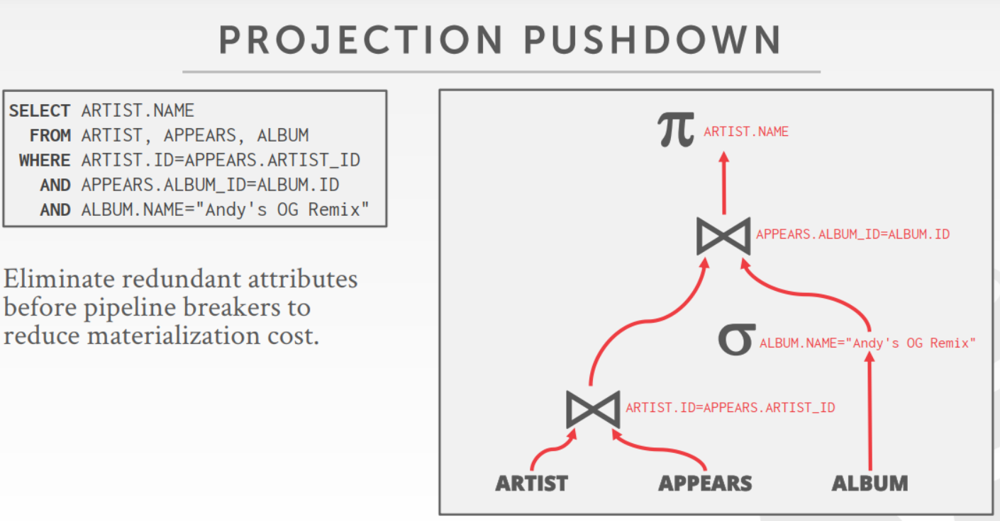 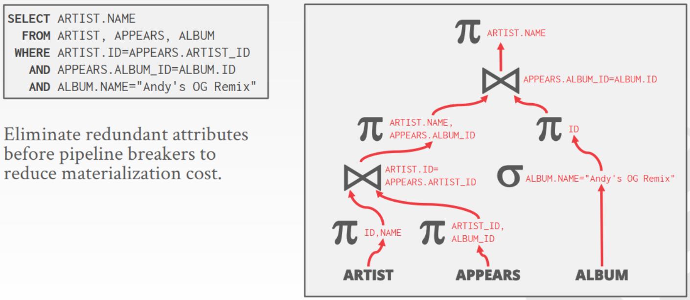

<!-- /wp:paragraph -->

<!-- wp:heading -->
<h2>Cost Estimation</h2>
<!-- /wp:heading -->

<!-- wp:paragraph -->

一个有n个表参与的join操作，可能的排列顺序有<code>4^n</code>种（卡塔兰数），因此使用穷举法进行比较会非常慢。为了减少搜索空间，需要成本预估模型预估这些操作所需的工作量。

<!-- /wp:paragraph -->

<!-- wp:paragraph -->

在成本估算模型中有以下三个假设：

<!-- /wp:paragraph -->

<!-- wp:list -->
<ul><li>数据是均匀分布的</li><li>每个选择条件相互独立</li><li>join操作时，内表的每一个值在外表中都能找到对应。 这三个假设与实际情况会有出入，造成估算误差。第一个假设带来的问题可以通过<code>heavy hitter</code>方法解决。在一些高端数据库中，会对相关联的列进行统计，减少假设二带来的误差。</li></ul>
<!-- /wp:list -->

<!-- wp:paragraph -->

MongoDB中没有成本预估模型，实际操作时会同时运行多个不同的查询计划，哪个先返回就取哪一个。

<!-- /wp:paragraph -->

<!-- wp:heading {"level":3} -->
<h3>Statistics</h3>
<!-- /wp:heading -->

<!-- wp:paragraph -->

DBMS在内部catalog中保存表的统计数据、属性和索引。这些统计数据需要定期进行更新。statistics catalog是数据库做成本估计的基础模块。

<!-- /wp:paragraph -->

<!-- wp:paragraph -->

对于每一个关系R，DBMS维护以下这些信息：

<!-- /wp:paragraph -->

<!-- wp:list -->
<ul><li>N：R中元组的数量</li><li>V(A, R): 每个属性中不相同的值的数量</li></ul>
<!-- /wp:list -->

<!-- wp:paragraph -->

根据上述两个信息，可以定义一个<strong>选择基数</strong><code>SC(A, R) = N / V(A, R)</code>，即每个可能取到的值会出现的平均次数。这个函数假设数据是均匀的。

<!-- /wp:paragraph -->

<!-- wp:heading {"level":3} -->
<h3>Plan Cost Estimation</h3>
<!-- /wp:heading -->

<!-- wp:paragraph -->

成本估计需要考量CPU、磁盘、内存，对于分布式数据库还需要考虑网络等因素。面向磁盘的数据库中I/O是数据库的主要瓶颈，磁盘和内存的处理速度相差400倍。因此会考虑采用CPU和内存占用率更高的算法减少I/O次数。但对于内存数据库，由于不涉及外存I/O，又会希望CPU和内存占用率尽可能低。通常来说，由于各个系统硬件规格不一，我们将查询需要访问的元组数量作为成本中的参考值。

<!-- /wp:paragraph -->

<!-- wp:paragraph -->

通过选择基数估算每个操作符之间传递的元组数量。当我们在一个unique键上操作时，很容易知道V(A, R)为1，这时候估算比较简单。但是当我们进行复杂操作，例如范围查询、交并集等时，就需要特别的方式。

<!-- /wp:paragraph -->

<!-- wp:paragraph -->

基于选择基数，我们可以计算出某个条件的选择率（sel），即表中符合条件的元组占比。注意这些估算通常会低估。

<!-- /wp:paragraph -->

<!-- wp:paragraph -->

A = constant时：

<!-- /wp:paragraph -->

<!-- wp:code -->
<pre class="wp-block-code"><code>sel(A=constant) = SC(A, R) / N</code></pre>
<!-- /wp:code -->

<!-- wp:image -->
<figure class="wp-block-image">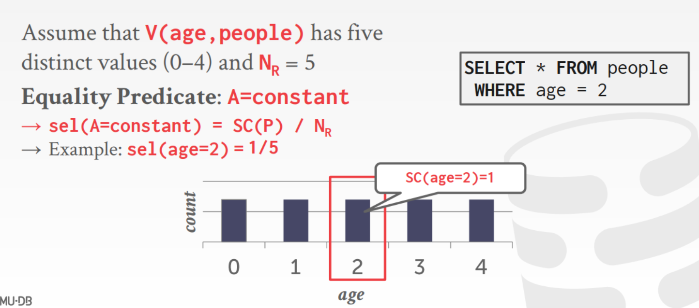</figure>
<!-- /wp:image -->

<!-- wp:paragraph -->

A >= constant时：

<!-- /wp:paragraph -->

<!-- wp:code -->
<pre class="wp-block-code"><code>sel(A>=a) = (A_max - a + 1) / (A_max - A_min + 1)</code></pre>
<!-- /wp:code -->

<!-- wp:image -->
<figure class="wp-block-image">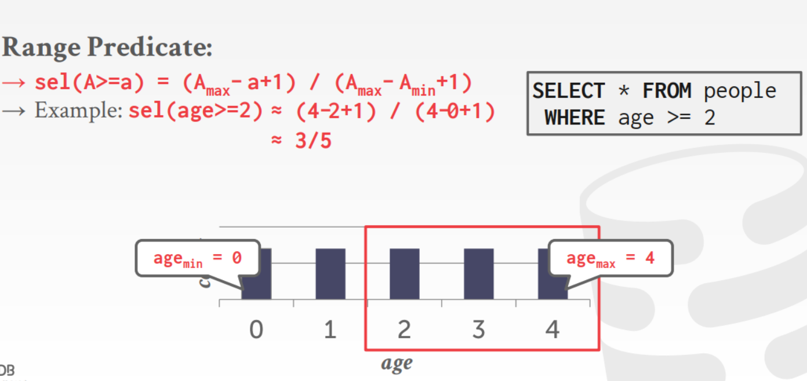</figure>
<!-- /wp:image -->

<!-- wp:paragraph -->

not P:

<!-- /wp:paragraph -->

<!-- wp:code -->
<pre class="wp-block-code"><code>sel(not P) = 1 - sel(P) </code></pre>
<!-- /wp:code -->

<!-- wp:image -->
<figure class="wp-block-image">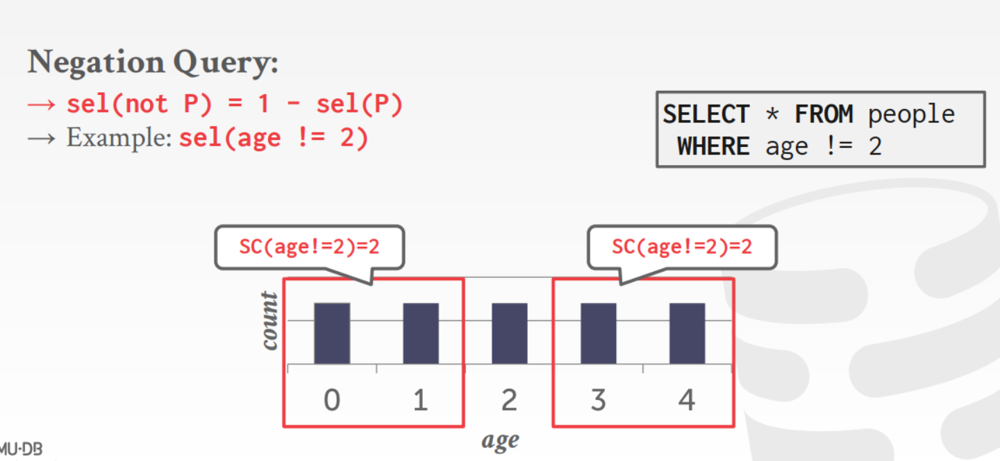</figure>
<!-- /wp:image -->

<!-- wp:paragraph -->

由于上述估算方法都是基于概率的，因此可以通过概率方法将他们组合成更复杂的公式。例如两个条件取交集或并集后的选择率，通常我们假设各个选择率之间是独立的。

<!-- /wp:paragraph -->

<!-- wp:heading {"level":4} -->
<h4>组合条件的选择率计算</h4>
<!-- /wp:heading -->

<!-- wp:image -->
<figure class="wp-block-image">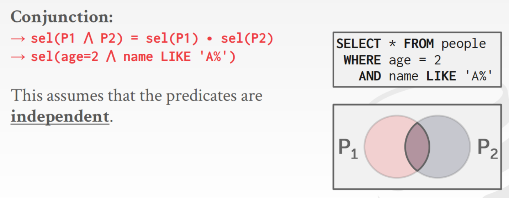</figure>
<!-- /wp:image -->

<!-- wp:image -->
<figure class="wp-block-image">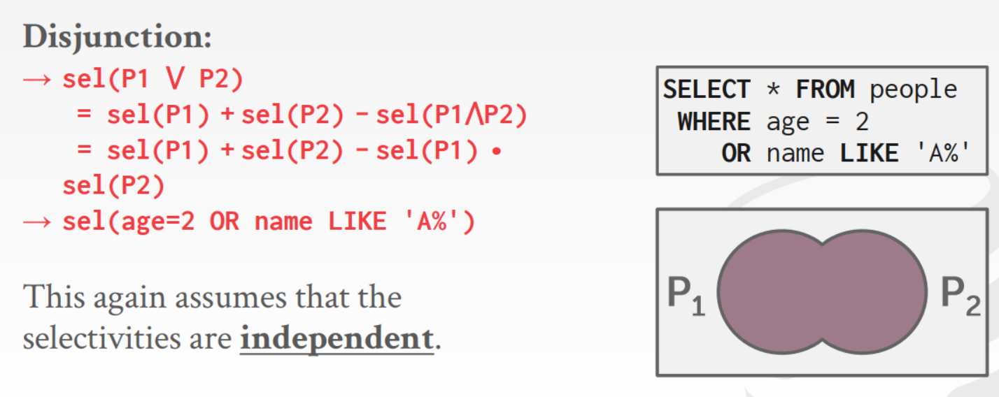</figure>
<!-- /wp:image -->

<!-- wp:heading {"level":4} -->
<h4>优化措施</h4>
<!-- /wp:heading -->

<!-- wp:heading {"level":5} -->
<h5>直方图</h5>
<!-- /wp:heading -->

<!-- wp:paragraph -->

为了统计每个值出现的次数，最简单的方法是每个特定的值出现的次数都以直方图的形式保存下来。但是当数据量特别大的时候，statistics的大小也会随之增大。为了节省一部分内存空间，可以将相邻的n个值的出现次数相加，以等宽直方图或等高直方图两种方式保存。

<!-- /wp:paragraph -->

<!-- wp:paragraph -->

<strong>等宽直方图</strong> 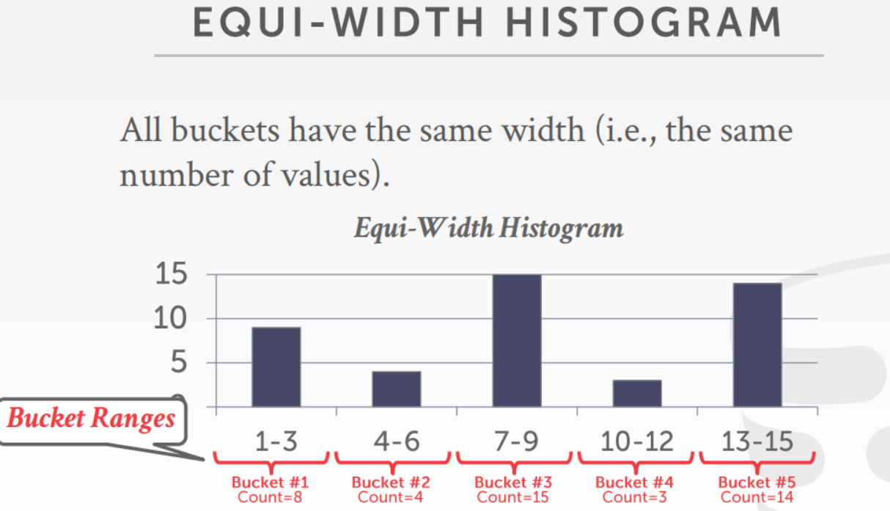 <strong>等高直方图</strong> 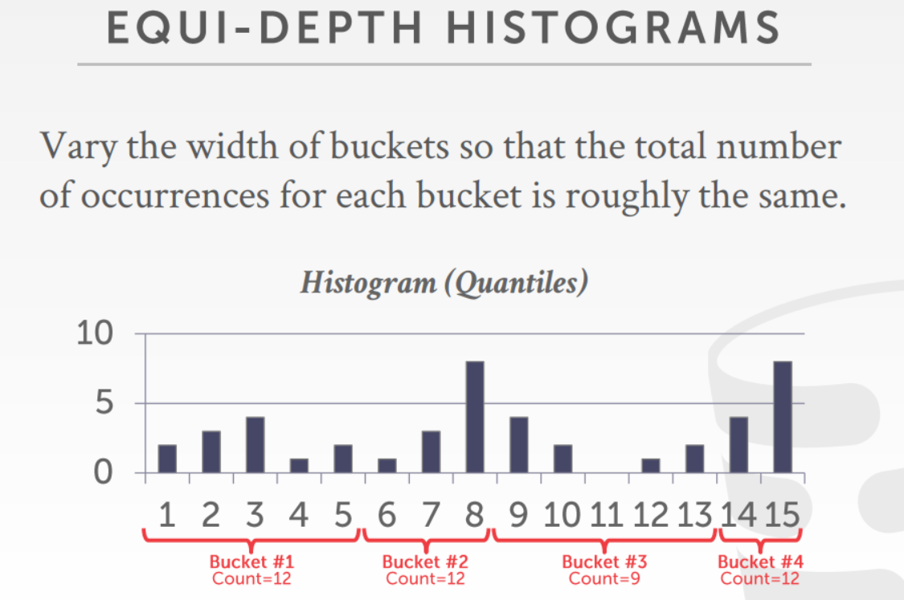 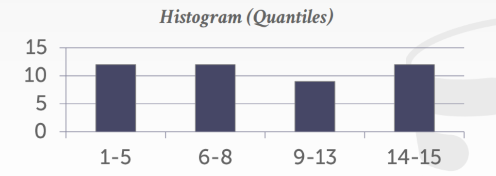

<!-- /wp:paragraph -->

<!-- wp:heading {"level":5} -->
<h5>sketch</h5>
<!-- /wp:heading -->

<!-- wp:paragraph -->

<a href="https://en.wikipedia.org/wiki/Count%E2%80%93min_sketch">Count-Min Sketch(1988)</a> <a href="https://en.wikipedia.org/wiki/HyperLogLog">HyperLogLog(2007)</a>

<!-- /wp:paragraph -->

<!-- wp:heading {"level":5} -->
<h5>采样法</h5>
<!-- /wp:heading -->

<!-- wp:paragraph -->

另外，可以通过采样统计方法得到统计信息。从表中随机抽取一部分作为样本，在样本上计算出选择率用作成本估计。数据库定期刷新抽取的样本。如何抽取样本是一个值得探究的问题。

<!-- /wp:paragraph -->

<!-- wp:paragraph -->

SQL Server将两种方法都结合起来，实际效果表明效果很好。当查询比较简单，系统估计运行时间不长时，直接使用直方图法。若系统估计运行时间会较长，则会花费额外的时间进行采样估计。

<!-- /wp:paragraph -->

<!-- wp:heading {"level":3} -->
<h3>Join操作的结果集大小估算</h3>
<!-- /wp:heading -->

<!-- wp:paragraph -->

给定两个表R和S，返回结果集的大小有可能是多少？我们假设内表中的值都会在外表中出现。 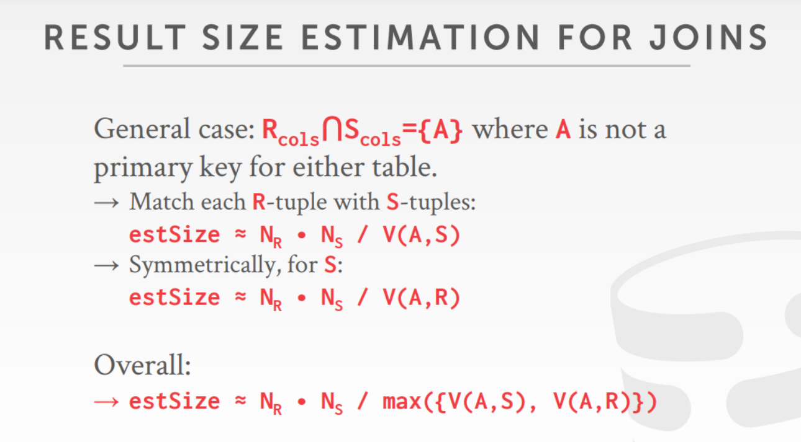

<!-- /wp:paragraph -->

<!-- wp:heading {"level":3} -->
<h3>Plan Enumeration</h3>
<!-- /wp:heading -->

<!-- wp:heading {"level":4} -->
<h4>Simple-relation Query Planning</h4>
<!-- /wp:heading -->

<!-- wp:paragraph -->

OLTP查询的查询计划制定是相对比较容易的，因为通常都Sargable(Search Argument Able)。

<!-- /wp:paragraph -->

<!-- wp:list -->
<ul><li>只需找到选择率最高的索引</li><li>通常情况下都是在外键上执行Join</li><li>可以采用启发式方法</li></ul>
<!-- /wp:list -->

<!-- wp:heading {"level":4} -->
<h4>Multi-relation Query Planning</h4>
<!-- /wp:heading -->

<!-- wp:paragraph -->

但是随着参与Join操作的表的数量增加，可选的计划也随之剧增。1970年IBM的技术人员提出了<em>动态编程</em>，通过将大问题分解为小问题，以简化问题规模。

<!-- /wp:paragraph -->

<!-- wp:heading {"level":4} -->
<h4>Candidate Plan Example</h4>
<!-- /wp:heading -->

<!-- wp:paragraph -->

通过以下四步产生候选计划集合：

<!-- /wp:paragraph -->

<!-- wp:list -->
<ul><li>枚举关系顺序</li><li>枚举Join算法</li><li>枚举访问方式</li></ul>
<!-- /wp:list -->

<!-- wp:paragraph -->

当涉及的表不多时，PostgresSQL采用动态编程的方法。当表比较多时，会采用遗传算法。

<!-- /wp:paragraph -->

<!-- wp:image -->
<figure class="wp-block-image">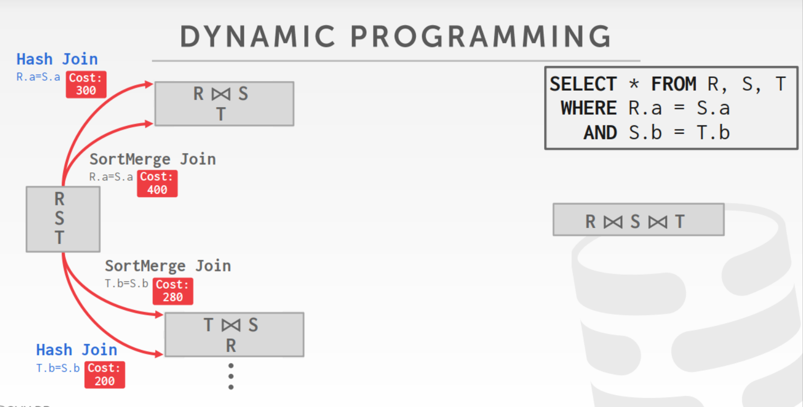</figure>
<!-- /wp:image -->

<!-- wp:image -->
<figure class="wp-block-image">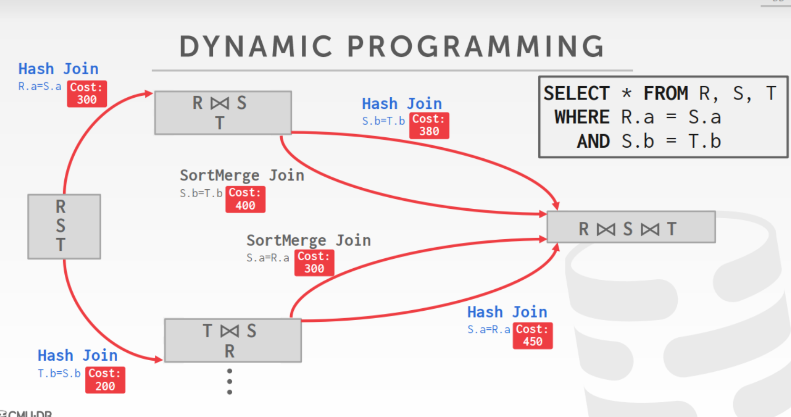</figure>
<!-- /wp:image -->

<!-- wp:image -->
<figure class="wp-block-image">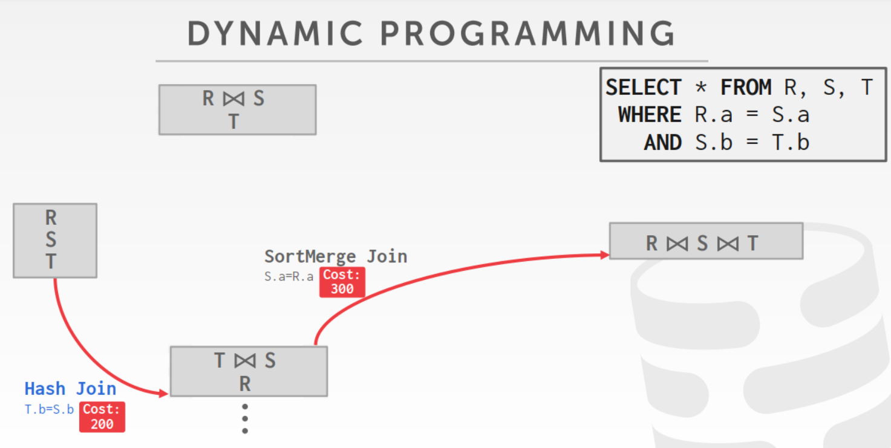</figure>
<!-- /wp:image -->

<!-- wp:heading {"level":3} -->
<h3>Nested Sub-queries</h3>
<!-- /wp:heading -->

<!-- wp:paragraph -->

可以采取两种方法对嵌套子查询进行优化：

<!-- /wp:paragraph -->

<!-- wp:heading {"level":4} -->
<h4>重写法</h4>
<!-- /wp:heading -->

<!-- wp:paragraph -->

将查询重写，对查询进行扁平化。 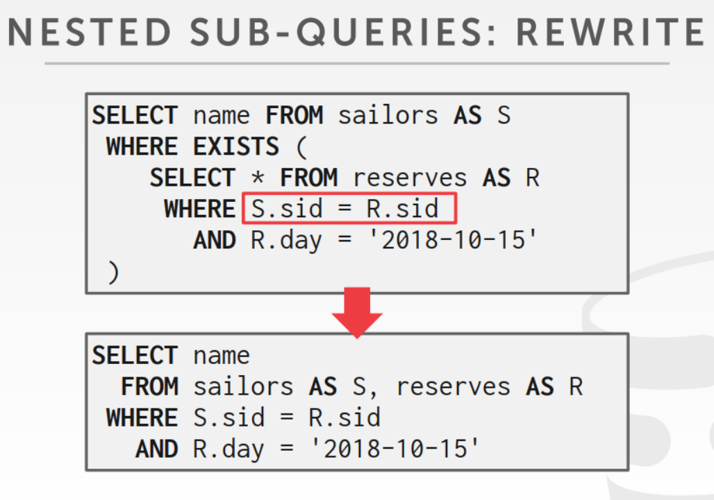

<!-- /wp:paragraph -->

<!-- wp:heading {"level":4} -->
<h4>分解查询法</h4>
<!-- /wp:heading -->

<!-- wp:paragraph -->

将子查询分解出来作为一个单独的查询，将结果存储为临时表供外部查询使用。 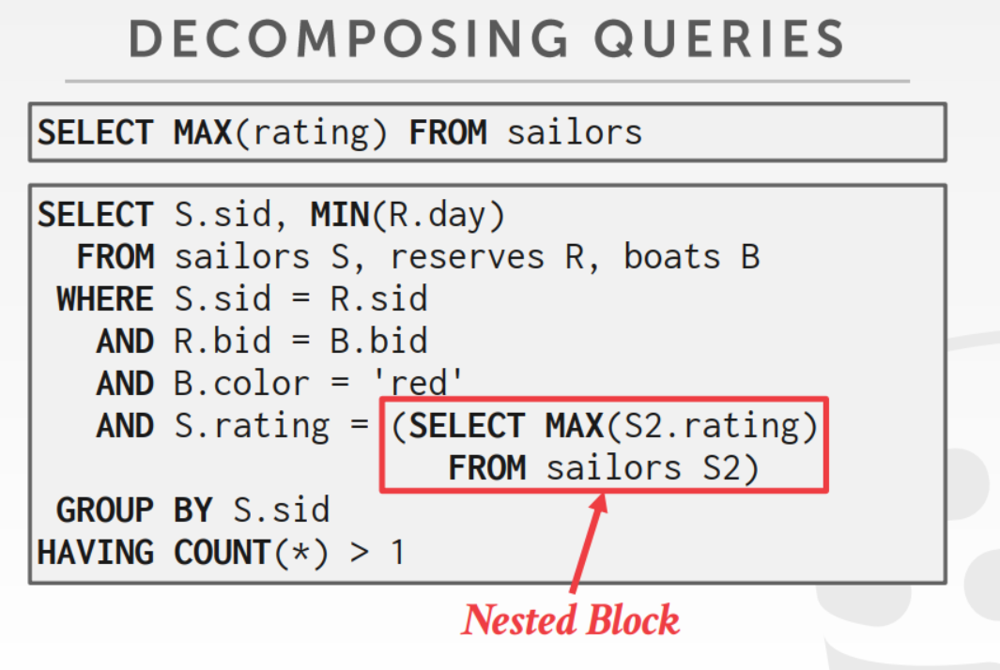 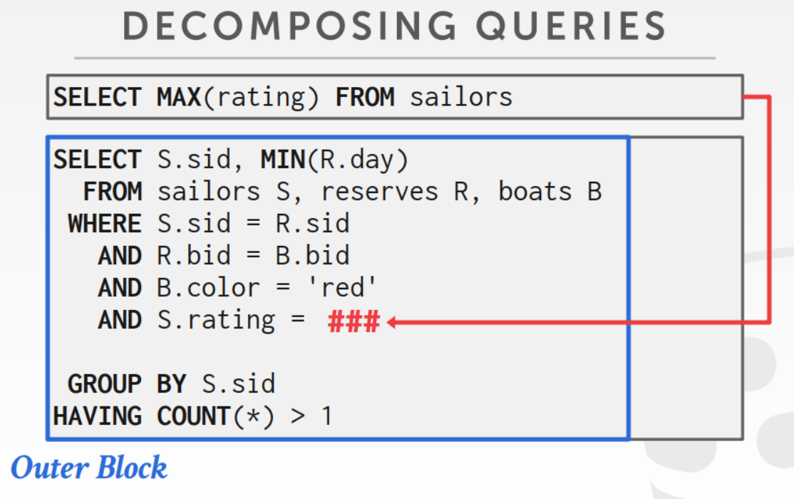

<!-- /wp:paragraph -->
