<!-- wp:heading -->
<h2>并发控制协议</h2>
<!-- /wp:heading -->

<!-- wp:paragraph -->

并发控制和恢复组件是DBMS架构中的重要组成部分，保证了多个事务之间并发执行的正确性和遇到异常后可以数据不丢失。

<!-- /wp:paragraph -->

<!-- wp:image -->
<figure class="wp-block-image">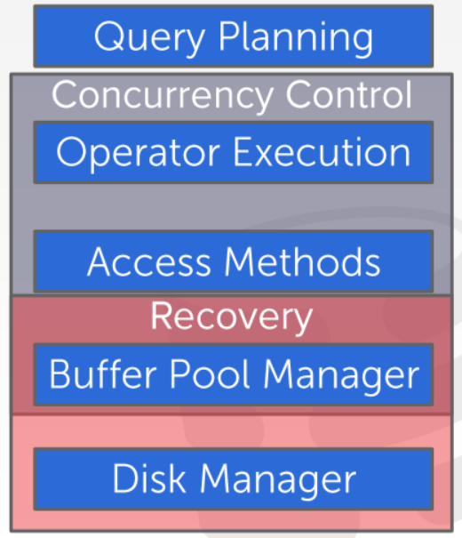</figure>
<!-- /wp:image -->

<!-- wp:paragraph -->

事务是在数据库中执行的一连串不可分割的操作。由于数据库只关心对哪些数据对象进行读写，因此事务可以看作一连串的读写操作。事务以<code>BEGIN</code>命令开始，<code>COMMIT</code>或<code>ABORT</code>结束。接收到<code>COMMIT</code>命令后DBMS保留所有的修改或将所有修改撤销，<code>ABORT</code>命令将所有修改撤销。

<!-- /wp:paragraph -->

<!-- wp:heading -->
<h2>ACID</h2>
<!-- /wp:heading -->

<!-- wp:heading {"level":3} -->
<h3>Atomicity</h3>
<!-- /wp:heading -->

<!-- wp:paragraph -->

原子性：指事务的所有操作或者全部成功，如果一个不成功则前面的操作也视为无效。

<!-- /wp:paragraph -->

<!-- wp:heading {"level":4} -->
<h4>Logging</h4>
<!-- /wp:heading -->

<!-- wp:paragraph -->

DBMS将执行过的所有操作保存到日志中，需要<code>ABORT</code>时通过日志找到需要撤销的操作。日志会被保存在内存和磁盘中。

<!-- /wp:paragraph -->

<!-- wp:heading {"level":4} -->
<h4>Shadow Paging</h4>
<!-- /wp:heading -->

<!-- wp:paragraph -->

在磁盘上复制被修改的页面副本，如果事务成功执行，则将原来的页替换为修改后的副本。由于不能进行循序访问，会产生磁盘碎片，而且每次都会伴随一个复制操作，这种方式效率比较低下。SystemR采用这种方式，现代数据库系统很少使用。

<!-- /wp:paragraph -->

<!-- wp:heading {"level":3} -->
<h3>Consistency</h3>
<!-- /wp:heading -->

<!-- wp:paragraph -->

如果数据库在事务开始执行时处于正确的状态，事务结束后仍处于正确状态，则称事务保持了一致性。一致性包括<strong>数据库一致性</strong>以及<strong>事务一致性</strong>，数据库一致性通过完整性约束实现，事务一致性由上层应用保证。

<!-- /wp:paragraph -->

<!-- wp:heading {"level":3} -->
<h3>Isolation</h3>
<!-- /wp:heading -->

<!-- wp:paragraph -->

如果用户提交了多个事务，我们希望这些事务运行时各自之间不会相互影响，并且无论这些事务以什么样的顺序执行，最终的结果都和单线程执行得到的结果一样。

<!-- /wp:paragraph -->

<!-- wp:paragraph -->

DBMS中通过并发控制协议实现多个事务之间的隔离性。并发控制协议可以分为<strong>悲观</strong>和<strong>乐观</strong>两类。

<!-- /wp:paragraph -->

<!-- wp:heading {"level":4} -->
<h4>隔离级别</h4>
<!-- /wp:heading -->

<!-- wp:paragraph -->

可串行性保证了事务并发运行时的一致性，但降低了并发度。DBMS提供多种可选的隔离级别，以获得更高的并发度。但更弱的隔离级别需要程序员在上层保证一致性。

<!-- /wp:paragraph -->

<!-- wp:paragraph -->

<strong>可串行化：</strong>保证可串行化调度。

<!-- /wp:paragraph -->

<!-- wp:paragraph -->

<strong>可重复读：</strong>保证可重复读，只允许读取已提交的数据，且一个事务两次读取同一个数据期间其他事务不得更新该数据。但不要求事务之间可串行化。

<!-- /wp:paragraph -->

<!-- wp:paragraph -->

<strong>已提交读：</strong>只允许读取已提交数据，不要求可重复读。

<!-- /wp:paragraph -->

<!-- wp:paragraph -->

<strong>未提交读：</strong>允许读取未提交数据。

<!-- /wp:paragraph -->

<!-- wp:heading {"level":4} -->
<h4>事务调度</h4>
<!-- /wp:heading -->

<!-- wp:paragraph -->

如果几个事务以不同的顺序执行，并且执行结果相等，则称这几个顺序是等价调度。

<!-- /wp:paragraph -->

<!-- wp:paragraph -->

如果两个事务需要操作同一个对象，并且其中一个操作是写，则这两个事务存在冲突。

<!-- /wp:paragraph -->

<!-- wp:paragraph -->

<strong>不可重复读(R-W冲突)</strong>： 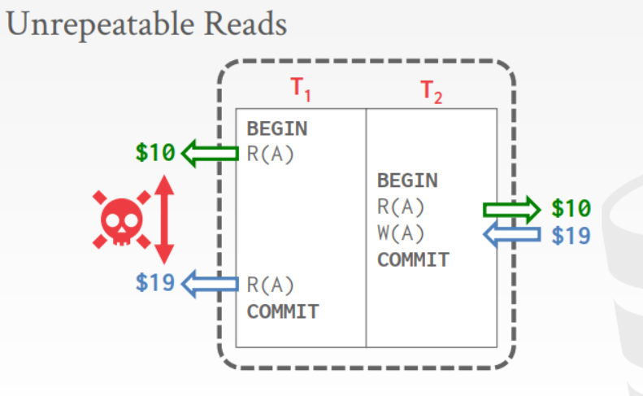

<!-- /wp:paragraph -->

<!-- wp:paragraph -->

<strong>脏读(W-R冲突)</strong>： 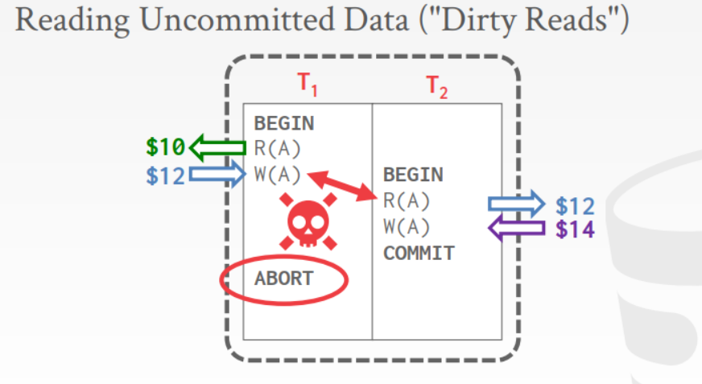

<!-- /wp:paragraph -->

<!-- wp:paragraph -->

<strong>W-W冲突（W-W冲突)</strong>： 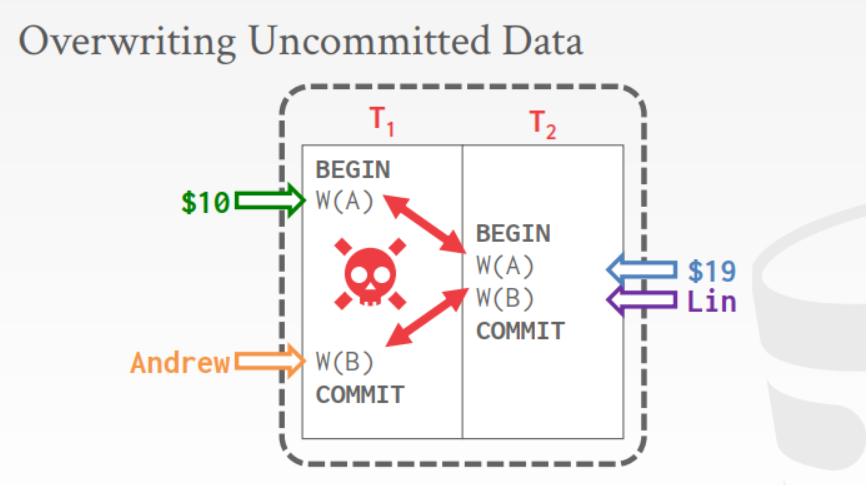

<!-- /wp:paragraph -->

<!-- wp:heading {"level":4} -->
<h4>依赖图</h4>
<!-- /wp:heading -->

<!-- wp:paragraph -->

涉及多个事务的调度会产生很多种可能，依赖图可以帮助我们快速判别调度是否是可串行的。每个事务在依赖图中都是一个顶点。如果两个事务存在依赖关系，即存在两个操作对同一个操作执行写，必须先执行<code>T_i</code>再执行<code>T_j</code>，则在依赖图中画一条从<code>i</code>到<code>j</code>的边。只要存在一个环，则该调度是不可串行化的。

<!-- /wp:paragraph -->

<!-- wp:image -->
<figure class="wp-block-image">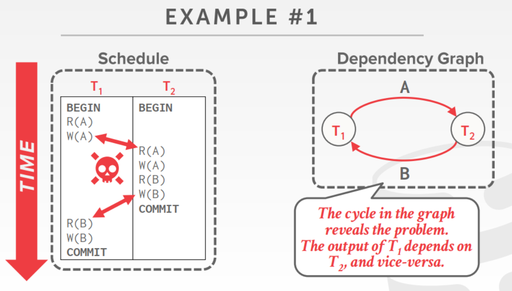</figure>
<!-- /wp:image -->

<!-- wp:image -->
<figure class="wp-block-image">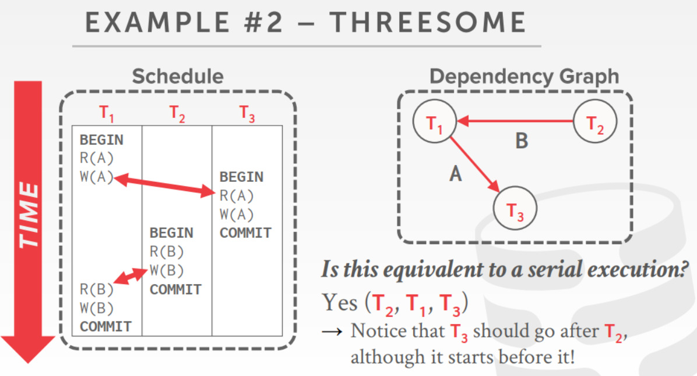</figure>
<!-- /wp:image -->

<!-- wp:embed {"url":"https://zhuanlan.zhihu.com/p/57579023"} -->
<figure class="wp-block-embed">

https://zhuanlan.zhihu.com/p/57579023

</figure>
<!-- /wp:embed -->

<!-- wp:heading {"level":3} -->
<h3>conflict serializability</h3>
<!-- /wp:heading -->

<!-- wp:paragraph -->

如果多个事务可以顺序执行，事务之间的操作不会交替，则称该调度是<strong>可串行的</strong>。只要各个事务各自的一致性得到保证，则实现整个串行调度的一致性。

<!-- /wp:paragraph -->

<!-- wp:paragraph -->

<strong>冲突可串行：</strong> 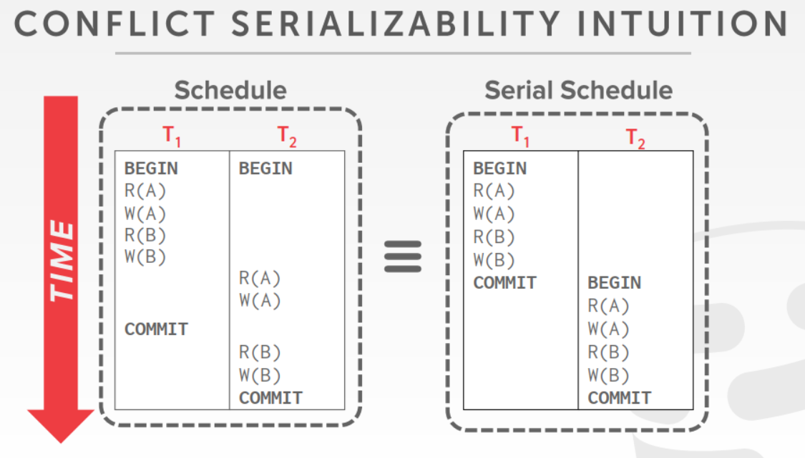

<!-- /wp:paragraph -->

<!-- wp:paragraph -->

<strong>冲突不可串行：</strong> 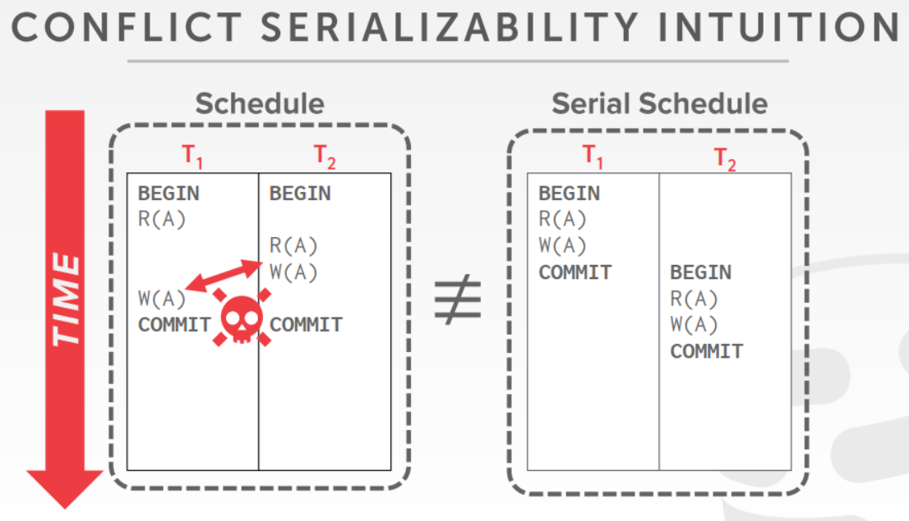

<!-- /wp:paragraph -->

<!-- wp:heading {"level":3} -->
<h3>View Serializability</h3>
<!-- /wp:heading -->

<!-- wp:paragraph -->

假设现在有两个调度<code>S_1</code>和<code>S_2</code>需要在<code>A</code>上执行一个冲突操作，只要保证：

<!-- /wp:paragraph -->

<!-- wp:list -->
<ul><li>两个调度能正确地读取A的初始值</li><li>在<code>S_1</code>中事务<code>T_1</code>在<code>T_2</code>写后读，则在<code>S_2</code>中也保持相同的顺序。</li><li>如果<code>T_1</code>在<code>S_1</code>中对A执行最后的写入，则<code>S_2</code>中也同样在最后写入。</li></ul>
<!-- /wp:list -->

<!-- wp:paragraph -->

即只要保证两个调度开始和结束的状态一样，就满足视图可串行化。

<!-- /wp:paragraph -->

<!-- wp:image -->
<figure class="wp-block-image">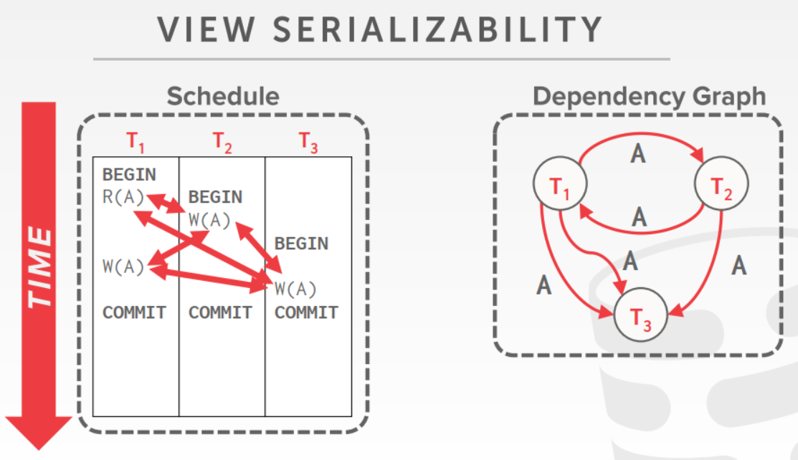</figure>
<!-- /wp:image -->

<!-- wp:image -->
<figure class="wp-block-image">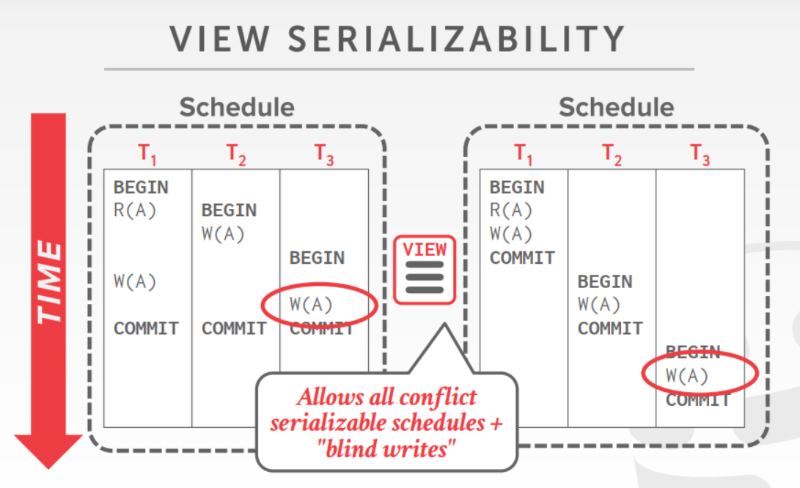</figure>
<!-- /wp:image -->

<!-- wp:paragraph -->

视图可串行要求DBMS知道各个事务中会执行什么样的操作，但实际上DBMS无法预测一个client要执行的所有操作，因为事务除了包括SQL语句，还包括编程语言层面的操作。因此视图可串行实现起来并不容易。

<!-- /wp:paragraph -->

<!-- wp:image -->
<figure class="wp-block-image">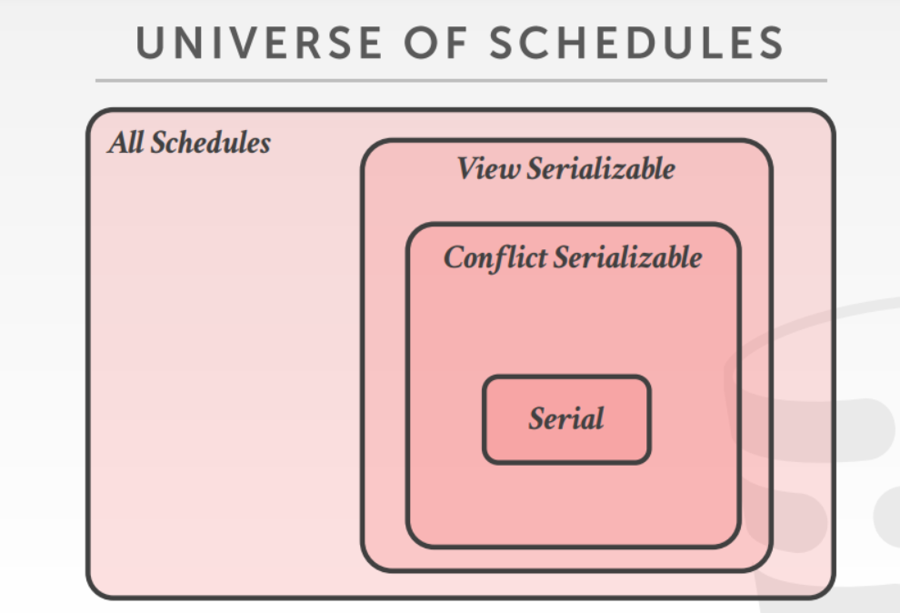</figure>
<!-- /wp:image -->

<!-- wp:heading {"level":3} -->
<h3>Durability</h3>
<!-- /wp:heading -->

<!-- wp:paragraph -->

一个事务提交后，应该被保存到非易失性介质中，使其之后也能被随时读取。

<!-- /wp:paragraph -->

<!-- wp:heading -->
<h2>Conclusion</h2>
<!-- /wp:heading -->

<!-- wp:paragraph -->

为了保证ACID约束，数据库需要牺牲性能。因此很多新型数据库都放弃了ACID约束，只保证数据库的可用性。

<!-- /wp:paragraph -->
