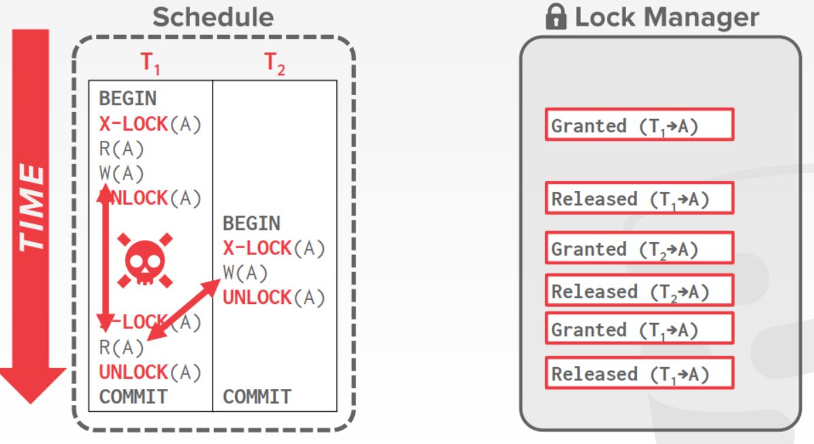
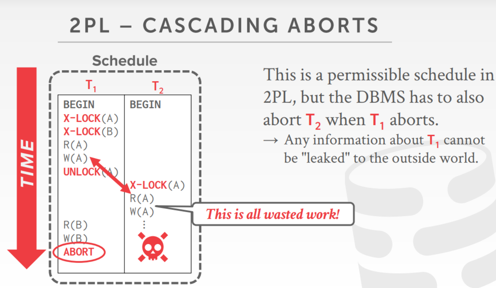
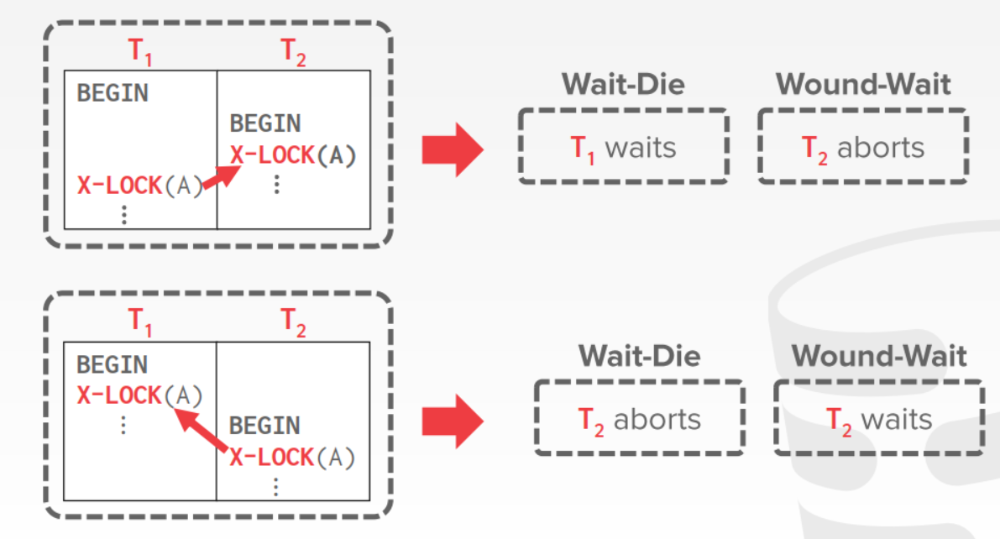
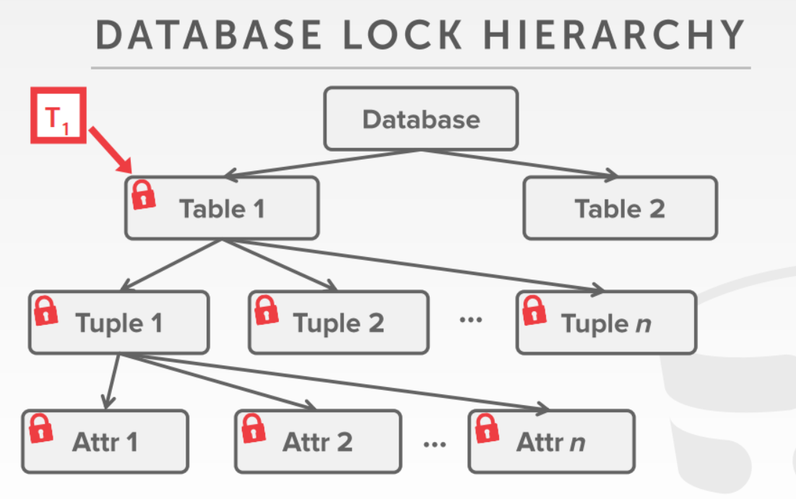
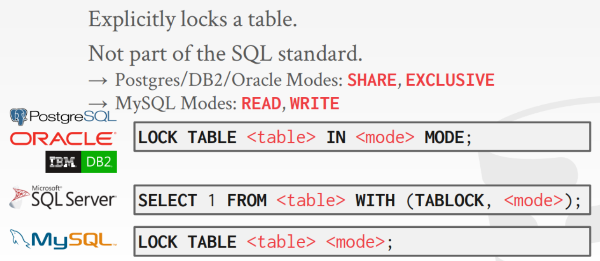
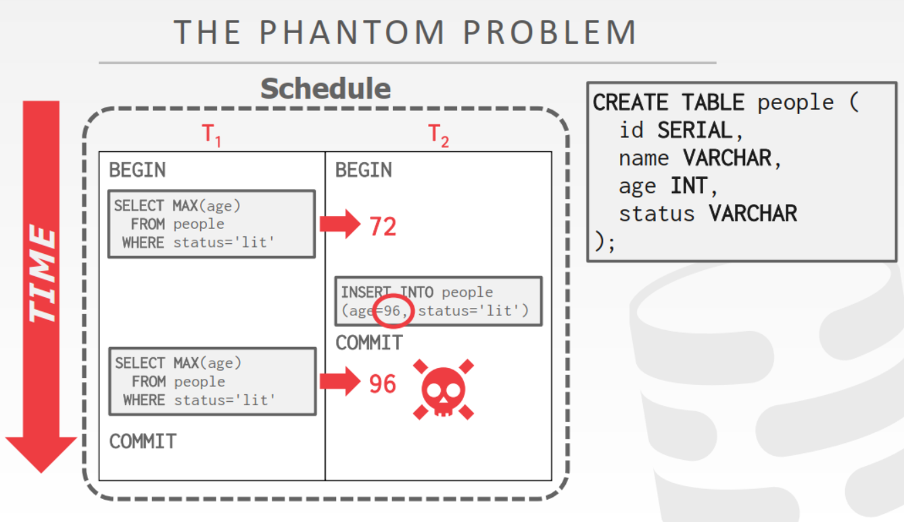
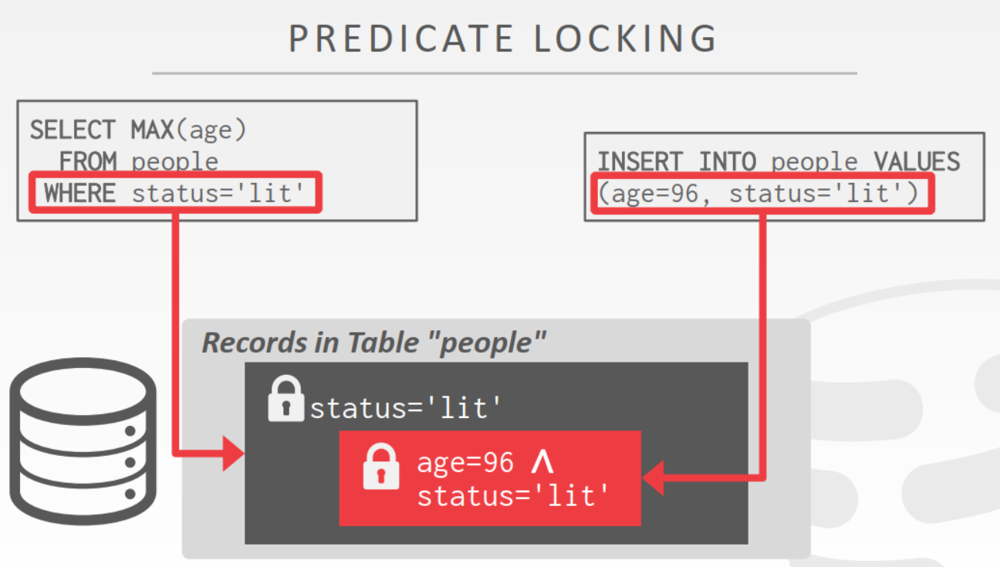

<!-- wp:heading -->
<h2>Lock Manager</h2>
<!-- /wp:heading -->

<!-- wp:paragraph -->

Lock Manager保存关于锁的元数据，比如权限、谁正在拥有/申请锁等。事务需要操作数据向Lock Manager申请锁。

<!-- /wp:paragraph -->

<!-- wp:heading -->
<h2>Lock Types</h2>
<!-- /wp:heading -->

<!-- wp:heading {"level":3} -->
<h3>Shared Lock</h3>
<!-- /wp:heading -->

<!-- wp:paragraph -->

可以同时被多个事务持有，执行读操作前申请共享锁。

<!-- /wp:paragraph -->

<!-- wp:heading {"level":3} -->
<h3>Exclusive Lock</h3>
<!-- /wp:heading -->

<!-- wp:paragraph -->

同一时间只能被一个事务持有，执行修改操作时申请互斥锁。

<!-- /wp:paragraph -->

<!-- wp:paragraph -->

然而共享互斥锁并不能保证冲突可串行化，以不同的方式获得锁可能会造成冲突： 

<!-- /wp:paragraph -->

<!-- wp:heading -->
<h2>Two-Phase Locking</h2>
<!-- /wp:heading -->

<!-- wp:paragraph -->

PL是一种并发控制协议，让事务在开始执行前事先获得所有需要的资源的锁，然后再执行。这样就保证了执行的冲突可串行性。

<!-- /wp:paragraph -->

<!-- wp:heading {"level":4} -->
<h4>Phase #1: Growing</h4>
<!-- /wp:heading -->

<!-- wp:paragraph -->

Growing阶段事务向Lock Manager申请到所有需要的锁。

<!-- /wp:paragraph -->

<!-- wp:heading {"level":4} -->
<h4>Phase #2: Shrinking</h4>
<!-- /wp:heading -->

<!-- wp:paragraph -->

事务执行完毕后Lock Manager释放分配给事务的锁，进入该阶段后不允许再申请新的锁。

<!-- /wp:paragraph -->

<!-- wp:paragraph -->

两阶段锁可以保证产生的调度都是冲突可串行的，但存在以下三个问题：

<!-- /wp:paragraph -->

<!-- wp:list -->
<ul><li>有可能会导致cascading abort</li><li>有一些可串行调度可能不被两阶段锁允许</li><li>导致死锁</li></ul>
<!-- /wp:list -->

<!-- wp:paragraph -->

例如下图中T2在T1提交前获得了T1释放的锁，然而T1执行过程中发生了错误需要丢弃，因此T2有可能（并不一定是，但调度器无法看到全局情形）读取到不正确的数据（Dirty Reads），也需要丢弃。这就是<strong>Cascading Abort</strong> 

<!-- /wp:paragraph -->

<!-- wp:heading {"level":3} -->
<h3>Strong Strict Two-Phase Locking</h3>
<!-- /wp:heading -->

<!-- wp:paragraph -->

为了解决2PL可能会出现的脏读和级联丢弃，SS2PL约定事务必须在提交后才能释放锁。SS2PL可以保证任何可能引起冲突的操作会被强制按照串行顺序执行。

<!-- /wp:paragraph -->

<!-- wp:heading -->
<h2>Deadlock</h2>
<!-- /wp:heading -->

<!-- wp:paragraph -->

当两个事务互相等待对方释放资源时，就会产生死锁。解决死锁可以有两种方法：

<!-- /wp:paragraph -->

<!-- wp:heading {"level":3} -->
<h3>Detection</h3>
<!-- /wp:heading -->

<!-- wp:paragraph -->

DBMS后台运行死锁检测算法，通过事务间的wait-for图检测当前是否存在死锁。如果存在死锁，选择一个事务（victim）进行回滚。回滚范围可以是整个事务，也可以是部分操作回滚。

<!-- /wp:paragraph -->

<!-- wp:heading {"level":3} -->
<h3>Prevention</h3>
<!-- /wp:heading -->

<!-- wp:paragraph -->

为每个事务分配时间戳，以时间戳为优先级，越老的事务优先级越高。则可以产生以下两种策略：

<!-- /wp:paragraph -->

<!-- wp:heading {"level":4} -->
<h4>Wait-Die("Old Waits for Young")</h4>
<!-- /wp:heading -->

<!-- wp:paragraph -->

如果申请资源的事务优先级比持有资源的优先级高，则申请者等待持有者完成；如果申请者优先级较低，则被丢弃。

<!-- /wp:paragraph -->

<!-- wp:heading {"level":4} -->
<h4>Wound-Wait("Young Waits for Old")</h4>
<!-- /wp:heading -->

<!-- wp:paragraph -->

如果申请资源的事务优先级比持有资源的事务优先级高，则持有者将被丢弃并释放锁；否则申请者进入等待。

<!-- /wp:paragraph -->

<!-- wp:image -->
<figure class="wp-block-image"></figure>
<!-- /wp:image -->

<!-- wp:paragraph -->

注意，以上两种预防策略中，一个事务被丢弃后重启获得的时间戳应该和原来的时间戳一样。

<!-- /wp:paragraph -->

<!-- wp:heading -->
<h2>Lock Ranularityies</h2>
<!-- /wp:heading -->

<!-- wp:paragraph -->

上面的几种锁都是对单一资源的访问权限进行限制，如果一个事务需要更新大量元组，就需要获得大量的锁。获得lock的开销往往比获得latch的开销大得多。因此DBMS需要考虑事务获得的锁的粒度，如果在更大粒度上（例如对表）加锁，就可以减少事务申请锁的次数。但增加粒度的代价是降低并行性。

<!-- /wp:paragraph -->

<!-- wp:heading {"level":3} -->
<h3>Lock Hierarchy</h3>
<!-- /wp:heading -->

<!-- wp:paragraph -->

层次锁 

<!-- /wp:paragraph -->

<!-- wp:heading {"level":3} -->
<h3>Itention Lock</h3>
<!-- /wp:heading -->

<!-- wp:paragraph -->

层次锁中如果要对某个叶结点进行修改，要对祖先节点加锁，与他相邻的兄弟节点也无法被其他事务访问。

<!-- /wp:paragraph -->

<!-- wp:paragraph -->

在祖先节点上申请意向锁，表明事务要在子结点上进行读写，而不限制其他事务在祖先节点上申请不冲突的锁。

<!-- /wp:paragraph -->

<!-- wp:paragraph -->

意向锁协议增加了并发性，减少了锁的开销，对于以下两类事务尤其适用：

<!-- /wp:paragraph -->

<!-- wp:list -->
<ul><li>只访问几个数据的短事务</li><li>读取整个文件或者一组文件的长事务</li></ul>
<!-- /wp:list -->

<!-- wp:paragraph -->

类似的封锁协议可以用于数据以有向无环图组织的数据库系统中。

<!-- /wp:paragraph -->

<!-- wp:paragraph -->

该协议也存在死锁，但有方法可以减少死锁发生的频度，甚至消除死锁。

<!-- /wp:paragraph -->

<!-- wp:heading -->
<h2>Lock Escalation</h2>
<!-- /wp:heading -->

<!-- wp:paragraph -->

通常不需要在事务中人为的添加锁，但是进行一些关键修改时，有必要在事务中显式加锁。很多商用数据库都支持显式加锁（该功能并不是SQL标准）。

<!-- /wp:paragraph -->

<!-- wp:image -->
<figure class="wp-block-image"></figure>
<!-- /wp:image -->

<!-- wp:heading -->
<h2>幻读问题</h2>
<!-- /wp:heading -->

<!-- wp:paragraph -->

如果系统允许插入删除操作，2PL可能会出现幻读，因为系统无法在一个先前不存在但在运行期间被其他线程插入的元组上加锁。

<!-- /wp:paragraph -->

<!-- wp:image -->
<figure class="wp-block-image"></figure>
<!-- /wp:image -->

<!-- wp:paragraph -->

可通过层次锁、条件锁或间隙锁解决。或者在事务提交前进行反复多次扫描，确保读到的数据时最新的。

<!-- /wp:paragraph -->

<!-- wp:heading {"level":3} -->
<h3>条件锁</h3>
<!-- /wp:heading -->

<!-- wp:paragraph -->

条件锁是在WHERE子句的条件上加锁，这样同一时间内就不会有多个事务在满足条件的同一组元组上操作。这种锁方法来自SystemR，现在已经基本没有系统使用。

<!-- /wp:paragraph -->

<!-- wp:image -->
<figure class="wp-block-image"></figure>
<!-- /wp:image -->

<!-- wp:heading {"level":3} -->
<h3>索引锁</h3>
<!-- /wp:heading -->

<!-- wp:paragraph -->

如果在WHERE指定的字段上存在索引，就可以给该索引加锁，避免幻读问题。

<!-- /wp:paragraph -->
