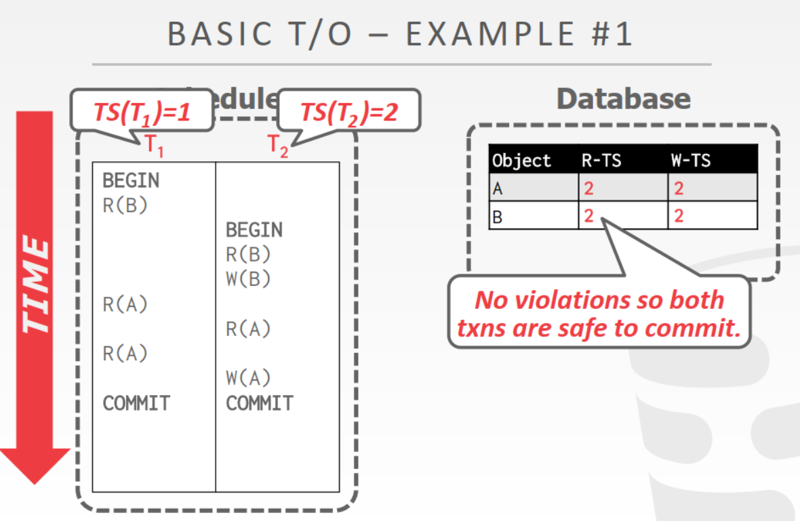
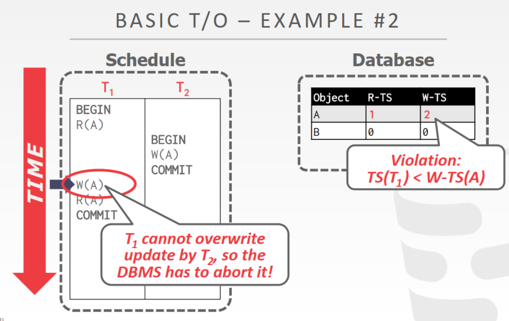
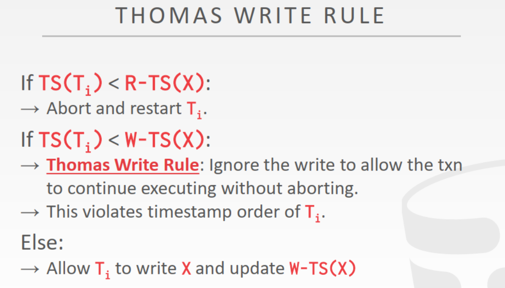
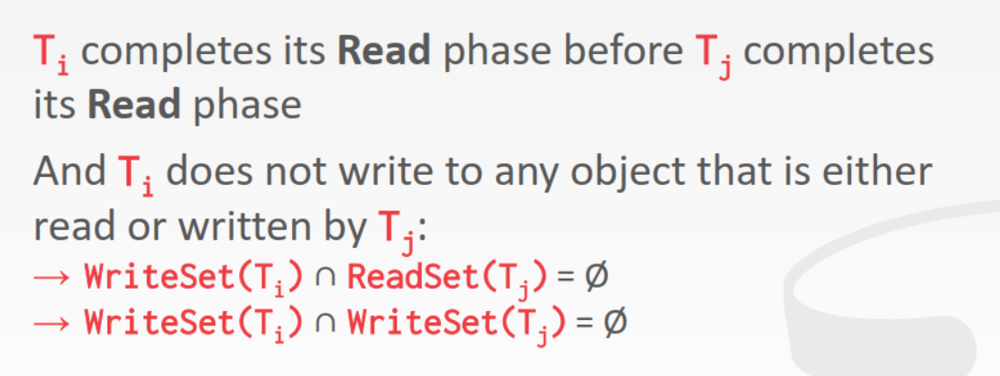

<!-- wp:heading -->
<h2>Introduction</h2>
<!-- /wp:heading -->

<!-- wp:paragraph -->

当预期事务执行过程中会频繁出现线程争用时，就需要使用锁对资源使用加以限制，因此锁是一种<strong>悲观</strong>策略。如果预期争用并不是那么频繁，就可以使用更<strong>乐观</strong>的算法。时间戳顺序协议通过给每个事务指定时间戳来实现事务串行化，因而在使用资源前不需要申请锁。

<!-- /wp:paragraph -->

<!-- wp:heading -->
<h2>Basic Timestamp Ordering Protocal</h2>
<!-- /wp:heading -->

<!-- wp:paragraph -->

数据库在某个时间点（事务执行期任意时间点）为每个事务记录时间戳<code>T_i</code>，时间戳是递增且唯一的。时间戳可以通过系统时钟或者<a href="https://zhuanlan.zhihu.com/p/56146800">逻辑时间</a>获得。

<!-- /wp:paragraph -->

<!-- wp:paragraph -->

为了实现可重复读，事务<code>T_i</code>会保存一份<code>X</code>的本地副本。

<!-- /wp:paragraph -->

<!-- wp:heading {"level":3} -->
<h3>Reads</h3>
<!-- /wp:heading -->

<!-- wp:paragraph -->

该协议需要为每个元组记录上一次读和写的时间戳。当某个事务需要读取某个元组上的值时，会对比自身时间戳<code>TS(T_i)</code>和元组时间戳<code>W-TS(X)</code>。如果元组<code>X</code>上一次写入的时间戳<code>W-TS(X)</code>大于<code>TS(T_i)</code>，说明事务读到了不应该读到的值，需要执行<code>ABORT</code>；如果元组时间戳不小于事务时间戳，则允许读取，并将元组时间戳的R字段更新为<code>max(R-TS(X), TS(T_i))</code>。

<!-- /wp:paragraph -->

<!-- wp:heading {"level":3} -->
<h3>Writes</h3>
<!-- /wp:heading -->

<!-- wp:paragraph -->

如果<code>TS(T_i)</code>小于<code>R-TS(X)</code>或<code>W-TS(X)</code>，执行<code>ABORT</code>并重启<code>T_i</code>；反之则可以写入，并更新元组时间戳的W字段为<code>max(W-TS(X), TS(T_i))</code>。

<!-- /wp:paragraph -->

<!-- wp:image -->
<figure class="wp-block-image"></figure>
<!-- /wp:image -->

<!-- wp:image -->
<figure class="wp-block-image"></figure>
<!-- /wp:image -->

<!-- wp:heading {"level":4} -->
<h4>Tomas write Rule</h4>
<!-- /wp:heading -->

<!-- wp:paragraph -->

思考出现<code>TS(T_i) < W-TS(X)</code>的情况，这意味着当前事务对X所做的修改在未来会被另一个事务覆盖。因此该事务的修改不写回磁盘也不会造成影响。因此事务无需进行ABORT，只要在本地副本上继续执行即可。 使用该规则后产生的调度有可能不满足冲突可串行。

<!-- /wp:paragraph -->

<!-- wp:image -->
<figure class="wp-block-image"></figure>
<!-- /wp:image -->

<!-- wp:heading {"level":3} -->
<h3>Recoverable Schedules</h3>
<!-- /wp:heading -->

<!-- wp:paragraph -->

一个事务依赖的所有事务都提交后，该事务在出现问题后就可以被恢复。但是Basic T/O并不能保证事务被提交时依赖的事务也全部被提交，因此一个事务被提交后也不一定是可恢复的。

<!-- /wp:paragraph -->

<!-- wp:heading {"level":3} -->
<h3>性能问题</h3>
<!-- /wp:heading -->

<!-- wp:paragraph -->

Basic T/O需要为每个元组保存副本，如果一个事务需要操作很多元组，将带来极大的内存开销。

<!-- /wp:paragraph -->

<!-- wp:paragraph -->

操作数很多的事务可能因为后执行的短事务插队导致需要频繁地重启，出现饥饿问题。

<!-- /wp:paragraph -->

<!-- wp:heading -->
<h2>Optimistic Concurrency Control</h2>
<!-- /wp:heading -->

<!-- wp:paragraph -->

DBMS为每个事务分配私有空间，保存要操作的数据副本。事务对各自的副本进行修改，然后写回。

<!-- /wp:paragraph -->

<!-- wp:heading {"level":4} -->
<h4>Read Phase</h4>
<!-- /wp:heading -->

<!-- wp:paragraph -->

读取数据并保存为副本，对副本进行操作。

<!-- /wp:paragraph -->

<!-- wp:heading {"level":4} -->
<h4>Validation Phase</h4>
<!-- /wp:heading -->

<!-- wp:paragraph -->

事务所有操作执行完毕后，DBMS为该事务分配一个时间戳，并检查结果正确性。验证时需要保证验证的方向是相同的（统一向前检查或统一向后检查）。

<!-- /wp:paragraph -->

<!-- wp:paragraph -->

系统在同一时候只能验证一个事务，如果有多个事务需要验证，就需要在事务的read set/write set上申请latch。

<!-- /wp:paragraph -->

<!-- wp:heading {"level":5} -->
<h5>Backward Validation</h5>
<!-- /wp:heading -->

<!-- wp:paragraph -->

检查在该事务之前已经提交的所有事务。如果已提交的事务中对当前事务也用到的某个值进行了修改，就需要丢弃当前事务。

<!-- /wp:paragraph -->

<!-- wp:heading {"level":5} -->
<h5>Forward Validation</h5>
<!-- /wp:heading -->

<!-- wp:paragraph -->

找到所有还未提交的事务，如果当前事务在某个事务开始读写之前提交，则检查下一个未提交事务。如果未提交的事务读/写到了某个被当前事务修改的值，就将当前事务丢弃。

<!-- /wp:paragraph -->

<!-- wp:image -->
<figure class="wp-block-image"></figure>
<!-- /wp:image -->

<!-- wp:heading {"level":4} -->
<h4>Write Phase</h4>
<!-- /wp:heading -->

<!-- wp:paragraph -->

写回磁盘 。

<!-- /wp:paragraph -->

<!-- wp:heading {"level":3} -->
<h3>Conclusion</h3>
<!-- /wp:heading -->

<!-- wp:paragraph -->

如果任务读写的数据比较分散，事务之间冲突较少，采用乐观并发控制可以减少上锁带来的开销。

<!-- /wp:paragraph -->

<!-- wp:heading -->
<h2>Partition-Based Timestamp Ordering</h2>
<!-- /wp:heading -->

<!-- wp:paragraph -->

将数据库划分为不相交的水平分区，通过时间戳对该分区涉及的事务进行排序，并让它们以串行的顺序执行。分区粒度越小，事务并行效率越高。

<!-- /wp:paragraph -->

<!-- wp:paragraph -->

每个分区拥有一个锁和事务队列，当一个事务在某个分区队列上时间戳最小，就获得该分区的锁。这个事务获得所有需要的分区的锁时，就可以开始执行。但由于无法事先知道哪些分区是需要的，所以在运行时如果需要访问其他分区，就将当前事务丢弃，重新申请所有需要的分区锁。

<!-- /wp:paragraph -->
