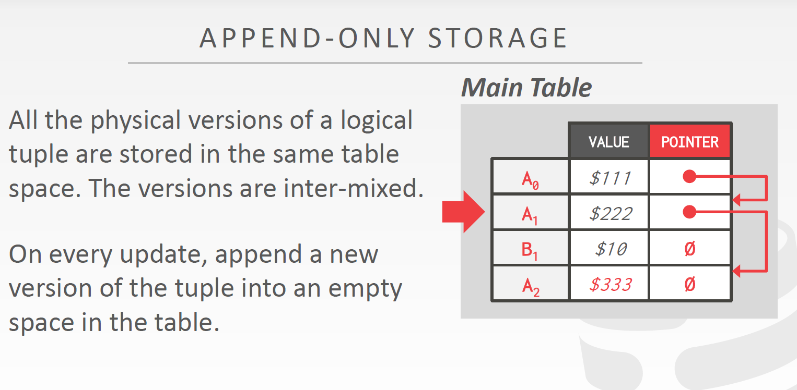
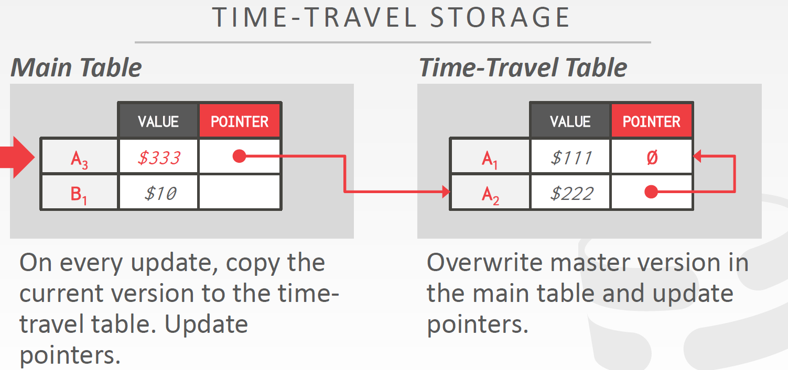
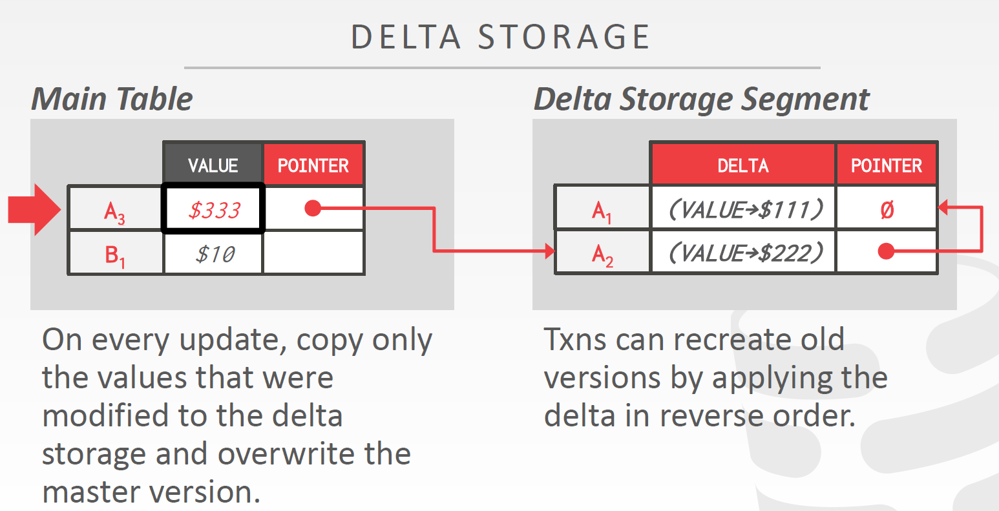
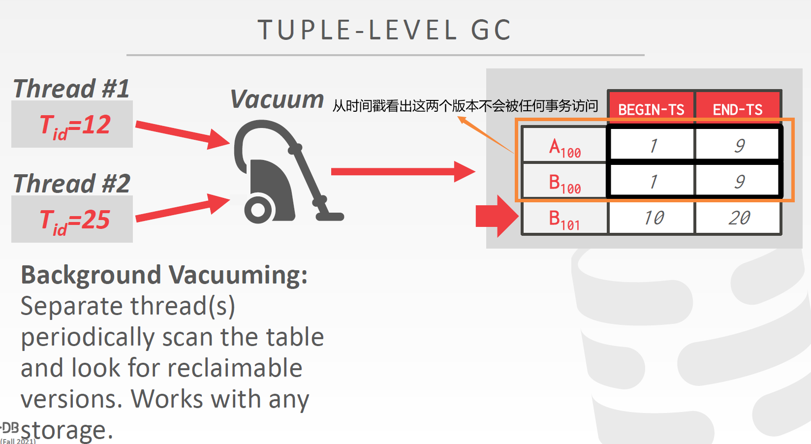
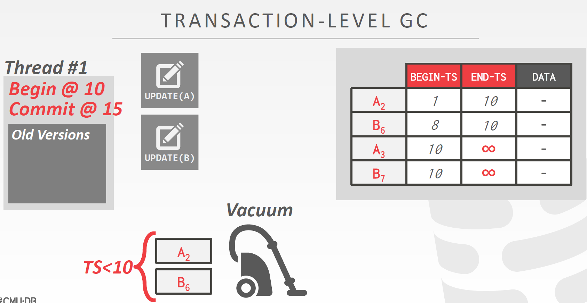
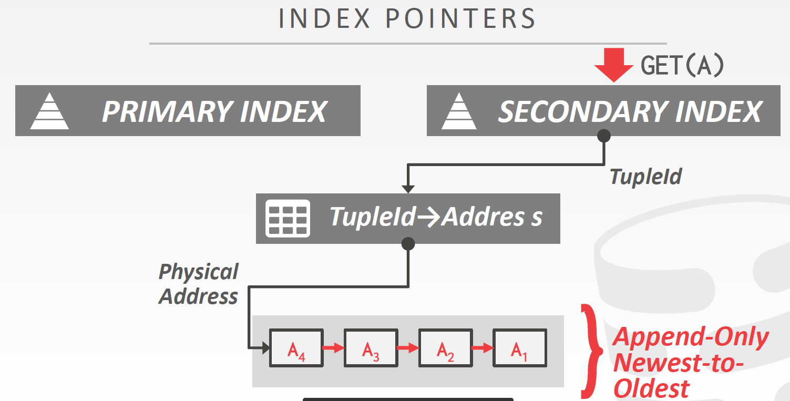
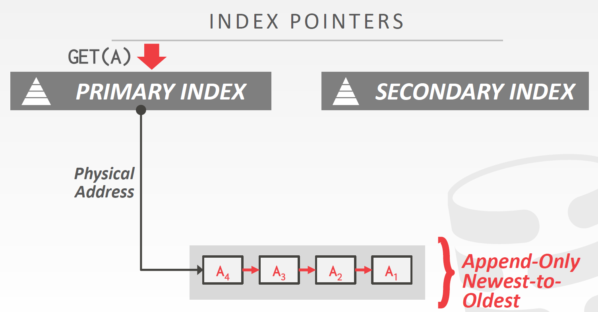
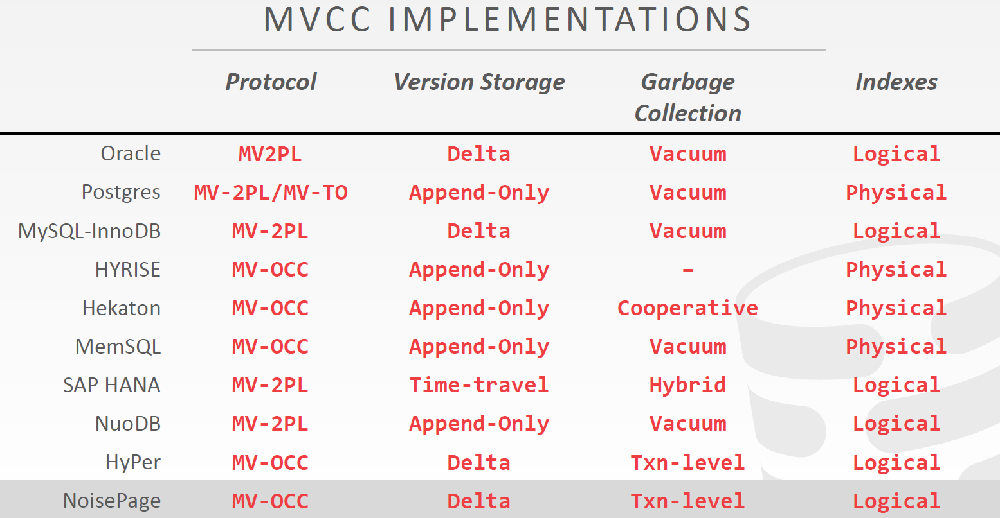

<!-- wp:heading -->
<h2>Why MVCC?</h2>
<!-- /wp:heading -->

<!-- wp:paragraph -->

之前的并发控制机制要么是通过延迟，要么是通过中止事务来保证可串行性。如果系统中保存了每一数据项的旧版本，并能识别出每个事务应该读到哪个版本，就可以避免这些问题。

<!-- /wp:paragraph -->

<!-- wp:heading -->
<h2>MVCC Design Decision</h2>
<!-- /wp:heading -->

<!-- wp:heading {"level":3} -->
<h3>Concurrency Control Protocal</h3>
<!-- /wp:heading -->

<!-- wp:paragraph -->

首先要选择一种并发控制协议2PL/Timestamp/OCC

<!-- /wp:paragraph -->

<!-- wp:heading {"level":3} -->
<h3>Version Storage</h3>
<!-- /wp:heading -->

<!-- wp:paragraph -->

DBMS在每个元组中加入一个指向版本链的指针，通过版本链为每个事务找到对其可见的版本。

<!-- /wp:paragraph -->

<!-- wp:heading {"level":4} -->
<h4>Append-Only Storage</h4>
<!-- /wp:heading -->

<!-- wp:paragraph -->

DBMS维护一张主表，主表的每一行保存了所有元组版本，同一个元组的版本通过指针连接在一起。每次对一个元组进行修改时，都将新版本加入到主表的末尾，并将上一个版本的指针域指向它。

<!-- /wp:paragraph -->

<!-- wp:paragraph -->

指针的指向可以有两种方向：

<!-- /wp:paragraph -->

<!-- wp:heading {"level":5} -->
<h5>Oldest-to-Newest</h5>
<!-- /wp:heading -->

<!-- wp:paragraph -->

索引中的指针域指向主表中最古老的版本，新版本加入到链表的末尾。这种方向不需要修改索引中的指针域，但每次加入都需要遍历链表。

<!-- /wp:paragraph -->

<!-- wp:heading {"level":5} -->
<h5>Newest-to-Oldest</h5>
<!-- /wp:heading -->

<!-- wp:paragraph -->

索引中的指针域指向最新版本，新版本加入时直接插入到链头。因此不需要遍历链表，但需要修改索引中的指针域。

<!-- /wp:paragraph -->

<!-- wp:paragraph -->

Append-Only Storage实现最容易，恢复操作消耗时间短，但占用大量内存空间，写入较慢。

<!-- /wp:paragraph -->

<!-- wp:image -->
<figure class="wp-block-image"></figure>
<!-- /wp:image -->

<!-- wp:heading {"level":4} -->
<h4>Time-Travel Storage</h4>
<!-- /wp:heading -->

<!-- wp:paragraph -->

Main Table只保存各个元组最新版本，所有元组的旧版本被放到Time-Travel Table中，并以Newest-to-Oldest的顺序链接。Main Table中最新版本的指针指向Time-Travel Table中对应旧版本链表的表头。

<!-- /wp:paragraph -->

<!-- wp:image -->
<figure class="wp-block-image"></figure>
<!-- /wp:image -->

<!-- wp:heading {"level":4} -->
<h4>Delta Storage</h4>
<!-- /wp:heading -->

<!-- wp:paragraph -->

MySQL和ORACLE采用这种方法，写入时开销更小，但恢复较慢。由Main Table和Delta Storage Segment两张表组成。总体思路和Time-Travel Storage差不多，但Delta Storage记录的是每个版本对哪些字段上的值进行了什么样修改，而不是整个元组。需要恢复到某个版本时，找到该版本所做的修改，然后重新执行操作即可。

<!-- /wp:paragraph -->

<!-- wp:image -->
<figure class="wp-block-image"></figure>
<!-- /wp:image -->

<!-- wp:heading {"level":3} -->
<h3>Garbage Collection</h3>
<!-- /wp:heading -->

<!-- wp:paragraph -->

当DBMS检测出某个版本不可能再被当前事务使用时，就会对其空间进行回收。

<!-- /wp:paragraph -->

<!-- wp:paragraph -->

回收有不同的级别：

<!-- /wp:paragraph -->

<!-- wp:heading {"level":4} -->
<h4>Tuple-level</h4>
<!-- /wp:heading -->

<!-- wp:paragraph -->

对表进行循序扫描，通过对比版本时间戳和当前事务时间戳检查版本是否还能被访问。

<!-- /wp:paragraph -->

<!-- wp:image -->
<figure class="wp-block-image"></figure>
<!-- /wp:image -->

<!-- wp:paragraph -->

DBMS通过bitmap记录哪些页面被修改过，因此在进行循序扫描时，就只需要扫描修改过的页面。

<!-- /wp:paragraph -->

<!-- wp:paragraph -->

扫描可以是后台定期执行，称为Background Vacuuming；也可以是Worker执行扫描任务时顺便检查版本是否过期，这种方式称为Cooperative Cleaning。后者只适用于Olderst-to-Newest方向的实现，因为Newest-to-Oldest的实现下马上就能得到最新版本，没有必要对旧版本进行扫描。

<!-- /wp:paragraph -->

<!-- wp:heading {"level":4} -->
<h4>Transaction-level</h4>
<!-- /wp:heading -->

<!-- wp:paragraph -->

事务会维护自己的read/write set。当一个事务提交后，DBMS会检查该事务创建的所有版本，并将那些不可能再被看见的版本删除。

<!-- /wp:paragraph -->

<!-- wp:image -->
<figure class="wp-block-image"></figure>
<!-- /wp:image -->

<!-- wp:heading {"level":3} -->
<h3>Index Management</h3>
<!-- /wp:heading -->

<!-- wp:paragraph -->

当对元组的修改不涉及主键时，无需对索引结构进行修改。但是当更新涉及主键时，通常的做法是先执行delete再执行insert。

<!-- /wp:paragraph -->

<!-- wp:paragraph -->

<a href="https://eng.uber.com/postgres-to-mysql-migration/">扩展阅读：Why Uber Engineering Switched from Postgres to MySQL</a>

<!-- /wp:paragraph -->

<!-- wp:paragraph -->

对于非主键索引，情况会更加复杂。有<strong>逻辑指针</strong>和<strong>物理指针</strong>两种方案：

<!-- /wp:paragraph -->

<!-- wp:heading {"level":4} -->
<h4>Logical Pointer</h4>
<!-- /wp:heading -->

<!-- wp:paragraph -->

每个元组分配一个不会变更的id，在这个id上建立索引。这种方案需要建立一个中间层。

<!-- /wp:paragraph -->

<!-- wp:image -->
<figure class="wp-block-image"></figure>
<!-- /wp:image -->

<!-- wp:heading {"level":4} -->
<h4>Physical Pointer</h4>
<!-- /wp:heading -->

<!-- wp:paragraph -->

直接保存版本链头的物理指针。

<!-- /wp:paragraph -->

<!-- wp:image -->
<figure class="wp-block-image"></figure>
<!-- /wp:image -->

<!-- wp:paragraph -->

ORACLE和MYSQL在MVCC方面采用的设计对OLTP任务表现是最好的，PostgreSQL最慢。

<!-- /wp:paragraph -->

<!-- wp:image -->
<figure class="wp-block-image"></figure>
<!-- /wp:image -->
