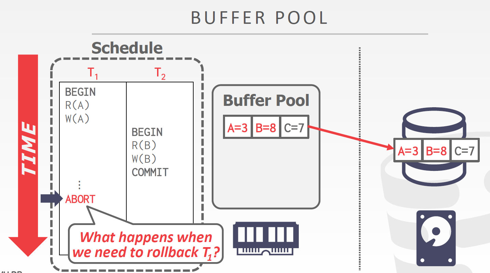
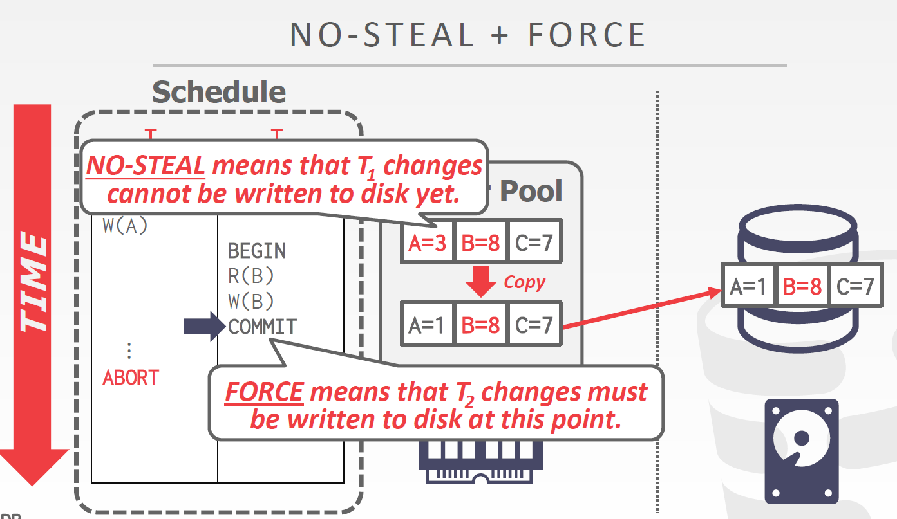
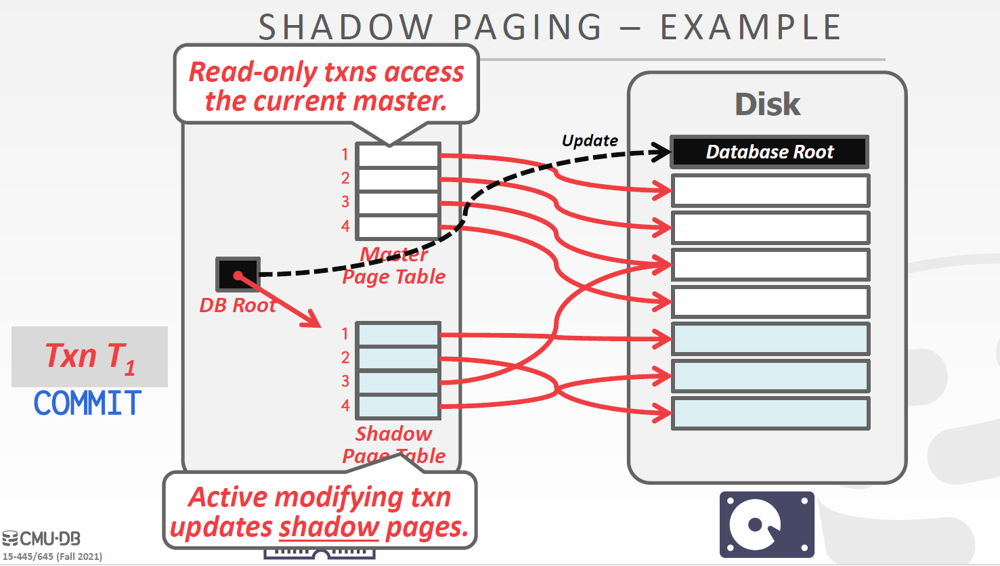
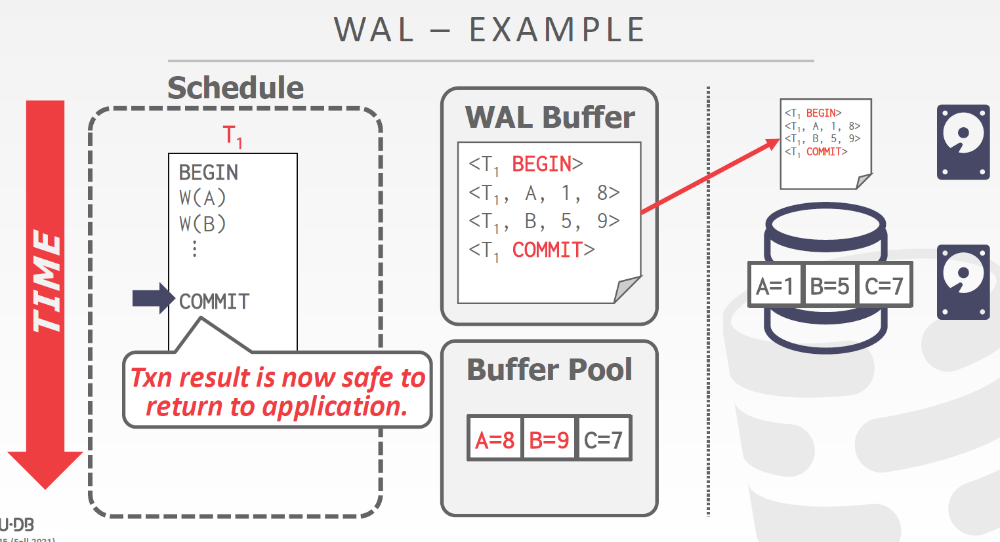

<!-- wp:heading -->
<h2>Recovery</h2>
<!-- /wp:heading -->

<!-- wp:paragraph -->

为了保证事务修改的数据能被正确地持久化，设计了恢复算法保证数据库在发生意外时的一致性、原子性和持久性。

<!-- /wp:paragraph -->

<!-- wp:paragraph -->

恢复算法具有两个部分：

<!-- /wp:paragraph -->

<!-- wp:list -->
<ul><li>正常执行时记录事务执行的操作，以保证可以从失败中恢复。</li><li>数据库运行崩溃后能从保存下来的信息中恢复到崩溃前状态，并保证ACD。</li></ul>
<!-- /wp:list -->

<!-- wp:heading -->
<h2>差错类型</h2>
<!-- /wp:heading -->

<!-- wp:heading {"level":3} -->
<h3>Transaction Failures</h3>
<!-- /wp:heading -->

<!-- wp:paragraph -->

事务层面的差错有可能是事务逻辑错误，例如违法完整性约束；也有可能是DBMS内部状态出错需要杀掉事务，例如进入死锁。

<!-- /wp:paragraph -->

<!-- wp:heading {"level":3} -->
<h3>System Failures</h3>
<!-- /wp:heading -->

<!-- wp:paragraph -->

系统级别的差错分为软件错误（OS或DBMS实现有BUG）和硬件错误（电源中断）。发生硬件错误时我们假设非易失性存储不会因为系统崩溃而受到影响，而是停止运行。

<!-- /wp:paragraph -->

<!-- wp:heading {"level":3} -->
<h3>Storage Media Failure</h3>
<!-- /wp:heading -->

<!-- wp:paragraph -->

存储介质差错可能是磁盘扫描头出错破坏了部分数据，这一类差错可以通过校验和检测出来，但DBMS无法从这种差错中恢复。

<!-- /wp:paragraph -->

<!-- wp:paragraph -->

DBMS必须保证以下两点：

<!-- /wp:paragraph -->

<!-- wp:list -->
<ul><li>已提交的事务必须保证持久化</li><li>未提交的事务如果被丢弃，不能出现部分数据被持久化的情况</li></ul>
<!-- /wp:list -->

<!-- wp:paragraph -->

如果未提交的事务被丢弃，需要Undo已执行过的操作；如果提交的事务在持久化前因为崩溃丢失，需要Redo所有执行过的操作。

<!-- /wp:paragraph -->

<!-- wp:heading -->
<h2>Buffer Pool管理策略</h2>
<!-- /wp:heading -->

<!-- wp:paragraph -->

 两个事务对同一个数组的不同字段进行修改，一个事务成功提交，另一个事务需要回滚。针对如何对这个元组进行持久化衍生出了不同的策略。

<!-- /wp:paragraph -->

<!-- wp:heading {"level":3} -->
<h3>Steal Policy</h3>
<!-- /wp:heading -->

<!-- wp:paragraph -->

根据DBMS是否允许将未提交的事务数据持久化到硬盘，分为Steal和No-Steal。Steal指Buffer Pool可以从未提交事务修改的页面窃取空间，No-Steal则不允许这种窃取。

<!-- /wp:paragraph -->

<!-- wp:heading {"level":3} -->
<h3>Force Policy</h3>
<!-- /wp:heading -->

<!-- wp:paragraph -->

DBMS要求所有更新都必须在提交时持久化到硬盘，称为Froce；否则称为No-Force

<!-- /wp:paragraph -->

<!-- wp:paragraph -->

通过两类策略组合衍生出不同的算法：

<!-- /wp:paragraph -->

<!-- wp:heading {"level":3} -->
<h3>No-Steal + Force</h3>
<!-- /wp:heading -->

<!-- wp:image -->
<figure class="wp-block-image"></figure>
<!-- /wp:image -->

<!-- wp:paragraph -->

当T2提交时T1尚未提交，No-Steal禁止将未提交的数据持久化到磁盘，而Force要求提交时必须持久化。为了解决这个问题，为T2生成了一个可以写出的版本。

<!-- /wp:paragraph -->

<!-- wp:paragraph -->

采用No-Steal策略不需要进行Undo，因为未执行完就被丢弃的数据不会出现在硬盘中。而采用Force策略则无需进行Redo操作，因为所有修改都被持久化（假设写磁盘操作是原子的）。但这种组合在Write-Set过大时会出现问题。

<!-- /wp:paragraph -->

<!-- wp:heading {"level":4} -->
<h4>Shadow Paging</h4>
<!-- /wp:heading -->

<!-- wp:paragraph -->

一种简单的实现是Shadow Paging： 磁盘中保存了一个记录了所有页号的DB Root，数据库将Root读入内存作为Master表，再复制一个Shadow Page Table。当事务对数据进行修改时，在一个新创建的页面上修改，修改Shadow Page Table中的指针使其指向新的页号。一旦事务提交成功，就修改DB Root的指针指向Shadow Page Table，并将新的DB Root写回磁盘。

<!-- /wp:paragraph -->

<!-- wp:image -->
<figure class="wp-block-image"></figure>
<!-- /wp:image -->

<!-- wp:paragraph -->

这种实现有几个问题：

<!-- /wp:paragraph -->

<!-- wp:list -->
<ul><li>每次修改完页面都要将页面、Page Table和Root写回磁盘</li><li>数据在磁盘中非常分散</li><li>需要垃圾回收机制</li><li>每次只能执行一个写事务</li><li>对页面的存取是以随机读取的形式进行</li></ul>
<!-- /wp:list -->

<!-- wp:heading -->
<h2>Write-Ahed Log Protocal</h2>
<!-- /wp:heading -->

<!-- wp:paragraph -->

DBMS记录事务对数据作的修改日志，日志保存足够的信息使DBMS可以在崩溃后做Undo和Redo. WAL协议必须在数据持久化到磁盘之前将log写回磁盘，日志写入完毕才可以视为提交成功。Log的写入时机可以是事务提交后马上写入，也可以是累积到一定数量时便写入。由于知道事务作了哪些修改，Buffer Pool Policy可以采取<strong>Steal + No-Force</strong>的组合。

<!-- /wp:paragraph -->

<!-- wp:paragraph -->

每条日志包含以下信息：

<!-- /wp:paragraph -->

<!-- wp:list -->
<ul><li>事务ID</li><li>对象ID</li><li>原值</li><li>修改后的值</li></ul>
<!-- /wp:list -->

<!-- wp:image -->
<figure class="wp-block-image"></figure>
<!-- /wp:image -->

<!-- wp:heading {"level":3} -->
<h3>Logging Schemes</h3>
<!-- /wp:heading -->

<!-- wp:heading {"level":4} -->
<h4>Physical Logging</h4>
<!-- /wp:heading -->

<!-- wp:paragraph -->

类似 git diff，记录对某个具体位置的具体操作。

<!-- /wp:paragraph -->

<!-- wp:heading {"level":4} -->
<h4>Logical Logging</h4>
<!-- /wp:heading -->

<!-- wp:paragraph -->

记录事务调用了什么操作（如UPDATE, DELETE, INSERT），不需要记录具体操作了哪些数据。

<!-- /wp:paragraph -->

<!-- wp:paragraph -->

记录逻辑记录需要的空间更小，但每次恢复都要重新从头执行一遍，而且无法得知磁盘中的哪部分数据是崩溃前已经被修改过的。目前业界使用更广泛的模式是将两者结合的<strong>Physiological Logging</strong>。

<!-- /wp:paragraph -->

<!-- wp:heading -->
<h2>Checkpoints</h2>
<!-- /wp:heading -->

<!-- wp:paragraph -->

如果不做特殊处理，日志就会一直增长，数据库崩溃后恢复扫描时间越来越长，于是出现了Checkpoint机制。

<!-- /wp:paragraph -->

<!-- wp:paragraph -->

DBMS每隔一段时间就将当前所有被修改过的数据写回磁盘，在日志上标记一个Checkpoint。当需要恢复时，上一个Checkpoint前已经提交的事务就可以不用处理，只处理尚未提交的事务。

<!-- /wp:paragraph -->

<!-- wp:paragraph -->

建立Checkpoint时需要暂停所有正在执行的事务，因此需要精心选择建立时间间隔。

<!-- /wp:paragraph -->
