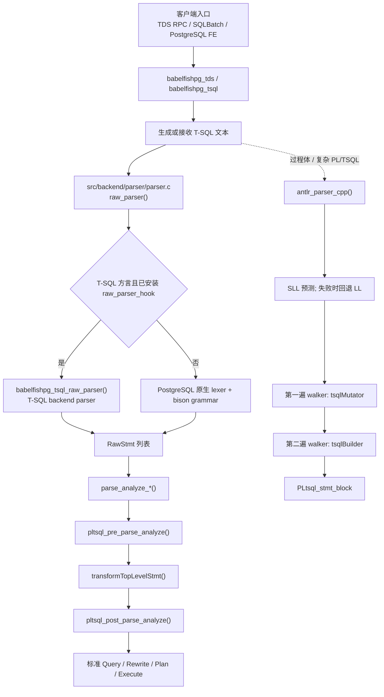
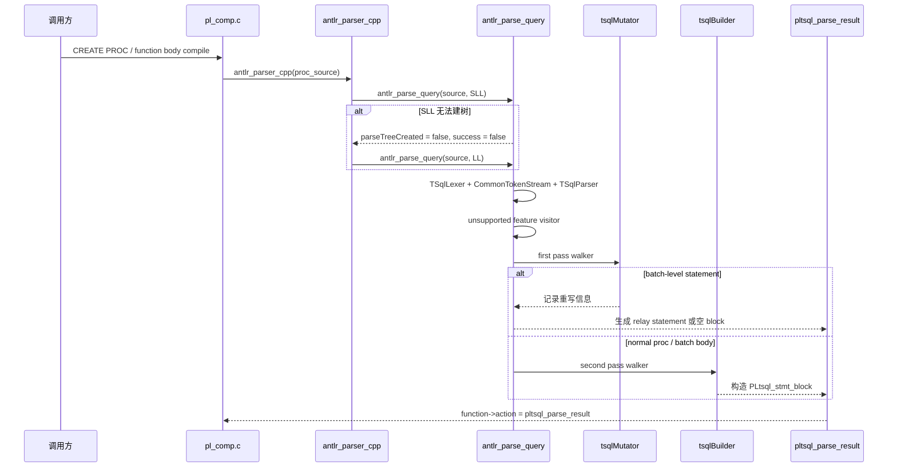
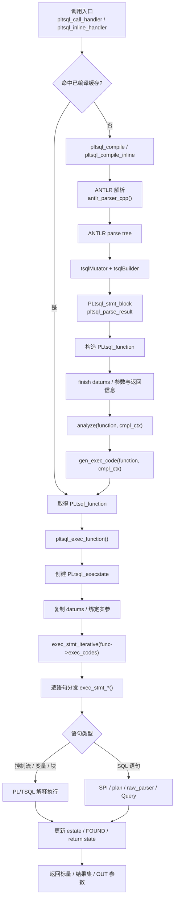
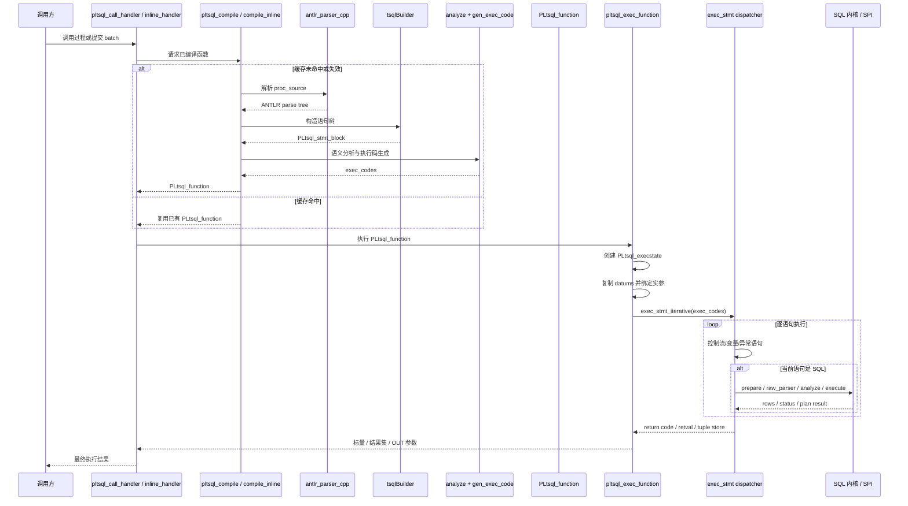
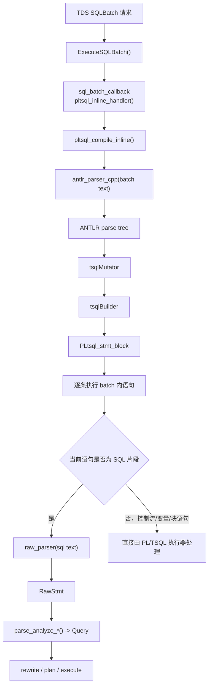

# ---
title: "Babelfish 语法解析与 PL/TSQL 执行架构解析"
date: 2026-03-06 10:00:00
slug: "babelfish-parser-architecture"
categories:
     - 数据库系统
     - 计算机技术
tags:
     - PostgreSQL
     - 数据库
     - T-SQL
     - Babelfish
description: >-
     本文梳理了 Babelfish 在协议入口、SQL 解析、PL/TSQL 编译、语义修正和执行分发上的整体架构，说明其“双解析栈”设计以及如何复用 PostgreSQL 主链路。
draft: false
---

# Babelfish 语法解析与 PL/TSQL 执行架构说明

## 1. 总体判断：Babelfish 采用分层协作的解析与执行架构

Babelfish 并非以单一 parser 统一处理全部 T-SQL，而是将“协议适配、SQL 解析、过程式编译、语义修正、执行分发”组织为分层协作的处理流水线：

- **协议入口层**先把 TDS RPC、SQLBatch、普通 SQL 请求整理成可消费的文本或调用语义；
- **SQL 解析层**以 PostgreSQL 的 `raw_parser()` 为总入口，在这里通过 `raw_parser_hook` 决定继续走 PostgreSQL 原生 grammar，还是切到 Babelfish 的 T-SQL backend parser；
- **PL/TSQL 编译层**使用 ANTLR 处理过程体、匿名 batch、控制流、变量声明等更适合过程式语言前端处理的内容；
- **语义分析层**尽量复用 PostgreSQL `parse_analyze_*()` 主链路，再通过 `pre_parse_analyze_hook` / `post_parse_analyze_hook` 注入 T-SQL 兼容语义；
- **执行分发层**根据节点类型决定是走标准 planner/executor，还是走 utility/FDW/PL 执行器等旁路。

因此，Babelfish 的核心设计目标并非重建一套独立的 PostgreSQL SQL 内核，而是：

> **尽量复用 PostgreSQL 已有 SQL 主链路，只把 T-SQL 的差异隔离在 parser hook、ANTLR walker、analyze hook 和专用执行桥接层里。**

---

## 2. 为什么必须是“双解析栈”

理解 Babelfish 架构的前提，是区分 T-SQL 在工程实现上对应的两类差异，以及它们各自适合的处理方式。

### 2.1 SQL 级差异：更适合复用 PostgreSQL SQL 内核

像 `SELECT`、`INSERT`、`UPDATE`、`DELETE`、DDL、普通 `EXEC` 这类语句，本质上仍然是“SQL 语句”。

这类语句最自然的目标产物是：

- `RawStmt`
- `Query`
- rewrite 结果
- plan tree
- executor 可执行结构

也就是说，这类语句更适合继续沿用 PostgreSQL 既有的 raw parse tree、语义分析、planner 和 executor 体系。Babelfish 只需在语法入口和语义细节上做兼容扩展，而无须为其重新构造一套独立的 SQL 执行内核。

### 2.2 过程式与 batch 语义：更适合单独编译

但当请求进入下面这些场景时，问题就变了：

- `BEGIN ... END`
- `DECLARE @x int`
- `IF ... ELSE`
- `WHILE`
- `TRY ... CATCH`
- SQLBatch 中混合的控制流和 SQL 片段
- 存储过程/函数体的整体编译

这些内容已经超出了传统 SQL parser 处理“单条 SQL”时的优势范围，更适合作为过程式语言前端进行编译。相应地，它们更适合先转换为 Babelfish 自身的中间表示，再由 PL/TSQL 执行器解释或调度执行。

### 2.3 Babelfish 的取舍

因此 Babelfish 最终采用两条互补的解析链：

- **Bison/backend parser 路径**：负责 SQL 级语句，产出 PostgreSQL 风格的 `RawStmt`、`CallStmt` 等节点；
- **ANTLR 路径**：负责过程体和复杂 batch，产出 `PLtsql_stmt_block` 等 PL/TSQL 内部 IR。

这样做避免了两个极端：

- 不需要为了支持 T-SQL，把 PostgreSQL planner/executor 全部重写一遍；
- 也不需要把复杂的过程式语言语法硬塞进 PostgreSQL 原生 SQL grammar。

---

## 3. 总体链路概览

先看总图，再分别拆解 SQL 路径和 PL/TSQL 路径会更清晰。



这张图可以概括成四句话：

1. **所有请求都会先被整理成可消费文本或调用语义；**
2. **SQL 语句主要在 `raw_parser()` 处分流；**
3. **过程体和复杂 batch 主要走 ANTLR 编译链；**
4. **最终执行时仍尽量回到 PostgreSQL 的标准 SQL 内核。**

下面按这两条主线分别展开。

---

## 4. SQL 主链路：从请求文本到 `Query`

如果当前请求的目标是“执行一条 SQL 语句”，那 Babelfish 的首选策略始终是：**尽快把它放回 PostgreSQL 的 SQL 主链路里。**

### 4.1 协议入口：先把请求变成“可解析文本”

Babelfish 的 parser 不直接处理网络报文。特别是在 TDS 场景下，请求在进入 parser 之前，通常会先经过协议层整理。

- TDS endpoint 位于 [contrib/babelfish_extensions/contrib/babelfishpg_tds](../contrib/babelfish_extensions/contrib/babelfishpg_tds)
- T-SQL glue 位于 [contrib/babelfish_extensions/contrib/babelfishpg_tsql](../contrib/babelfish_extensions/contrib/babelfishpg_tsql)

典型流程是：

1. 客户端发送 SQLBatch 或 RPC；
2. 协议层解析参数 token、过程名、批文本；
3. 协议层把这些信息整理成一段 T-SQL 文本，或构造成后续能消费的调用上下文；
4. 之后才交给 Babelfish/PG 的解析主链路。

这一步的意义在于：

> **Babelfish 的 parser 架构部署在协议适配之后，而非直接建立在网络协议报文之上。**

### 4.2 `raw_parser()`：SQL 方言切换的总闸门

PostgreSQL core 的 `raw_parser()` 定义在 [src/backend/parser/parser.c](../src/backend/parser/parser.c)。Babelfish 在这里加了 `raw_parser_hook`，使得 `raw_parser()` 成为 SQL 方言切换点：

- 当前不是 T-SQL 方言时，继续走 PostgreSQL 原生 lexer + bison grammar；
- 当前是 T-SQL 方言且 hook 已安装时，切到 Babelfish parser。

Babelfish 在 [contrib/babelfish_extensions/contrib/babelfishpg_tsql/src/pl_handler.c](../contrib/babelfish_extensions/contrib/babelfishpg_tsql/src/pl_handler.c) 的 `_PG_init()` 中安装：

- `raw_parser_hook = babelfishpg_tsql_raw_parser`
- `pre_parse_analyze_hook = pltsql_pre_parse_analyze`
- `post_parse_analyze_hook = pltsql_post_parse_analyze`

真正的 T-SQL SQL parser 入口是 [contrib/babelfish_extensions/contrib/babelfishpg_tsql/src/backend_parser/parser.c](../contrib/babelfish_extensions/contrib/babelfishpg_tsql/src/backend_parser/parser.c) 中的 `babelfishpg_tsql_raw_parser()`。它主要负责：

- 初始化 T-SQL scanner / parser；
- 根据 `RawParseMode` 设置 lookahead；
- 调用 `pgtsql_base_yyparse()`；
- 产出 `RawStmt` 列表；
- 记录 Bison 解析耗时。

这里需要强调的是：

> **Babelfish 接管的是 raw parse 入口，而不是替换整个 PostgreSQL SQL 执行体系。**

### 4.3 `parse_analyze_*()`：尽量复用 PostgreSQL 语义分析

`RawStmt` 产出之后，后续链路大部分仍然是 PostgreSQL 原生流程：

- [src/backend/tcop/postgres.c](../src/backend/tcop/postgres.c) 中的 `pg_parse_query()` 调用 `raw_parser()`；
- 同文件中的 `pg_analyze_and_rewrite_fixedparams()` / `pg_analyze_and_rewrite_varparams()` 继续做 analyze 与 rewrite；
- [src/backend/parser/analyze.c](../src/backend/parser/analyze.c) 中的 `parse_analyze_*()` 负责构造 `ParseState`、执行 `transformTopLevelStmt()`、生成 `Query`。

Babelfish 的改造重点不在“推翻 analyze”，而在“通过 hook 修正语义”。

#### `pltsql_pre_parse_analyze()`

位于 [contrib/babelfish_extensions/contrib/babelfishpg_tsql/src/pl_handler.c](../contrib/babelfish_extensions/contrib/babelfishpg_tsql/src/pl_handler.c)。它在 transform 前做兼容性预处理，例如：

- 重写对象引用；
- 调整某些 `CREATE` / `ALTER` 的 T-SQL 语义；
- 补齐 Babelfish catalog 所需列；
- 对 trigger、schema、nullability 等差异做前置修正。

#### `pltsql_post_parse_analyze()`

同样位于 [contrib/babelfish_extensions/contrib/babelfishpg_tsql/src/pl_handler.c](../contrib/babelfish_extensions/contrib/babelfishpg_tsql/src/pl_handler.c)。它在 `Query` 已经生成后继续补齐 T-SQL 兼容行为，例如：

- identity 相关行为修正；
- JSON、视图和对象行为修正；
- 某些插入与约束语义的后置调整。

也就是说，Babelfish 对 SQL 语句的整体策略可以概括为：

> **raw parse 解决“把语法看懂”，analyze hook 解决“把语义校正到更接近 SQL Server”。**

### 4.4 SQL 路径的总体目标

由此可以看出，Babelfish 对 SQL 的处理目标并不止于“构造 AST”，而是：

> **把不同类型的 T-SQL 语义路由到最合适的执行抽象。**

---

## 5. PL/TSQL 主链路：从源码到可执行程序

与 SQL 主链路不同，PL/TSQL 更接近一门过程式语言。因此，Babelfish 对其采用的处理方式也更接近“先编译、后执行”的模型。

如果把这部分看成一个小型编译器/解释器，那么最核心的流水线可以概括为：

> **源码文本 → ANTLR parse tree → `PLtsql_stmt_block` → `PLtsql_function` → `exec_codes` → `PLtsql_execstate` → 逐语句执行**

### 5.1 编译入口：普通对象调用与匿名 batch 共用一套前端

PL/TSQL 的入口主要有两类：

- **已创建的过程/函数调用**：走 [contrib/babelfish_extensions/contrib/babelfishpg_tsql/src/pl_handler.c](../contrib/babelfish_extensions/contrib/babelfishpg_tsql/src/pl_handler.c) 中的 `pltsql_call_handler()`；
- **匿名 batch / SQLBatch / `sp_executesql`**：通常走同文件里的 `pltsql_inline_handler()`。

这两类入口虽然来源不同，但最终都会进入编译逻辑：

- `pltsql_compile()`
- `pltsql_compile_inline()`

如果缓存命中，就直接复用已有 `PLtsql_function`；如果缓存未命中或失效，才进入完整编译流程。

### 5.2 ANTLR 前端：负责把过程体编译成 PL/TSQL IR

关键实现位于：

- 编译入口：[contrib/babelfish_extensions/contrib/babelfishpg_tsql/src/pl_comp.c](../contrib/babelfish_extensions/contrib/babelfishpg_tsql/src/pl_comp.c)
- ANTLR 入口：[contrib/babelfish_extensions/contrib/babelfishpg_tsql/src/tsqlIface.cpp](../contrib/babelfish_extensions/contrib/babelfishpg_tsql/src/tsqlIface.cpp)

在 `pl_comp.c` 中，过程源码 `proc_source` 会交给 `antlr_parser_cpp(proc_source)`。它内部大致做了这些事：

1. 创建 `TSqlLexer`、`CommonTokenStream`、`TSqlParser`；
2. 先尝试 **SLL** 预测模式；
3. 如果不能稳定建树，则回退到 **LL** 模式重新解析；
4. 先跑 unsupported-feature visitor，尽早识别不支持特性；
5. 第一遍 walker：`tsqlMutator`，负责重写与 batch 级信息整理；
6. 第二遍 walker：`tsqlBuilder`，真正构造 `PLtsql_stmt_block`；
7. 最终把结果写入 `pltsql_parse_result`，并挂到 `function->action`。

这一步产出的还不是 PostgreSQL `Query`，而是 Babelfish 自己的 PL/TSQL 中间表示。



### 5.3 从 `PLtsql_stmt_block` 到 `PLtsql_function`

ANTLR 的结果还需要进一步装配，才能变成真正的可执行对象。这个阶段的关键对象有四个：

1. **`PLtsql_stmt_block`**：ANTLR 构造出的语句树，是面向过程式语义的 IR；
2. **`PLtsql_datum[]`**：变量、参数、记录、表变量等编译期符号对象；
3. **`PLtsql_function`**：编译产物总装配对象；
4. **`exec_codes`**：由执行器消费的执行码/执行计划化结构。

其中 `PLtsql_function` 通常会承载：

- `action`：顶层 `PLtsql_stmt_block`
- 参数/返回值元数据
- `fn_argvarnos`
- `fn_tupdesc`
- `exec_codes`
- 缓存和版本校验信息

在此之后，`pl_comp.c` 还会继续做两步：

- `analyze(function, cmpl_ctx)`
- `gen_exec_code(function, cmpl_ctx)`

也就是说，ANTLR 不是直接生成“最终可执行程序”，而是先生成语句树，再经过语义分析和执行码生成，最后才得到适合运行期消费的结构。

### 5.4 执行阶段：由 `PLtsql_execstate` 驱动逐语句执行

运行时主入口位于 [contrib/babelfish_extensions/contrib/babelfishpg_tsql/src/pl_exec.c](../contrib/babelfish_extensions/contrib/babelfishpg_tsql/src/pl_exec.c) 的 `pltsql_exec_function()`。

这一阶段会依次完成：

1. `pltsql_estate_setup()` 创建 `PLtsql_execstate`；
2. `copy_pltsql_datums()` 把编译期 datums 复制成当前调用实例；
3. 把 `fcinfo->args[]` 绑定到本地参数变量；
4. 初始化 `FOUND`、`@@fetch_status` 等运行时状态；
5. 调用 `exec_stmt_iterative(&estate, func->exec_codes, &config)` 进入主执行循环；
6. 根据语句类型分发到 `exec_stmt_block()`、`exec_stmt_if()`、`exec_stmt_execsql()`、`exec_stmt_call()` 等实现；
7. 最终把返回值、结果集和 OUT 参数组织回调用方。

从职责上说：

- `PLtsql_function` 可以理解为编译后的程序对象；
- `PLtsql_execstate` 可以理解为该程序对象的一次运行期实例。

### 5.5 过程里出现 SQL 时，会再次回到 SQL 内核

这里需要特别说明：PL/TSQL 在经过 ANTLR 解析后，并不会脱离 PostgreSQL SQL 内核。

当过程体中出现 SQL 语句时，例如：

- `SELECT ...`
- `INSERT ...`
- `EXEC ...`
- 动态 SQL

执行器会进入 `exec_stmt_execsql()`、`exec_stmt_call()`、`exec_stmt_dynexecute()` 等路径。这些路径通常仍然会继续使用：

- SPI
- 计划缓存与复用
- `raw_parser()` / `Query`
- PostgreSQL/Babelfish 标准 analyze / rewrite / executor

因此，PL/TSQL 在运行时实际上是一个双层执行模型：

- **外层**：PL/TSQL 执行器负责块、变量、控制流、异常和运行态；
- **内层**：SQL 内核负责具体 SQL 片段的 parse / analyze / execute。

这正是 SQL 路径和 PL/TSQL 路径最终重新汇合的地方。

### 5.6 一张图看完整编译执行链路



再配一张时序图，会更容易看清“编译”和“执行”是怎么衔接的：



---

## 6. SQLBatch、RPC 与存储过程的解析入口与处理路径

在前述两条主链路的基础上，再判断某类请求究竟进入 `raw_parser()` 还是 `antlr_parser_cpp()` 就较为直接。可采用如下判定原则：

> **如果当前目标是执行一条 SQL 语句，优先走 `raw_parser()`；如果当前目标是把一段过程式程序编译成 PL/TSQL 内部表示，走 `antlr_parser_cpp()`。**

以下按几类典型请求分别说明。

### 6.1 普通查询：进入 `raw_parser()` 主链路

例如：

```sql
SELECT TOP 1 name FROM sys.tables;
```

它的典型产物流转如下：

| 阶段 | 处理位置 | 输入 | 产出物 | 说明 |
| --- | --- | --- | --- | --- |
| 1 | 客户端 / 协议入口 | SQL 文本 | 原始查询字符串 | 来自 SQLBatch 或 PG FE simple query |
| 2 | `pg_parse_query()` | 查询字符串 | `List<RawStmt>` | 调用 `raw_parser()` |
| 3 | `raw_parser()` | 查询字符串 | `RawStmt` | T-SQL 方言下进入 `babelfishpg_tsql_raw_parser()` |
| 4 | `parse_analyze_*()` | `RawStmt` + source text | `Query` | 完成名字解析、类型推导和语义变换 |
| 5 | `pltsql_pre_parse_analyze()` / `pltsql_post_parse_analyze()` | `RawStmt` / `Query` | 修正后的 `Query` | 注入 T-SQL 兼容语义 |
| 6 | rewrite / planner / executor | `Query` | plan tree / result rows | PostgreSQL 标准主链路 |

这类请求不会进入 `antlr_parser_cpp()`，因为它不是过程体编译。

### 6.2 `CREATE PROCEDURE`：外层是 SQL，内层过程体是 ANTLR

例如：

```sql
CREATE PROCEDURE dbo.usp_demo
AS
BEGIN
    DECLARE @x int = 1;
    IF @x = 1
        SELECT @x;
END
```

这里要分成两层来看：

1. **外层 `CREATE PROCEDURE` 这条 DDL 本身**，仍会经过 SQL parser 主链路；
2. **过程体 `BEGIN ... END`**，会被提取为 `proc_source`，再送入 `antlr_parser_cpp()` 做 PL/TSQL 编译。

也可以表述为：

- SQL parser 负责处理对象定义的外层 DDL 结构；
- ANTLR 负责处理过程体对应的过程式程序内容。

### 6.3 RPC 请求：通常先转换为 SQL 文本，再进入 SQL 主链路

在 TDS 场景里，RPC 不是 parser 直接消费的对象。协议层通常会先把它翻译成一段 T-SQL 文本，例如：

```sql
EXECUTE dbo.usp_demo @n = 10, @m = @out OUTPUT
```

之后它再进入 SQL 路径：

| 阶段 | 处理位置 | 输入 | 产出物 | 说明 |
| --- | --- | --- | --- | --- |
| 1 | `babelfishpg_tds` RPC 解析 | TDS packet / parameter tokens | 结构化 RPC 请求 | 还不是 SQL AST |
| 2 | RPC → T-SQL 翻译 | RPC 请求 | `EXECUTE ...` 文本 | 例如 `FillStoredProcedureCallFromParameterToken()` 生成 |
| 3 | T-SQL 执行入口 | `EXECUTE ...` 文本 | 查询字符串 | 交给 Babelfish T-SQL 层 |
| 4 | `raw_parser()` 主链路 | SQL 文本 | `RawStmt` / `CallStmt` | 取决于调用目标 |
| 5 | analyze / executor | parser 产出物 | 结果集 / OUTPUT / return status | 完成实际执行 |

所以“RPC 会不会绕过 parser”这个问题的答案通常是否定的：**很多 RPC 只是先被翻译回 SQL，再进入 parser。**

### 6.4 SQLBatch：先 ANTLR 编译 batch，再对其中 SQL 片段走 `raw_parser()`

SQLBatch 是最容易被误解的一类请求，因为它同时包含两层处理。



它的真实含义是：

- **第一阶段**：把整个 SQLBatch 当成一段 PL/TSQL batch 文本，用 ANTLR 编译成 `PLtsql_stmt_block`；
- **第二阶段**：等 `PLtsql_stmt_block` 开始执行后，凡是其中的 SQL 片段，仍然会再次进入 `raw_parser()` 和 PostgreSQL SQL 主链路。

因此，对 SQLBatch 更准确的描述不是“仅经过 ANTLR”或“仅经过 raw parser”，而是：

> **SQLBatch 在入口先走 ANTLR，在执行 batch 内部 SQL 片段时再按需走 `raw_parser()`。**

### 6.5 一张速查表：如何快速判断入口 parser

| 请求类型 | 示例 | 是否先变成 SQL 文本 | 入口 parser | 关键产出物 |
| --- | --- | --- | --- | --- |
| 普通查询 | `SELECT * FROM t` | 是 | `raw_parser()` | `RawStmt` → `Query` |
| 普通 T-SQL `EXEC proc` | `EXEC dbo.p 1` | 是 | `raw_parser()` | `CallStmt` / `Query` |
| TDS RPC | RPC packet | 通常先翻译为 SQL 文本 | `raw_parser()` | `CallStmt` |
| 过程/函数体编译 | `BEGIN ... END` body | 是，作为 `proc_source` | `antlr_parser_cpp()` | parse tree → `PLtsql_stmt_block` |
| SQLBatch | 一整段 batch | 是 | 入口先 `antlr_parser_cpp()` | `PLtsql_stmt_block`，其内 SQL 再进 `raw_parser()` |

---

## 7. 一个端到端例子：PL/TSQL 如何编译并执行

如果仅从抽象概念出发，`ANTLR`、`PLtsql_function`、`exec_codes` 与 `PLtsql_execstate` 之间的关系不够直观。通过一个具体示例可以更清晰地展示它们之间的衔接关系。

过程定义如下：

```sql
CREATE PROCEDURE dbo.usp_demo
     @n int,
     @m int OUTPUT
AS
BEGIN
     DECLARE @x int = @n + 1;

     IF @x > 10
          SELECT @x AS value;

     SET @m = @x;
     RETURN;
END
```

### 7.1 创建阶段：把源码编译成可缓存程序

当这段过程被创建或首次编译时，产物会依次出现：

1. **源码文本**：`CREATE PROCEDURE ... BEGIN ... END`
2. **ANTLR parse tree**：由 `antlr_parser_cpp()` + `TSqlParser` 建树得到
3. **`PLtsql_stmt_block`**：由 `tsqlBuilder` 构造，里面包含 `DECLARE`、`IF`、`SELECT`、`SET`、`RETURN` 等语句节点
4. **`PLtsql_function`**：编译器把参数、datums、顶层 `action`、元数据等装配进去
5. **`exec_codes`**：由 `analyze()` 和 `gen_exec_code()` 生成，供执行器快速消费
6. **缓存条目**：最终放入 `pltsql_HashTable`，供后续调用复用

### 7.2 调用阶段：把已编译程序实例化为一次运行

调用：

```sql
EXEC dbo.usp_demo @n = 10, @m = @out OUTPUT;
```

此时运行期的主要产物和动作是：

1. **`FunctionCallInfo` / `fcinfo`**：带着 `@n = 10` 等实参进入 handler；
2. **`PLtsql_function`**：从缓存中取出已编译过程；
3. **`PLtsql_execstate`**：创建本次调用专属的运行态；
4. **局部变量实例**：`@x` 在本次调用中被初始化为 `11`，`@m` 被绑定为输出参数槽位；
5. **逐语句执行结果**：
   - `IF @x > 10` 成立；
   - `SELECT @x AS value` 进入 SQL 内核执行，产生结果集；
   - `SET @m = @x` 更新输出参数；
   - `RETURN` 结束过程；
6. **返回结果**：
   - 一个结果集：`value = 11`
   - 一个 OUTPUT 值：`@m = 11`

从实现方式看，Babelfish 在这一过程中并非“将过程直接翻译为 SQL”，而是：

- 先把过程编译成 PL/TSQL 程序对象；
- 再把这个程序对象实例化为一次运行态；
- 在运行过程中，遇到 SQL 片段时再把它送回 SQL 内核执行。

---

## 8. 关键对象与接口的定位

看完整体链路后，再回头看这些对象会更容易定位。

| 层次 | 关键对象 / 接口 | 作用 |
| --- | --- | --- |
| SQL raw parse | `raw_parser()` | PostgreSQL 原始解析总入口 |
| SQL raw parse | `raw_parser_hook` | T-SQL parser 注入点 |
| T-SQL SQL parser | `babelfishpg_tsql_raw_parser()` | 生成 `RawStmt` 列表 |
| Parse analysis | `pltsql_pre_parse_analyze()` | transform 前兼容修正 |
| Parse analysis | `pltsql_post_parse_analyze()` | `Query` 生成后的语义修正 |
| PL/TSQL compile | `antlr_parser_cpp()` | ANTLR 解析入口 |
| PL/TSQL compile | `tsqlMutator` | 第一遍 walker，做重写/采集 |
| PL/TSQL compile | `tsqlBuilder` | 第二遍 walker，构造 `PLtsql_stmt_block` |
| PL/TSQL runtime | `PLtsql_function` | 编译产物总装配对象 |
| PL/TSQL runtime | `PLtsql_execstate` | 单次调用的运行态 |
| PL/TSQL runtime | `exec_stmt_*()` | 逐语句执行分发器 |


---

## 9. 这套架构的工程收益

综合上述链路后，可以较为明确地看到 Babelfish 这套设计的工程收益。

### 9.1 最大化复用 PostgreSQL 主链路

对普通 SQL，Babelfish 可以继续使用 PostgreSQL 的：

- `RawStmt`
- `Query`
- rewrite
- planner
- executor

这显著降低了兼容层的维护成本。

### 9.2 用 ANTLR 吸收过程式复杂度

T-SQL 的过程式语言和 batch 语义本来就不适合硬塞进标准 SQL grammar。ANTLR 把这部分复杂度吸收到独立编译前端里，职责边界更清晰。

### 9.3 用 hook 隔离方言污染

把主要差异集中在：

- `raw_parser_hook`
- `pre_parse_analyze_hook`
- `post_parse_analyze_hook`
- 各类 rendezvous hook（例如 `remote_proc_var_hook`）

可以让 PostgreSQL core 主体尽量保持稳定边界。

---

## 10. 推荐阅读源码

### Core 入口

- [src/backend/parser/parser.c](../src/backend/parser/parser.c)
- [src/backend/parser/analyze.c](../src/backend/parser/analyze.c)
- [src/backend/tcop/postgres.c](../src/backend/tcop/postgres.c)
- [src/backend/tcop/utility.c](../src/backend/tcop/utility.c)

### Babelfish T-SQL 解析与 hook

- [contrib/babelfish_extensions/contrib/babelfishpg_tsql/src/pl_handler.c](../contrib/babelfish_extensions/contrib/babelfishpg_tsql/src/pl_handler.c)
- [contrib/babelfish_extensions/contrib/babelfishpg_tsql/src/backend_parser/parser.c](../contrib/babelfish_extensions/contrib/babelfishpg_tsql/src/backend_parser/parser.c)
- [contrib/babelfish_extensions/contrib/babelfishpg_tsql/src/backend_parser/gram-tsql-rule.y](../contrib/babelfish_extensions/contrib/babelfishpg_tsql/src/backend_parser/gram-tsql-rule.y)
- [contrib/babelfish_extensions/contrib/babelfishpg_tsql/src/tsqlIface.cpp](../contrib/babelfish_extensions/contrib/babelfishpg_tsql/src/tsqlIface.cpp)
- [contrib/babelfish_extensions/contrib/babelfishpg_tsql/src/pl_comp.c](../contrib/babelfish_extensions/contrib/babelfishpg_tsql/src/pl_comp.c)
- [contrib/babelfish_extensions/contrib/babelfishpg_tsql/src/pl_exec.c](../contrib/babelfish_extensions/contrib/babelfishpg_tsql/src/pl_exec.c)

---

## 11. 总结

把整篇文章收束成一句话，Babelfish 的 parser 与执行架构本质上是在做三件事：

1. **在入口处分清“这是 SQL，还是过程式程序”；**
2. **对 SQL 尽量复用 PostgreSQL，对过程式程序单独编译成 PL/TSQL IR；**
3. **在执行阶段再把两条链路重新接回同一个数据库内核。**

因此它不是“给 PostgreSQL 多加一个 T-SQL 语法文件”这么简单，而是一个跨协议、跨 parser、跨 IR、跨执行通道的兼容前端系统。

如果再压缩成一句最核心的话，就是：

> **Babelfish 的策略是：在 parser 层做最小必要分叉，在 analyze 层做语义兼容，在 execution 层把无法自然表达的 T-SQL 语义路由到专用执行桥。**

这也是它能够同时支持：

- TDS 协议入口，
- T-SQL SQL 语法，
- PL/TSQL 过程体，
- 并继续复用 PostgreSQL planner/executor 的根本原因。
