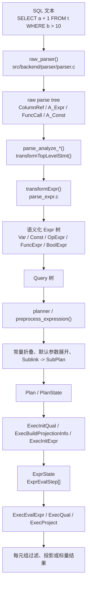
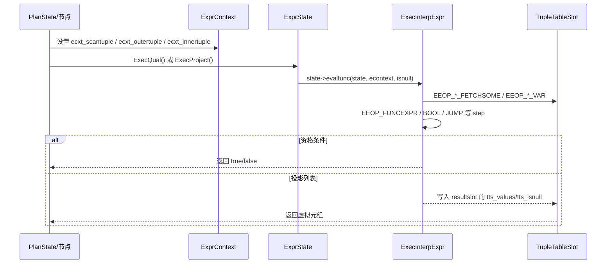
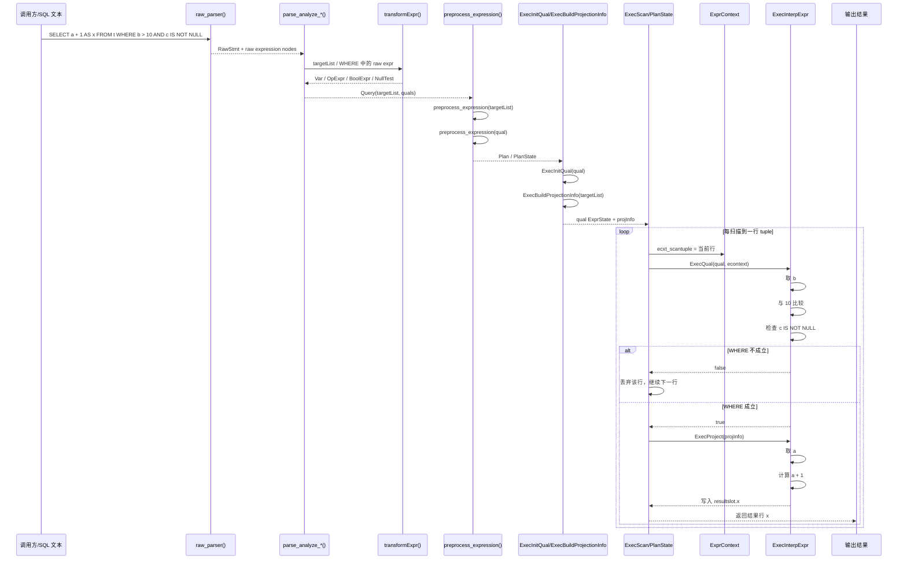

## 1. 总体判断：PostgreSQL 的表达式处理是“分阶段收敛”的框架

如果把 PostgreSQL 中的表达式处理过程压缩成一句话，可以概括为：

> **先把 SQL 文本解析成 raw expression tree，再把 raw tree 语义化为带类型与绑定信息的 `Expr` 树，随后在 planner 中做表达式预处理，最后在 executor 中编译成线性 step program 并逐 tuple 计算。**

它不是“parser 直接算值”，也不是“执行器直接解释 SQL 文本”，而是分成四个层次：

1. **raw parse 层**：把文本变成尚未绑定对象、尚未确定类型的原始语法树；
2. **parse analyze 层**：把 `ColumnRef`、`A_Expr`、`FuncCall` 之类 raw 节点变成 `Var`、`OpExpr`、`FuncExpr` 等可执行语义节点；
3. **planner 预处理层**：对表达式做常量折叠、别名展开、子链接改写等，为计划生成和执行做准备；
4. **executor 计算层**：把 `Expr` 树编译成 `ExprState + ExprEvalStep[]`，并在 `ExprContext` 中对每一行数据求值。

因此 PostgreSQL 对表达式的核心设计并不是“保留树到最后再递归解释”，而是：

> **前半段用树结构完成语义建模，后半段用线性 step 程序完成高效执行。**

---

## 2. 为什么表达式必须拆成多个阶段

表达式看起来只是 `a + 1`、`b > 10`、`func(x)` 这样的局部结构，但工程上它同时涉及四类不同问题，而这四类问题天然适合放在不同阶段解决。

### 2.1 语法问题：文本先要能被“看懂”

例如：

```sql
a + 1
b > 10 AND c IS NOT NULL
sum(x) FILTER (WHERE y > 0)
```

在最早阶段，系统只需要知道：

- 这里是一个运算符表达式；
- 那里是一个函数调用；
- `AND` 左右又各自是子表达式；
- 某个位置出现了列引用或字面量。

这一步适合交给 grammar + raw parser，产出诸如：

- `ColumnRef`
- `A_Const`
- `A_Expr`
- `FuncCall`
- `BoolExpr`

但这时系统还不知道 `a` 到底引用哪张表的哪一列，也不知道 `+` 最终该绑定到哪个具体 operator/function。

### 2.2 语义问题：表达式必须“绑定”到数据库对象

`a + 1` 真正可执行之前，至少要回答：

- `a` 来自哪个 range table entry；
- `a` 的类型是什么；
- 常量 `1` 是 `int4`、`numeric` 还是别的类型；
- `+` 应该选择哪个重载；
- 是否需要隐式 cast；
- 最终表达式结果类型、typmod、collation 是什么。

这些都属于 parse analysis 阶段的职责。

### 2.3 计划问题：表达式还需要为 planner 服务

表达式不是只为了“算出一个值”。planner 还要基于它判断：

- 哪些子表达式可以预先折叠为常量；
- `IN (...)` 是否值得改成 hash 查找；
- `SubLink` 是否需要改写为 `SubPlan`；
- join alias、参数、子查询相关引用如何下放或替换。

这一步属于 planner 的表达式预处理。

### 2.4 运行时问题：真正执行时不能再递归走整棵树

如果 executor 在每一行数据上都递归遍历 `Expr` 树、频繁分派函数、反复做 slot 检查，开销会很高。

所以 PostgreSQL 的做法是：

- 先把表达式树编译为线性的 `ExprEvalStep[]`；
- 运行期只需要驱动一个小型解释器或 JIT 后的执行函数；
- 每次基于当前 tuple 和参数上下文快速求值。

这就是 executor 里 `ExprState` 设计的出发点。

---

## 3. 总体链路概览



这张图对应着四个关键判断：

1. **parser 只负责建 raw tree，不负责目录查询与执行；**
2. **analyze 负责把 raw node 变成真正带语义的 `Expr`；**
3. **planner 负责把表达式改造成更适合计划与执行的形态；**
4. **executor 最终并不直接跑树，而是跑 step program。**

---

## 4. raw parse：表达式首先只是 raw node

### 4.1 `raw_parser()` 是表达式进入 PostgreSQL 的总入口

入口位于 [src/backend/parser/parser.c](../src/backend/parser/parser.c)。

`raw_parser()` 的职责非常明确：

- 调用 scanner / bison grammar；
- 产出 raw parse tree；
- **不做表访问，不做语义绑定，不做执行准备**。

这也是 [src/backend/parser/parser.c](../src/backend/parser/parser.c) 文件头部特别强调的点：grammar 不能依赖 catalog 访问，因此输出的只是 **raw parsetree**。

### 4.2 expression grammar 产出的还只是“语法形状”

表达式 grammar 主要位于 [src/backend/parser/gram.y](../src/backend/parser/gram.y)。这里会把文本组织成表达式相关的 raw node，例如：

- `ColumnRef`
- `A_Const`
- `A_Expr`
- `FuncCall`
- `TypeCast`
- `A_Indirection`
- `BoolExpr`
- `SubLink`

比如：

```sql
a + 1
```

在 raw parse 之后，更接近：

```text
A_Expr(+)
├─ ColumnRef(a)
└─ A_Const(1)
```

此时它仍然不是 executor 可执行的 `OpExpr`。

### 4.3 raw 层的关键词：只保留结构，不决定语义

这一层的目标不是决定“这个表达式怎么执行”，而是决定：

- 语法是否合法；
- 子表达式边界在哪里；
- 运算符、函数、字面量、列引用之间如何嵌套。

因此 raw 层最重要的产物不是类型或执行计划，而是：

> **一棵足够保真、但尚未绑定语义的表达式语法树。**

---

## 5. parse analysis：把 raw expression tree 变成可执行语义树

### 5.1 `parse_analyze_*()` 驱动表达式语义化

在 [src/backend/parser/analyze.c](../src/backend/parser/analyze.c) 中：

- `parse_analyze_fixedparams()`
- `parse_analyze_varparams()`
- `parse_analyze_withcb()`

都会进入 `transformTopLevelStmt()`，再进一步分派到 `transformSelectStmt()`、`transformUpdateStmt()`、`transformInsertStmt()` 等语句级处理函数。

表达式本身通常会通过这些入口被送进：

- `transformTargetList()`
- `transformWhereClause()`
- `transformLimitClause()`
- `transformAssignedExpr()`

它们最终又会落到 [src/backend/parser/parse_expr.c](../src/backend/parser/parse_expr.c) 里的 `transformExpr()`。

### 5.2 `transformExpr()` 是表达式语义分析的核心入口

`transformExpr()` 会设置当前表达式所处上下文 `ParseExprKind`，然后进入 `transformExprRecurse()`。

这个递归分派器会按 raw node 类型分别处理，例如：

- `ColumnRef` → `transformColumnRef()`
- `A_Const` → `make_const()`
- `A_Expr` → `transformAExprOp()` / `transformAExprIn()` / `transformAExprBetween()`
- `FuncCall` → `transformFuncCall()`
- `BoolExpr` → `transformBoolExpr()`
- `SubLink` → `transformSubLink()`
- `CaseExpr` → `transformCaseExpr()`

也就是说：

> **`transformExprRecurse()` 是 raw expression node 到 typed/analyzed expression node 的总分发器。**

### 5.3 `ColumnRef` 如何变成 `Var`

`transformColumnRef()` 位于 [src/backend/parser/parse_expr.c](../src/backend/parser/parse_expr.c)。它主要做三件事：

1. 先检查当前表达式上下文是否允许列引用；
2. 再根据名字长度判断是 `A`、`A.B`、`A.B.C` 还是 whole-row 形式；
3. 通过 namespace / range table 解析，把引用绑定成真正的列节点。

因此一个 raw 的：

```text
ColumnRef(a)
```

在 analyze 后，通常会变成更接近：

```text
Var
├─ varno = 某个 RTE
├─ varattno = 某列号
└─ vartype = 该列类型
```

### 5.4 `A_Expr` 如何变成 `OpExpr`

`transformAExprOp()` 负责普通运算符表达式的转换。典型流程是：

1. 先递归分析左右子表达式；
2. 根据运算符名和参数类型解析 operator 重载；
3. 必要时插入隐式类型转换；
4. 最终通过 `make_op()` 生成 `OpExpr`。

因此 raw 的：

```text
A_Expr(+)
├─ ColumnRef(a)
└─ A_Const(1)
```

分析后会更接近：

```text
OpExpr(+)
├─ Var(a)
└─ Const(1)
```

并且 `OpExpr` 已经携带可执行所需的 operator / function 绑定信息。

### 5.5 `FuncCall` 如何变成 `FuncExpr`

`transformFuncCall()` 会先递归转换实参，再调用 `ParseFuncOrColumn()` 完成函数/列二义性解析、重载决议、默认参数扩展等工作。

它最终可能得到：

- `FuncExpr`
- `Aggref`
- `WindowFunc`
- 某些列/函数歧义场景下的其他可行节点

这说明 PostgreSQL 对函数调用的处理不是“见到括号就生成一个函数节点”，而是：

> **先把参数表达式分析清楚，再做名字解析、重载决议与类别判断。**

### 5.6 `transformWhereClause()` 和 `transformTargetEntry()` 把表达式嵌回语句框架

在 [src/backend/parser/parse_clause.c](../src/backend/parser/parse_clause.c) 中，`transformWhereClause()` 的职责是：

- 调用 `transformExpr()`；
- 必要时做额外 hook 优化；
- 最终用 `coerce_to_boolean()` 保证条件表达式是布尔语义。

在 [src/backend/parser/parse_target.c](../src/backend/parser/parse_target.c) 中，`transformTargetEntry()` 则负责：

- 先把 SELECT/RETURNING/UPDATE 源表达式做 `transformExpr()`；
- 再包装成 `TargetEntry`；
- 为目标列分配列名和 resno。

这意味着表达式在 analyze 层并不是孤立存在的，而是被装配进：

- `Query->targetList`
- `Query->jointree->quals`
- `Query->havingQual`
- `Query->limitCount`
- `Query->returningList`

等语句结构里。

### 5.7 analyze 阶段的核心产物：`Query` 里的 typed `Expr`

到了这一步，表达式已经从“纯语法节点”变成了：

- 已经完成对象绑定；
- 已经确定类型与 collation；
- 已经插入必要 coercion；
- 能继续进入 optimizer / executor 的 `Expr` 树。

因此 parse analysis 的本质可以概括为：

> **把 raw expression tree 解释成数据库真正理解的语义表达式树。**

---

## 6. planner 预处理：把语义树改造成更适合计划与执行的形态

### 6.1 planner 会系统性预处理 `targetList`、`qual`、`having`、`limit` 等表达式

在 [src/backend/optimizer/plan/planner.c](../src/backend/optimizer/plan/planner.c) 中，planner 早期会对：

- `parse->targetList`
- `withCheckOptions`
- `returningList`
- `havingQual`
- `limitOffset`
- `limitCount`
- `onConflict` / `merge` 相关表达式

统一调用 `preprocess_expression()`。

因此 planner 并不是只优化 join/path，它也会先系统性清洗、规整 query tree 中的表达式。

### 6.2 `preprocess_expression()` 的几类关键动作

从 [src/backend/optimizer/plan/planner.c](../src/backend/optimizer/plan/planner.c) 可见，这一阶段至少会做这些工作：

#### 1）展开 join alias

如果 query 含 join RTE，表达式会先经过 `flatten_join_alias_vars()`，把 join alias 上的引用还原为更基础的变量表达形式。

#### 2）常量折叠与默认参数展开

`preprocess_expression()` 会调用 `eval_const_expressions()`。而在 [src/backend/optimizer/util/clauses.c](../src/backend/optimizer/util/clauses.c) 中，这个过程不仅做常量折叠，还会：

- 展开需要默认参数的函数调用；
- 把 named arguments 转成 positional 形式；
- 扁平化嵌套的 `AND` / `OR`。

这一点非常重要，因为 executor **并不负责** 处理这些 planner 级整理动作。

#### 3）qual 规范化

对于 `EXPRKIND_QUAL`，planner 会调用 `canonicalize_qual()` 继续规整条件表达式。

#### 4）为 `ScalarArrayOpExpr` 选择 hash 执行机会

`convert_saop_to_hashed_saop()` 会检查像 `x IN (const1, const2, ...)` 这类表达式，必要时在节点上填入 hash 相关函数信息，使 executor 可以用哈希而不是线性扫描来求值。

#### 5）把 `SubLink` 变成 `SubPlan`

如果 query 含 `SubLink`，`preprocess_expression()` 会调用 `SS_process_sublinks()`，把表达式内部的子查询语义改造成执行期可消费的 `SubPlan` 结构。

### 6.3 standalone expression 也会经过简化版 planner 处理

对于不在普通 query plan 里的表达式，例如：

- CHECK constraint
- generated column
- default expression
- utility 命令里临时构造的表达式

executor 侧常通过 `ExecPrepareExpr()` 先调用 `expression_planner()`，该函数位于 [src/backend/optimizer/plan/planner.c](../src/backend/optimizer/plan/planner.c)。

它至少会做两件事：

1. `eval_const_expressions()`
2. `fix_opfuncids()`

也就是说，即便没有完整的 plan tree，PostgreSQL 仍然会尽量先把表达式整理到适合执行的状态。

---

## 7. executor 编译：把 `Expr` 树编译成 `ExprState + ExprEvalStep[]`

### 7.1 executor 不直接镜像表达式树，而是把它编译成线性程序

[src/backend/executor/README](../src/backend/executor/README) 对这件事解释得很清楚：

- 表达式不会像 `Plan` 那样再对应一棵 state tree；
- 每棵可独立执行的表达式只对应一个 `ExprState`；
- 真正的执行内容保存在 `ExprState->steps[]` 中；
- `steps[]` 是 `ExprEvalStep` 的扁平数组。

这套设计的核心目标是：

- 避免运行期树递归；
- 降低函数调用和栈开销；
- 兼容解释执行与 JIT 编译两种后端。

### 7.2 `ExprState`、`ExprEvalStep`、`ExprContext` 是三类关键对象

#### `ExprState`

定义见 [src/include/nodes/execnodes.h](../src/include/nodes/execnodes.h)。它可以理解为“编译后的表达式程序对象”，其中包含：

- `resvalue` / `resnull`
- `resultslot`
- `steps`
- `evalfunc`
- `expr`
- `parent`

#### `ExprEvalStep`

定义见 [src/include/executor/execExpr.h](../src/include/executor/execExpr.h)。它是一条表达式指令，典型 opcode 包括：

- `EEOP_CONST`
- `EEOP_INNER_VAR` / `EEOP_OUTER_VAR` / `EEOP_SCAN_VAR`
- `EEOP_FUNCEXPR`
- `EEOP_BOOL_AND_STEP_*`
- `EEOP_QUAL`
- `EEOP_JUMP`
- `EEOP_SUBPLAN`
- `EEOP_DONE`

#### `ExprContext`

定义见 [src/include/nodes/execnodes.h](../src/include/nodes/execnodes.h)。它保存运行期求值所需环境，例如：

- `ecxt_scantuple`
- `ecxt_innertuple`
- `ecxt_outertuple`
- `ecxt_per_query_memory`
- `ecxt_per_tuple_memory`
- 参数值
- 聚合值
- CASE / domain 临时值

因此可以把这三者理解为：

- `Expr`：静态语义树；
- `ExprState`：编译后的程序；
- `ExprContext`：程序执行时的现场。

### 7.3 `ExecInitExpr()` / `ExecInitQual()` / `ExecBuildProjectionInfo()` 是主要编译入口

在 [src/backend/executor/execExpr.c](../src/backend/executor/execExpr.c) 中：

- `ExecInitExpr()`：编译普通标量表达式；
- `ExecInitQual()`：编译隐式 `AND` 语义的 qual；
- `ExecInitCheck()`：编译 CHECK 约束语义；
- `ExecBuildProjectionInfo()`：编译 targetlist 投影；
- `ExecPrepareExpr()`：给 standalone expression 做 `expression_planner()` + `ExecInitExpr()`。

其中 `ExecInitQual()` 和 `ExecBuildProjectionInfo()` 非常常见，因为大多数 plan node 都要处理：

- `qual`
- `targetlist`

### 7.4 `ExecInitExprRec()` 递归走树，但产物是线性 step 列表

表达式编译真正的主力函数是 `ExecInitExprRec()`。

它会：

1. 按节点类型匹配 `nodeTag(node)`；
2. 为该节点生成 0 个、1 个或多个 `ExprEvalStep`；
3. 递归编译子表达式；
4. 把结果写到指定的 `Datum*` / `bool*` 目标位置；
5. 最后由外层统一补一个 `EEOP_DONE`。

这一步最关键的思想是：

> **虽然输入是树，但输出是“带跳转的线性指令流”。**

### 7.5 几类典型节点如何被编译

#### `FuncExpr` / `OpExpr`

在 `ExecInitExprRec()` 里，`FuncExpr` 和 `OpExpr` 都会通过 `ExecInitFunc()` 组织成函数求值 step，最终生成类似：

- 参数子表达式先计算；
- 结果直接写入 `FunctionCallInfo` 参数槽；
- 然后发出 `EEOP_FUNCEXPR*` 类 opcode。

#### `BoolExpr`

`BoolExpr` 会被拆成：

- 先计算各子表达式；
- 再插入 `EEOP_BOOL_AND_STEP_FIRST` / `STEP` / `STEP_LAST` 或 OR 对应 step；
- 配合跳转索引实现 short-circuit。

#### `CaseExpr`

`CaseExpr` 会被编译成：

- 测试值计算；
- 每个 `WHEN` 条件计算；
- `EEOP_JUMP_IF_NOT_TRUE` 跳到下一个分支；
- 匹配成功时执行 `THEN`；
- 最终统一跳到 CASE 结束位置。

这已经非常接近一个小型字节码程序，而不再像普通 AST 递归解释。

### 7.6 `ExecReadyExpr()` 决定最终采用哪种执行后端

表达式 step 流构建完以后，会调用 `ExecReadyExpr()`：

- 如果 JIT 可用并值得编译，走 JIT；
- 否则走 `ExecReadyInterpretedExpr()`。

这说明：

> **`execExpr.c` 负责“编译表达式”，`execExprInterp.c` 负责“解释执行表达式”。**

两者职责是分开的。

---

## 8. 运行时求值：解释器如何在 tuple 上执行表达式

### 8.1 `ExecInterpExpr()` 是默认解释执行入口

默认解释器位于 [src/backend/executor/execExprInterp.c](../src/backend/executor/execExprInterp.c)。

它的核心特征是：

- 基于 `ExprEvalStep->opcode` 做 dispatch；
- 对支持 computed goto 的编译器使用 direct threading；
- 否则退回 switch-threaded 实现；
- 对极简单表达式还会选择专门 fast-path 函数，如 `ExecJustConst()`、`ExecJustScanVar()` 等。

因此 PostgreSQL 的表达式执行并不是“每个节点一个虚函数回调”，而是：

> **在一个紧凑的解释器循环里按 opcode 连续执行。**

### 8.2 `ExecEvalExprSwitchContext()` 负责切换到 per-tuple 内存上下文

[src/include/executor/executor.h](../src/include/executor/executor.h) 中的 `ExecEvalExprSwitchContext()` 会：

1. 切到 `econtext->ecxt_per_tuple_memory`；
2. 调用 `state->evalfunc(state, econtext, isnull)`；
3. 再切回原上下文。

这意味着表达式求值产生的短生命周期对象，通常都依附在 per-tuple memory 上，并在 tuple 处理结束后统一 reset。

### 8.3 `ExecQual()`、`ExecProject()` 是两类最常见的外部调用接口

#### `ExecQual()`

- 用于 WHERE / JOIN / FILTER / recheck 等条件判断；
- 期待输入来自 `ExecInitQual()`；
- 把 NULL 当作 false 处理。

#### `ExecProject()`

- 用于 targetlist 求值；
- 会清空结果 slot；
- 执行 projection expression；
- 最后把结果标记成 virtual tuple 返回。

### 8.4 典型 scan 节点如何驱动表达式求值

在 [src/backend/executor/execScan.c](../src/backend/executor/execScan.c) 中，典型路径是：

1. 当前扫描行放入 `econtext->ecxt_scantuple`；
2. 调用 `ExecQual(qual, econtext)` 判断该行是否通过过滤；
3. 如果通过，再调用 `ExecProject(projInfo)` 形成输出行；
4. 否则继续扫描下一行。

这说明 executor 中表达式求值始终是“围绕当前 tuple 上下文”展开的。



---

## 9. 一个端到端例子：`SELECT a + 1 AS x FROM t WHERE b > 10 AND c IS NOT NULL`

这个例子同时覆盖了：

- targetlist 表达式：`a + 1`
- qual 表达式：`b > 10 AND c IS NOT NULL`

因此比较适合观察完整链路。

### 9.1 raw parse 之后

表达式大致可理解为：

```text
target:
A_Expr(+)
├─ ColumnRef(a)
└─ A_Const(1)

where:
BoolExpr(AND)
├─ A_Expr(>)
│  ├─ ColumnRef(b)
│  └─ A_Const(10)
└─ NullTest(IS NOT NULL)
   └─ ColumnRef(c)
```

### 9.2 analyze 之后

表达式会被绑定为更接近：

```text
target:
OpExpr(+)
├─ Var(t.a)
└─ Const(1)

where:
BoolExpr(AND)
├─ OpExpr(>)
│  ├─ Var(t.b)
│  └─ Const(10)
└─ NullTest(IS NOT NULL)
   └─ Var(t.c)
```

同时这些表达式会被挂入 `Query->targetList` 和 `Query->jointree->quals`。

### 9.3 planner 之后

planner 会继续对它们做预处理，例如：

- 常量 `1`、`10` 的类型归一；
- operator/function 绑定信息补全；
- qual 做规范化；
- 若存在更复杂的 `IN` / `SubLink` 等，再进一步改写。

### 9.4 executor startup 之后

- `qual` 会经 `ExecInitQual()` 编译成一个 `ExprState`；
- `targetList` 会经 `ExecBuildProjectionInfo()` 编译成 projection expression；
- `a + 1`、`b > 10`、`c IS NOT NULL` 都会分解成一串 `ExprEvalStep`。

例如 targetlist 中的 `a + 1`，可近似理解为：

```text
EEOP_SCAN_FETCHSOME
EEOP_SCAN_VAR          -- 取 a
EEOP_CONST             -- 放入常量 1
EEOP_FUNCEXPR          -- 调用 + 对应底层函数
EEOP_ASSIGN_TMP        -- 写入结果 slot 的第 1 列
EEOP_DONE
```

### 9.5 每处理一行时

1. scan 节点把当前行放进 `ecxt_scantuple`；
2. `ExecQual()` 先求 `b > 10 AND c IS NOT NULL`；
3. 若为 false，则丢弃该行；
4. 若为 true，则 `ExecProject()` 求 `a + 1`；
5. 结果写入输出 slot，形成返回元组。

### 9.6 把这个例子展开成一张完整处理时序图

如果把同一个例子从“收到 SQL”一直展开到“逐行出结果”，它的完整时序大致如下：



这张图可以帮助把前面的分层描述压缩成一条连续链路：

1. **raw parser 只负责把 SQL 文本拆成 raw node；**
2. **analyze 把 raw node 绑定成 `Var`、`OpExpr`、`BoolExpr` 等语义节点；**
3. **planner 再把这些表达式规整成更适合执行的形式；**
4. **executor startup 把 qual 和 targetlist 分别编译为 `ExprState`；**
5. **真正逐行运行时，先 `ExecQual()`，再 `ExecProject()`。**

这个例子最能说明 PostgreSQL 表达式框架的本质：

> **语法树只在前半段负责建模；一旦进入 executor，表达式就已经更像一段小程序。**

---

## 10. standalone expression 与 plan 内表达式的区别

除了普通查询计划中的表达式，PostgreSQL 还大量处理“脱离完整 plan tree 的表达式”，例如：

- CHECK 约束
- 生成列
- DEFAULT 表达式
- utility 命令参数表达式
- 分区约束表达式

它们的典型路径是：

```text
Expr
-> expression_planner()
-> ExecPrepareExpr()
-> ExprState
-> ExecEvalExprSwitchContext()
```

这一点说明 PostgreSQL 的表达式框架本身是相对独立的：

- 它当然可以嵌入完整查询计划；
- 但也可以作为一个独立的“表达式编译与运行时子系统”被复用。

---

## 11. 关键对象与接口速查

| 层次 | 关键对象 / 接口 | 作用 |
| --- | --- | --- |
| Raw parse | `raw_parser()` | 把文本解析为 raw parsetree |
| Raw parse | `A_Expr` / `ColumnRef` / `FuncCall` | 表达式 raw node |
| Analyze | `transformExpr()` | 表达式语义分析总入口 |
| Analyze | `transformColumnRef()` | 名字解析，生成 `Var` 等 |
| Analyze | `transformAExprOp()` | 运算符表达式转 `OpExpr` |
| Analyze | `transformFuncCall()` | 函数调用解析与重载决议 |
| Analyze | `transformWhereClause()` | 条件表达式转布尔 qual |
| Planner | `preprocess_expression()` | query 中表达式统一预处理 |
| Planner | `eval_const_expressions()` | 常量折叠、参数整理、AND/OR 扁平化 |
| Planner | `expression_planner()` | standalone expression 的 planner 预处理 |
| Executor compile | `ExecInitExpr()` | 编译普通表达式 |
| Executor compile | `ExecInitQual()` | 编译 qual |
| Executor compile | `ExecBuildProjectionInfo()` | 编译 targetlist 投影 |
| Executor compile | `ExecInitExprRec()` | 树到 step program 的主要编译器 |
| Runtime | `ExprState` | 编译后的表达式对象 |
| Runtime | `ExprEvalStep` | 一条表达式执行指令 |
| Runtime | `ExprContext` | 每次求值的执行上下文 |
| Runtime | `ExecInterpExpr()` | 默认解释执行入口 |
| Runtime | `ExecEvalExprSwitchContext()` | 切到 per-tuple memory 后求值 |
| Runtime | `ExecQual()` / `ExecProject()` | 条件判断与投影输出 |

---

## 12. 这套设计的工程收益

### 12.1 把“语法复杂度”和“执行效率”拆开

parser / analyze 阶段可以专注表达 SQL 语义，而 executor 则专注运行效率。两端各自优化，不必互相牵制。

### 12.2 统一了多种表达式来源

无论表达式来自：

- SELECT targetlist
- WHERE/HAVING/JOIN 条件
- CHECK / DEFAULT / generated column
- utility 命令中的独立表达式

最终都会汇合到统一的：

- `Expr`
- `ExprState`
- `ExprEvalStep[]`
- `ExprContext`

框架中。

### 12.3 为解释执行与 JIT 留出统一中间层

`ExprEvalStep[]` 既能被解释器消费，也能作为 JIT 编译的输入基础，因此 PostgreSQL 不需要为两套执行后端维护两种完全不同的表达式前端。

---

## 13. 推荐阅读源码

### Parser / Analyze

- [src/backend/parser/parser.c](../src/backend/parser/parser.c)
- [src/backend/parser/gram.y](../src/backend/parser/gram.y)
- [src/backend/parser/analyze.c](../src/backend/parser/analyze.c)
- [src/backend/parser/parse_expr.c](../src/backend/parser/parse_expr.c)
- [src/backend/parser/parse_clause.c](../src/backend/parser/parse_clause.c)
- [src/backend/parser/parse_target.c](../src/backend/parser/parse_target.c)

### Planner

- [src/backend/optimizer/plan/planner.c](../src/backend/optimizer/plan/planner.c)
- [src/backend/optimizer/util/clauses.c](../src/backend/optimizer/util/clauses.c)

### Executor

- [src/backend/executor/README](../src/backend/executor/README)
- [src/backend/executor/execExpr.c](../src/backend/executor/execExpr.c)
- [src/backend/executor/execExprInterp.c](../src/backend/executor/execExprInterp.c)
- [src/backend/executor/execScan.c](../src/backend/executor/execScan.c)
- [src/backend/executor/execUtils.c](../src/backend/executor/execUtils.c)
- [src/include/executor/execExpr.h](../src/include/executor/execExpr.h)
- [src/include/nodes/execnodes.h](../src/include/nodes/execnodes.h)
- [src/include/executor/executor.h](../src/include/executor/executor.h)

---

## 14. 总结

把 PostgreSQL 的表达式框架压缩成四句话，就是：

1. **parser 先把表达式文本变成 raw node；**
2. **analyze 再把 raw node 绑定成真正的 `Expr` 语义树；**
3. **planner 对 `Expr` 树做执行前整理与改写；**
4. **executor 最终把表达式编译成 step program，在 `ExprContext` 中逐 tuple 求值。**

因此 PostgreSQL 的表达式处理并不是单一函数、单一模块完成的，而是一个跨：

- parser
- analyze
- planner
- executor

四层协作的处理流水线。

如果再进一步压缩成一句最核心的话，就是：

> **PostgreSQL 用树来表达语义，用 step program 来表达执行。**
