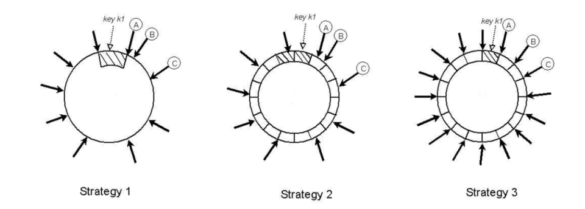
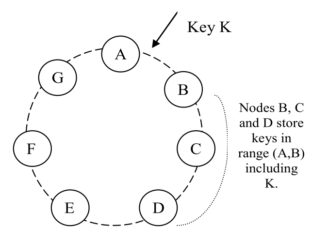
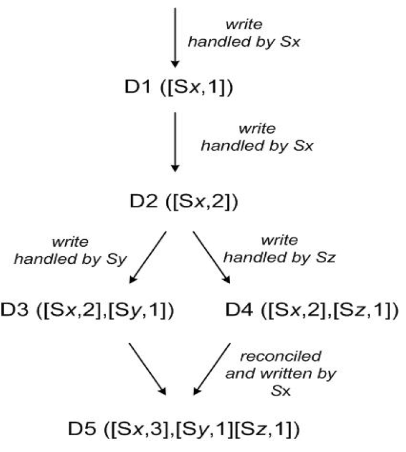

<!-- wp:shortcode -->
[toc]
<!-- /wp:shortcode -->

<!-- wp:heading -->
<h2>Dynamo回顾</h2>
<!-- /wp:heading -->

<!-- wp:paragraph -->

Dynamo是2006年Amazon为了支撑内部应用而设计的键值数据库，主要为了满足以下需求而构建：

<!-- /wp:paragraph -->

<!-- wp:list -->
<ul><li>在购物车、客户偏好、商品目录等应用场景下往往只需要以主键（Primary Key）去检索一个对应的值（Value），关系型数据库在这些场景下效率会非常低下。</li><li>而面对日益增长的用户数量，系统应该具有良好的<strong>扩展性</strong>，通过增加设备的数量提供更强大的服务能力。</li><li>保证一部分设备下线或数据中心断电后仍能向客户提供稳定服务，需要系统保证数据的<strong>可用性</strong>和<strong>一致性</strong>。</li></ul>
<!-- /wp:list -->

<!-- wp:heading {"level":3} -->
<h3>数据分区（Partitioning）</h3>
<!-- /wp:heading -->

<!-- wp:paragraph -->

Dynamo提供增量扩展的能力，系统中随时可能有新节点加入。Dynamo采用<strong>一致性哈希</strong>将数据分散到各个节点，并使新加入的节点可以用简单的方式加入到集群中。

<!-- /wp:paragraph -->

<!-- wp:heading {"level":4} -->
<h4>原始一致性哈希</h4>
<!-- /wp:heading -->

<!-- wp:paragraph -->

逻辑上将所有节点排列成一个环，每个节点经过哈希后被分配到一个位置，就像时钟上的刻度。当一个新的数据写入时，计算key的哈希值，并对应到环中的位置<code>p</code>。从<code>p</code>出发顺时针找到的第一个节点，将数据存到该节点中。

<!-- /wp:paragraph -->

<!-- wp:paragraph -->

Dynamo最早采用原始的算法进行分区管理，但逐渐发现原始算法有两个问题：

<!-- /wp:paragraph -->

<!-- wp:list -->
<ul><li>节点位置通过哈希值分配，导致每个节点之间的间隔可能不一样，数据点落在每个间隔的概率也不一样。</li><li>网络中的节点可能是性能不同的服务器，没有办法针对不同性能的节点分配负载。 因此需要对算法进行改进。</li></ul>
<!-- /wp:list -->

<!-- wp:heading {"level":4} -->
<h4>改进的一致性哈希</h4>
<!-- /wp:heading -->

<!-- wp:paragraph -->

与原始版本环上是物理节点不同，改进版本的环与物理节点解耦，由虚拟节点组成。一个物理节点可以对应到多个虚拟节点，每个虚拟节点对应一个环上的<code>token</code>。当一个新节点<code>X</code>加入到系统后，获得特定数量的<code>token</code>，数量可以根据物理节点的容量调节。通过对应到不同数量的虚拟节点，获得了弹性的节点管理能力。

<!-- /wp:paragraph -->

<!-- wp:image -->
<figure class="wp-block-image"></figure>
<!-- /wp:image -->

<!-- wp:heading {"level":3} -->
<h3>数据复制（Replication）</h3>
<!-- /wp:heading -->

<!-- wp:paragraph -->

为了在部分服务器宕机的情况下不丢失数据并继续为客户提供服务，Dynamo在数据分区的基础上将同一份数据拷贝到<code>N</code>个节点上。

<!-- /wp:paragraph -->

<!-- wp:paragraph -->

具体来说，插入一个数据时找到环上的第一个节点后，这个节点成为协调者节点<code>（coordinator）</code>。协调者节点负责将数据复制到环上顺时针顺序的后续<code>N-1</code>个节点上。如下图所示，主键为K的数据被哈希到区间<code>(A, B]</code>，节点B成为协调者节点后将数据拷贝到节点C和节点D.

<!-- /wp:paragraph -->

<!-- wp:paragraph -->

存储<code>Key K</code>的所有逻辑节点会被加入到一个列表中，称为<strong>Preference List</strong>，在选择逻辑节点时如果遇到重复的物理节点就会跳过该节点，以保证列表中的N个物理节点是不重复的。为了提升高可用性，Preference List中的节点要分散到不同的数据中心，以防止某个数据中心挂掉。

<!-- /wp:paragraph -->

<!-- wp:image -->
<figure class="wp-block-image"></figure>
<!-- /wp:image -->

<!-- wp:heading {"level":4} -->
<h4>增加/移除节点</h4>
<!-- /wp:heading -->

<!-- wp:paragraph -->

当一个新节点要加入到环中，后续的几个节点原来负责管理的一部分范围会移交到新节点。例如上图中如果加入一个新节点<code>X</code>到<code>(A,B]</code>，原本由节点<code>B</code>负责的<code>(F, G]</code>分区会被移交到<code>X</code>，<code>B</code>向<code>X</code>传输相应范围内的数据。

<!-- /wp:paragraph -->

<!-- wp:paragraph -->

如果<code>X</code>被移除，则会将对应的数据分散到对应其它节点。

<!-- /wp:paragraph -->

<!-- wp:paragraph -->

实际运行表明这种方式可以在存储节点之间保持key的均匀分布。

<!-- /wp:paragraph -->

<!-- wp:heading {"level":3} -->
<h3>最终一致性</h3>
<!-- /wp:heading -->

<!-- wp:paragraph -->

Dynamo提供<strong>最终一致性</strong>保证，更新操作异步地持久化到系统中，也就是说协调者向副本节点发送完副本不会等所有副本节点都回复，就会向客户端返回成功消息。网络中的数据最终会达到一致，但什么时候能达到一致是不清楚的。

<!-- /wp:paragraph -->

<!-- wp:paragraph -->

更新数据时协调者节点会将新数据拷贝给Perference List中的各个副本节点，新数据经过分区和拷贝，分散到各个数据中心的不同节点上。但难免会有某个节点暂时掉线或由于并发写入而使得各个副本出现不一致的状况。

<!-- /wp:paragraph -->

<!-- wp:paragraph -->

Dynamo通过<strong>向量时钟</strong>和<strong>读时合并</strong>对数据的多个版本进行管理。

<!-- /wp:paragraph -->

<!-- wp:heading {"level":4} -->
<h4>向量时钟（Vector Clock）</h4>
<!-- /wp:heading -->

<!-- wp:paragraph -->

Lamport时间戳可以表示具有因果关系的事件之间的逻辑顺序，但是对于相互之间没有因果关系的事件，Lamport时间戳并不能正确地表示。形式化地表述的话，假设有事件<code>a</code>和事件<code>b</code>，<code>C(x)</code>表示事件<code>x</code>的逻辑时间戳，若事件<code>a</code>发生在<code>b</code>之前<code>（a->b）</code>，则可以推出<code>C(a)<C(b)</code>；但在<code>C(a)<C(b)</code>的情况下，其实有可能是<code>a</code>和<code>b</code>并发地另一个进程发送消息，两者之间并不能推断出存在因果关系。

<!-- /wp:paragraph -->

<!-- wp:paragraph -->

如果使用Lamport时间戳管理不同的数据版本，可能会出现一份数据并发地被两个节点修改，两个版本属于需要进行合并操作，但是由于时间戳存在大小关系导致系统将其中一份数据当作旧版本覆盖掉。

<!-- /wp:paragraph -->

<!-- wp:paragraph -->

向量时钟是对Lamport时间戳的改进，通过<strong>版本向量</strong>记录当前版本数据先前被哪些节点修改过，每个节点修改过几次。只要对比版本向量，就可以判断出两个版本存在先后顺序还是平行的版本。如果版本向量<code>a</code>中的所有计数器都小于另一个版本向量<code>b</code>，那么就可以判断<code>a</code>是<code>b</code>的祖先版本，可以被安全地覆盖。否则两个版本存在冲突。（为了控制篇幅向量时钟具体怎么操作的请参考原论文和<a href="https://zhuanlan.zhihu.com/p/56886156">分布式系统：向量时钟</a>）

<!-- /wp:paragraph -->

<!-- wp:image -->
<figure class="wp-block-image"></figure>
<!-- /wp:image -->

<!-- wp:heading {"level":4} -->
<h4>读时合并</h4>
<!-- /wp:heading -->

<!-- wp:paragraph -->

客户端进行写入时需要先进行读取，从数据的context可以知道该数据目前有多少个版本。如上图存在<code>D3</code>和<code>D4</code>两个冲突版本。某个客户端读取时会读取所有版本并在本地进行合并后，由<code>Sx</code>作为协调节点进行写回。

<!-- /wp:paragraph -->

<!-- wp:paragraph -->

为了缩短版本向量的长度，Dynamo为每一个<code>(节点, 计数器)</code>元组附加记录上一次计数器加一的时间戳，当版本向量长度到达一定阈值时，将最老的元组剔除。这种做法可能可能会导致版本冲突判断出现误差，但作者表示运行当中并没有发现太大问题。

<!-- /wp:paragraph -->

<!-- wp:heading {"level":4} -->
<h4>宽松仲裁（Sloppy Quorum）</h4>
<!-- /wp:heading -->

<!-- wp:paragraph -->

为了保证写入和读取内容的一致性，Dynamo采用类似仲裁系统<code>（Quorum Systems）</code>的一致性协议，简单来说就是读写申请需要得到半数以上的节点同意才能进行。假设一个数据需要复制到<code>N</code>个副本节点，<code>R</code>和<code>W</code>分别代表读和写的票数，则需要满足不等式<code>R+W>N</code>。

<!-- /wp:paragraph -->

<!-- wp:paragraph -->

具体的读写过程如下：

<!-- /wp:paragraph -->

<!-- wp:paragraph -->

<code>Put()</code>：协调者节点将数据写入本地并更新版本向量后，将版本向量连同数据发送到<code>N</code>个副本节点，如果至少有<code>W-1</code>个副本节点返回成功，则本次写入视作成功。

<!-- /wp:paragraph -->

<!-- wp:paragraph -->

<code>Get()</code>：协调者节点收到请求后将该请求发送给<code>N</code>个副本节点，等待<code>R</code>个结果返回后，检查版本向量。如果存在多个不具有因果关系的版本，则将它们全部发送给客户端，由客户端进行冲突合并。

<!-- /wp:paragraph -->

<!-- wp:heading {"level":4} -->
<h4>Merkle Tree</h4>
<!-- /wp:heading -->

<!-- wp:paragraph -->

为了能快速检测出不同节点中副本是否达到了一致，每个节点都为哈希环上的边所对应的键范围建立了Merkle Tree.

<!-- /wp:paragraph -->

<!-- wp:paragraph -->

Merkle Tree以实际存储的数据为叶结点，相邻的两个叶结点分别计算哈希值，组成一个非叶结点作为它们的共同父结点。得到的所有父节点重复该步骤，逐层向上构造，直到得到一个根节点。

<!-- /wp:paragraph -->

<!-- wp:paragraph -->

如果两个节点的副本数据一致，根结点的哈希值也会相同；若不相同，以树搜索的方式向下找到不一致的叶子节点并解决冲突。

<!-- /wp:paragraph -->

<!-- wp:paragraph -->

通过树状索引的方式可以避免线状扫描和传输范围内所有数据带来的开销，但当有节点加入或脱离，key range发生改变，就需要重新计算哈希值构建树。Merkle Tree同样运用在在比特币的区块链系统中。[7]

<!-- /wp:paragraph -->

<!-- wp:heading {"level":3} -->
<h3>高可用保证</h3>
<!-- /wp:heading -->

<!-- wp:paragraph -->

为了保证能提供随时可用的服务，除了将数据分散到不同数据中心的服务器，在节点下线后也要能及时检测出并找到可以替代它的节点。

<!-- /wp:paragraph -->

<!-- wp:heading {"level":4} -->
<h4>Gossip协议</h4>
<!-- /wp:heading -->

<!-- wp:paragraph -->

Dynamo中采用去中心化的故障检测方法Gossip协议。这个协议受传染病模型的启发，一些节点被指定为种子节点（病原体），向其他节点发送消息。接收到消息的节点被传染后，随机向其他节点发送消息，直到所有节点都进行过信息交换。

<!-- /wp:paragraph -->

<!-- wp:paragraph -->

只要客户端保持一定频率的请求，各个节点之间就会产生交互，而只要某个节点在一段时间内没有相应，请求方就可以认为该节点已经下线（实际上有可能并没有下线，只是由于两个节点间的网络问题），并从Preference List找到其它节点处理请求。

<!-- /wp:paragraph -->

<!-- wp:paragraph -->

在网络中的节点都是可信节点的环境中，Gossip协议是一个非常好用的去中心化分布式协议。可扩展性高，具有容错能力，提供最终一致性。不足之处在于传播过程有启动过程，因此存在延迟；而各个节点随机传播信息，网络中存在冗余信息，浪费了一部分网络带宽和CPU资源。

<!-- /wp:paragraph -->

<!-- wp:paragraph -->

 （图转自[4]）

<!-- /wp:paragraph -->

<!-- wp:heading {"level":4} -->
<h4>Hinted Handoff</h4>
<!-- /wp:heading -->

<!-- wp:paragraph -->

为了保证数据持久性和写入高可用，当协调者节点挂掉时，请求会被发送到其它可用的节点。接收到请求的节点会在额外的数据库中保存该数据，记录原来的协调者是哪个节点，并定期检查协调者是否重新上线。一旦原来的协调者重新上线，便将数据传输回去并删掉本地的数据副本。

<!-- /wp:paragraph -->

<!-- wp:paragraph -->

挂掉的节点负责的数据临时交给另一个节点，等挂掉节点重新上线后再交换给它，可以让系统读写能力不受短时故障影响。

<!-- /wp:paragraph -->

<!-- wp:heading {"level":3} -->
<h3>总结</h3>
<!-- /wp:heading -->

<!-- wp:paragraph -->

Dynamo可用于对可用性、可扩展性和稳定性要求较高的场景。设计中采用的一系列技术到今天大家都多少有所耳闻。

<!-- /wp:paragraph -->

<!-- wp:paragraph -->

<strong>1、并不是所有应用都需要SQL的复杂性和事务保证</strong> Dynamo作为早期NoSQL数据库中的佼佼者，对企业数据库架构设计产生了深远的影响。携程最近发的一篇博客也提到内部开发了一套Dynamo风格的存储系统[5]。

<!-- /wp:paragraph -->

<!-- wp:paragraph -->

Amazon设计Dynamo的动机可以追溯到一次流量高峰期间，由于数据库事务死锁导致的严重故障。经过深刻的反思后，他们发现浏览商品和添加购物车之类的负载根本不需要用到复杂的事务性保证。系统只要保证在高并发情况下可用，提供稳定的性能保证就够了。由此拉开了分布式NoSQL系统的大幕。

<!-- /wp:paragraph -->

<!-- wp:paragraph -->

Dynamo的成功应用也证明，只提供最终一致性完全可以用于构建高可用系统。

<!-- /wp:paragraph -->

<!-- wp:paragraph -->

<strong>2、去中心化的架构可以带来灵活的控制能力。</strong> Dynamo的去中心化可以体现在读写的去中心化和集群管理的去中心化。

<!-- /wp:paragraph -->

<!-- wp:list -->
<ul><li>中心化的系统写入往往通过master节点调度，虽然保证一致性，但在要求性能的场景下容易成为瓶颈。一致性和可用性可以通过调整参数进行调节，例如仲裁系统中提供的三个参数<code>R</code>, <code>W</code>和<code>N</code>，通过减少<code>W</code>可以通过牺牲一致性使系统在更多节点挂掉后仍具有随时可写入的能力。</li><li>集群通过Gossip协议可以自动发现节点加入和故障，不需要引入外部服务，降低了系统的复杂性。</li></ul>
<!-- /wp:list -->

<!-- wp:heading -->
<h2>参考文献</h2>
<!-- /wp:heading -->

<!-- wp:paragraph -->

[1] Dynamo: Amazon’s Highly Available Key-value Store<a href="https://www.allthingsdistributed.com/files/amazon-dynamo-sosp2007.pdf">[pdf]</a><a href="https://arthurchiao.art/blog/amazon-dynamo-zh/">[中文翻译]</a> [2] <a href="https://news.ycombinator.com/item?id=915212">Dynamo: A flawed architecture</a> [3] <a href="https://zhuanlan.zhihu.com/p/31147149/">一篇改变互联网发展进程的论文 | Dynamo</a> [4] <a href="https://cloud.tencent.com/developer/inventory/2929/article/1662426">一致性算法-Gossip协议详解</a> [5] <a href="https://zhuanlan.zhihu.com/p/556601917">携程Dynamo风格存储的落地实践</a> [6] <a href="https://www.prnasia.com/story/351088-1.shtml">NoSQL“开山之作”Amazon DynamoDB的十年创新之旅</a> [7] <a href="https://zhuanlan.zhihu.com/p/103372259">Merkle Tree</a> [8] <a href="https://zhuanlan.zhihu.com/p/419944615">向量时钟（Vector Clock）的本质</a>

<!-- /wp:paragraph -->
