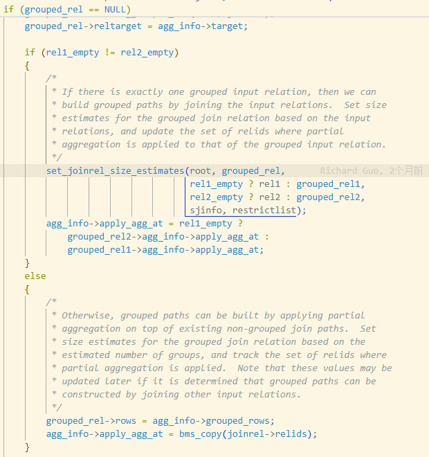
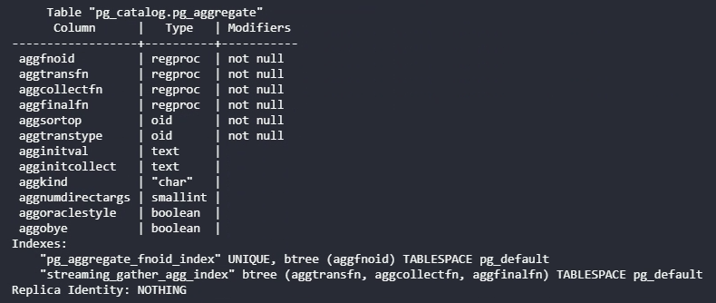

# PG 19 “聚合+连接”执行优化：Eager aggregation

## 引言

PostgreSQL 补丁**“Implement Eager Aggregation”**（实现“提前聚合”）[4] 由 Richard Guo 提交  ，是对查询优化器的一项重要增强。补丁引入 **Eager Aggregation（提前聚合）** 优化，通过**在连接（JOIN）之前提前执行部分聚合**，减少中间数据量，从而提升查询性能。

该方法源自Yan, Larson 等人在 VLDB 1995 发表的论文 *“Eager Aggregation and Lazy Aggregation”* [1]

**Eager Aggregation** 的基本思想：

> 在执行 JOIN 之前，**尽可能早地对某个表或子查询进行部分聚合（partial aggregation）**，然后再参与后续的连接操作，最终在顶层完成完整的聚合。

### 本文组织


## 理论框架

### 聚合函数可分解性

### 主定理

### E1（原始查询）

### 推论

## 设计及实现

PG 19 实现了**推论1“提前聚合”**的基本形式

### **部分聚合（Partial Aggregation）**

PostgreSQL 自 9.6 引入并行聚合以来[5]，已经能够支持将聚合计算拆分为**部分聚合**（Partial Aggregation）、**合并**（Combine）和**最终聚合**（Final Aggregation）阶段。

具体而言，在并行查询中，多个 Worker 进程首先对各自的数据分片执行部分聚合计算，然后由主进程将各工作者产生的中间聚合状态进行合并并计算最终结果。

**在规划阶段**，优化器会判断聚合函数是否支持部分聚合模式，并相应地生成两阶段的路径和计划节点。首先，`create_partial_grouping_paths` 等逻辑会为可并行的聚合生成一个 Partial Aggregate 的路径，随后再创建一个对应的 Finalize Aggregate 路径用于合并。Partial Aggregate 节点负责执行聚合的**过渡计算**（transition），而 Finalize Aggregate 节点则负责**合并中间结果并最终产出**聚合值。整个规划流程保证如果聚合函数能够拆分，则计划中会包含 Partial + Finalize 两级聚合节点；若不支持部分模式，则仅使用常规单级聚合节点。

**在执行层面**，PostgreSQL 对聚合的不同阶段有明确的函数接口和控制逻辑。每个聚合函数在系统表 `pg_aggregate` 中定义了: **状态转移函数** (`aggtransfn`)、**最终函数** (`aggfinalfn`)、以及（可选的）**合并函数** (`aggcombinefn`)，以及内部状态类型、初始值等。

- **pg_aggregate 系统表字段：** 每个聚合函数在 `pg_aggregate` 中都有一行记录，重要字段包括 `aggcombinefn` 和 `aggserialfn/aggdeserialfn`（用于并行时状态序列化）等。通常来说，如果一个聚合的 `aggcombinefn` 不为 0（有效的函数 OID），则表示它定义了合并逻辑，因而支持部分聚合模式；反之如果 `aggcombinefn` 为 0，则该聚合缺乏将多个部分状态合并的函数，无法安全地并行或分阶段聚合[postgrespro.ru](https://postgrespro.ru/list/thread-id/2361122#:~:text=Just a handful of aggregates,now don't support partial aggregation)。例如，早期 PostgreSQL 版本中像 `ARRAY_AGG`、`STRING_AGG` 等聚合没有定义 combine 函数，因此不能并行聚合；而后来版本补充了它们的 combine 实现。
- **聚合种类（aggkind）：** 一般普通聚合（aggkind='n'）只要定义了 combine 函数即可视为可分解。特殊类型的聚合（如带 ORDER BY 的聚合、hypothetical set 聚合等）可能有额外限制，但这些也是在其定义中标识。

Executor 中的 `AggState` 结构通过一个 `AggSplit` 标志来标识当前聚合节点所处的阶段/模式（例如部分聚合或最终聚合）[postgresql.org](https://www.postgresql.org/message-id/CAKJS1f_Cc6D%2BJm7oo%3DdQ0kdWqMuzDpWFE3PzR8kPy2DSnc8YsQ%40mail.gmail.com#:~:text=of how the code was,We'd need an)。执行时区别主要在于：对普通（或部分）聚合节点，Executor会对每个输入元组调用聚合的状态转移函数进行累计；而对Finalize聚合节点，Executor接受的是已部分聚合的中间状态，需要调用聚合的合并函数来汇总多个部分状态[postgresql.org](https://www.postgresql.org/message-id/CAKJS1f_Cc6D%2BJm7oo%3DdQ0kdWqMuzDpWFE3PzR8kPy2DSnc8YsQ%40mail.gmail.com#:~:text=pg_aggregate,in explain)。也就是说，在Finalize阶段，**使用 `aggcombinefn` 来合并之前阶段产生的聚合状态**，而在普通Aggregate或Partial Aggregate阶段，则**使用 `aggtransfn` 来逐条处理原始输入**[postgresql.org](https://www.postgresql.org/message-id/CAKJS1f_Cc6D%2BJm7oo%3DdQ0kdWqMuzDpWFE3PzR8kPy2DSnc8YsQ%40mail.gmail.com#:~:text=pg_aggregate,in explain)。此外，Partial Aggregate节点在处理完输入后**不会调用最终函数**(`aggfinalfn`)，其输出就是聚合的中间状态；而 Finalize Aggregate 节点在合并完成后会调用最终函数将聚合状态转换为最终结果输出[postgresql.org](https://www.postgresql.org/message-id/CAKJS1f_Cc6D%2BJm7oo%3DdQ0kdWqMuzDpWFE3PzR8kPy2DSnc8YsQ%40mail.gmail.com#:~:text=only we use the pg_aggregate,in explain)。通过这种机制，PostgreSQL 实现了部分聚合->合并->最终计算的分阶段模型。

总的来说，PostgreSQL 的执行模型已经涵盖了部分聚合、合并和最终聚合这三个逻辑阶段，并在 Planner/Executor 中有相应抽象来支持。

在 `EXPLAIN` 计划中，这体现为存在 “Partial Aggregate” 节点（由并行 worker 执行）和对应的 “Finalize Aggregate” 节点（由主节点执行）。例如，并行执行 `SUM()` 时，每个 worker 会对其数据片段进行部分聚合累加出局部和，主节点上的 Finalize Aggregate 则汇总各部分和并输出最后结果。

```SQL
explain analyze select min(ts) from test;
                                                                 QUERY PLAN
--------------------------------------------------------------------------------------------------------------------------------------------
 Finalize Aggregate  (cost=154588.51..154588.52 rows=1 width=8) (actual time=476.593..476.593 rows=1 loops=1)
   ->  Gather  (cost=154588.29..154588.50 rows=2 width=8) (actual time=476.539..476.588 rows=3 loops=1)
         Number of Workers: 2
         ->  Partial Aggregate  (cost=153588.29..153588.30 rows=1 width=8) (actual time=471.074..471.074 rows=1 loops=3)
               ->  Parallel Seq Scan on test  (cost=0.00..143171.43 rows=4166743 width=8) (actual time=0.040..240.595 rows=3333333 loops=3)
 Planning time: 0.148 ms
 Execution time: 477.425 ms
(7 rows)
```

### 关键数据结构

**Aggref 节点表示聚合调用**

 在PostgreSQL的查询树中，`Aggref` 是表示聚合函数调用的表达式节点。例如 `SUM(x)` 在解析树中就是一个 Aggref，包含了所调用的聚合函数的 OID (`aggfnoid`)、输入参数列表、输出类型 (`aggtype`)、以及聚合的状态类型 (`aggtranstype`) 等信息[doxygen.postgresql.org](https://doxygen.postgresql.org/prepagg_8c.html#:~:text=149 aggTuple %3D SearchSysCache1)[doxygen.postgresql.org](https://doxygen.postgresql.org/prepagg_8c.html#:~:text=170 %2F,transition state%2C if polymorphic)。Aggref 本身并不直接区分是部分还是最终聚合——它更偏向逻辑层面的表示。然而，在规划阶段，当优化器决定使用部分聚合时，会在对应的 Aggref/TargetEntry 上设置其 `aggtranstype`（内部状态类型）等属性，并在物理计划中结合 Agg节点的模式标志来体现部分/最终之分[doxygen.postgresql.org](https://doxygen.postgresql.org/prepagg_8c.html#:~:text=170 %2F,transition state%2C if polymorphic)[doxygen.postgresql.org](https://doxygen.postgresql.org/nodeAgg_8c.html#:~:text=match at L6192 3801 if,aggsplit)。也就是说，一个聚合在部分聚合阶段和最终阶段共享同一个查询树表达（相同的 Aggref），但在实际执行时会因所在 Agg 节点的 aggsplit 模式不同而使用不同的函数。

**AggPath/Agg 节点建模聚合路径：** 在路径规划阶段，PG 使用 `AggPath`（或相应的 GroupingPath）来表示一个聚合操作的计划路径。AggPath包括聚合策略（哈希聚合或排序聚合）、以及 `AggSplit` 模式等信息。对于支持部分聚合的场景，优化器会生成两种相关的路径：

- 部分聚合路径（Partial Agg），其 AggSplit 标志包含 “SKIPFINAL” (表示跳过最终函数) 等，以执行仅累积状态、不输出最终值的聚合。
- 最终聚合路径（Finalize Agg），其 AggSplit 标志包含 “COMBINE” (表示需要合并多个部分状态) 以及不跳过最终计算，以在获取部分结果后合并并输出最终结果[postgresql.org](https://www.postgresql.org/message-id/CAKJS1f_Cc6D%2BJm7oo%3DdQ0kdWqMuzDpWFE3PzR8kPy2DSnc8YsQ%40mail.gmail.com#:~:text=only we use the pg_aggregate,in explain)[doxygen.postgresql.org](https://doxygen.postgresql.org/nodeAgg_8c.html#:~:text=match at L6192 3801 if,aggsplit)。

在实际计划中，这对应于 Partial Aggregate 和 Finalize Aggregate 两个 PlanNode。每个 PlanNode 中持有一个或多个 Aggref 表达式，但它们通过 AggSplit 来知道该节点应调用 aggtransfn 还是 aggcombinefn，以及是否应调用 aggfinalfn[postgresql.org](https://www.postgresql.org/message-id/CAKJS1f_Cc6D%2BJm7oo%3DdQ0kdWqMuzDpWFE3PzR8kPy2DSnc8YsQ%40mail.gmail.com#:~:text=pg_aggregate,in explain)[postgresql.org](https://www.postgresql.org/message-id/CAKJS1f_Cc6D%2BJm7oo%3DdQ0kdWqMuzDpWFE3PzR8kPy2DSnc8YsQ%40mail.gmail.com#:~:text=That's sort of simplified as,combined and)。例如，在 Partial Agg 节点 (`aggsplit` 带有 SKIPFINAL)，执行引擎会针对每个输入调用 aggtransfn 更新状态，并且在聚合结束时不调用 aggfinalfn[postgresql.org](https://www.postgresql.org/message-id/CAKJS1f_Cc6D%2BJm7oo%3DdQ0kdWqMuzDpWFE3PzR8kPy2DSnc8YsQ%40mail.gmail.com#:~:text=That's sort of simplified as,combined and)。而在 Finalize Agg 节点 (`aggsplit` 带有 COMBINE，没有 SKIPFINAL)，引擎会对收到的每组部分状态调用 aggcombinefn 来合并，最后对合并后的状态调用 aggfinalfn 输出结果[postgresql.org](https://www.postgresql.org/message-id/CAKJS1f_Cc6D%2BJm7oo%3DdQ0kdWqMuzDpWFE3PzR8kPy2DSnc8YsQ%40mail.gmail.com#:~:text=pg_aggregate,in explain)[postgresql.org](https://www.postgresql.org/message-id/CAKJS1f_Cc6D%2BJm7oo%3DdQ0kdWqMuzDpWFE3PzR8kPy2DSnc8YsQ%40mail.gmail.com#:~:text=That's sort of simplified as,combined and)。

**AggState 执行阶段细节：** 执行时每个 Agg（聚合）节点对应一个 `AggState`，其中保存了每个聚合的运行时信息（AggStatePerTrans 等）。AggState 中的重要字段包括当前的聚合模式标志 `aggsplit`、聚合策略 `aggstrategy` 等[doxygen.postgresql.org](https://doxygen.postgresql.org/nodeAgg_8c.html#:~:text=3320 aggstate)。PG 在初始化 AggState 时会根据 PlanNode 的 aggsplit 设置需要使用的函数指针：如果是部分模式则取 pg_aggregate.aggtransfn 作为状态累积函数，如果是结合/最终模式则取 aggcombinefn 作为累积函数，同时根据是否跳过最终阶段决定是否调用 aggfinalfn[postgresql.org](https://www.postgresql.org/message-id/CAKJS1f_Cc6D%2BJm7oo%3DdQ0kdWqMuzDpWFE3PzR8kPy2DSnc8YsQ%40mail.gmail.com#:~:text=pg_aggregate,in explain)[doxygen.postgresql.org](https://doxygen.postgresql.org/nodeAgg_8c.html#:~:text=match at L6192 3801 if,aggsplit)。在 `nodeAgg.c` 中可以看到，根据 aggsplit 标志选择不同的函数调用路径：当 DO_AGGSPLIT_COMBINE 为真时使用 combine 函数处理输入（即表明当前在 Finalize/合并阶段）[doxygen.postgresql.org](https://doxygen.postgresql.org/nodeAgg_8c.html#:~:text=match at L6483 3943 if,aggsplit)；当 DO_AGGSPLIT_COMBINE 为假（即普通或部分聚合阶段）则使用 transition 函数处理输入[postgresql.org](https://www.postgresql.org/message-id/CAKJS1f_Cc6D%2BJm7oo%3DdQ0kdWqMuzDpWFE3PzR8kPy2DSnc8YsQ%40mail.gmail.com#:~:text=pg_aggregate,in explain)。类似地，AggState 会在 DO_AGGSPLIT_SKIPFINAL 为真时跳过调用最终函数[doxygen.postgresql.org](https://doxygen.postgresql.org/nodeAgg_8c.html#:~:text=match at L6192 3801 if,aggsplit)。通过这些机制，AggState 能够清楚地区分并处理“部分聚合”和“最终聚合”两种执行逻辑。

论文《Eager Aggregation and Lazy Aggregation》中将**可分解聚合函数**形式化为 $F_d = F_{d2} \circ F_{d1}$，其中 $F_{d1}$ 作用于数据分块产生中间结果，$F_{d2}$ 再将多个中间结果合成为最终结果。这一模型要求聚合函数满足可分解性，即可以拆分为“局部聚合函数”和“全局聚合函数”两个组成部分。

对照 PostgreSQL 的实现，我们可以看到两者在概念上基本一致：

**部分聚合 (Partial Aggregation) 对应 $F_{d1}$：**PG 中的聚合过渡函数 (`AggTransFn`) 扮演了 $F_{d1}$ 的角色。它接受原始输入逐条更新聚合的内部状态，相当于对数据子集计算局部聚合结果。例如，对于 `SUM()`，过渡函数会持续累加，得到子集的部分和；对于 `AVG()`，过渡函数累积 sum 和 count 等中间量。这一步骤在每个并行 worker 或每个数据分区上独立进行，相当于论文中的对每个数据分块应用 $F_{d1}$。

**合并 & 最终聚合对应 $F_{d2}$：**PG 中的合并函数 (`AggCombineFn`) 加上最终函数 (`AggFinalFn`)共同实现了论文中 $F_{d2}$ 的功能。合并函数负责将多个 $F_{d1}$ 的输出（聚合状态）合并到一起，最终函数则（如有需要）对合并后的状态做最后的转换得到结果值。换言之，PG在 Finalize 阶段先用 `AggCombineFn` 汇总各部分聚合状态，然后用 `AggFinalFn` 得出最终输出，这整个过程等价于对所有 $F_{d1}$ 结果施加 $F_{d2}$。以平均数为例，各部分的 (sum, count) 状态通过 combine 函数两两累加合成为全局 (Sum_total, Count_total)，再经最终函数计算 `Sum_total/Count_total` 得出平均值。对于像 SUM、MAX 这类最终结果与内部状态相同的聚合，`AggFinalFn` 可以是简单恒等映射，此时 $F_{d2}$ 的主要工作就是 combine 函数做累加或比较等操作。总体而言，PostgreSQL 的 combine+final 阶段完全实现了对部分结果集进行二次聚合的逻辑，与 $F_{d2}$ 对应[postgresql.org](https://www.postgresql.org/message-id/CAKJS1f_Cc6D%2BJm7oo%3DdQ0kdWqMuzDpWFE3PzR8kPy2DSnc8YsQ%40mail.gmail.com#:~:text=pg_aggregate,in explain)。

论文模型将 $F_{d2}$ 视作一个整体函数，而 PG 实现上常将其细分为**合并**和**最终**两步。这是因为某些聚合需要一个单独的最终计算（例如 AVG 需要在合并后做除法得到最终平均值）。但从语义上看，$F_{d2}$ 可以理解为 PG 在 Finalize 阶段所做的一切操作的组合，即“合并部分聚合状态并输出结果”的复合功能。因此，我们可以认为**PG 的部分聚合阶段就是论文的 $F_{d1}$，PG 的合并+最终阶段共同实现了 $F_{d2}$**。只要聚合定义中提供了正确的 `AggCombineFn` 和 `AggFinalFn`，使用两阶段执行应当与单阶段直接计算得到相同的结果——这正是可分解聚合函数的要求。

PostgreSQL 当前聚合模型与论文中的可分解聚合语义基本一致：对于**可分解**的聚合函数，PG能够做到在各数据片上应用$F_{d1}$，并在更高层聚合$F_{d1}$的结果来得到全局结果$F_d$。这为实现论文所述的 **eager aggregation**（尽早部分聚合）提供了必要的语义基础。

### **核心逻辑** 

实现上，优化器会在**扫描/连接阶段**收集聚合信息并评估每个基表或已连接关系是否适用 Eager 聚合。如果某个关系满足条件，就会为其创建一个对应的 **grouped relation**（带部分聚合的 RelOptInfo），并为之生成新的路径。路径生成包括两种方式：其一，对于单个基表（或子查询）在构造基本扫描路径时直接叠加部分聚合路径；其二，在构造连接路径时，将一侧已经部分聚合的 **grouped relation** 与另一侧的非聚合关系连接，产出新的 grouped relation（表示连接结果已部分聚合）。具体实现中，优化器仅对“最便宜的或已按分组键排序”的基础路径尝试添加部分聚合，以控制规划开销。例如，若某基表存在按所需分组键排序的索引扫描路径，补丁会构造对应的**排序聚合路径**；否则可能基于最优非排序路径构造**哈希聚合路径**。

适用场景及限制：

1. **连接类型限制**：对于INNER JOIN或OUTER JOIN的非空侧，优化器可考虑下推部分聚合，但绝不会对 OUTER JOIN 的可空一侧应用该优化

   **原因**：外连接的可空侧会在连接输出产生NULL填充行，例如 COUNT(*) 这类聚合会将这些NULL行计入结果，若提前聚合将导致遗漏，从而发生错误

2. **聚合函数限制**：仅对**可部分聚合（可分解）的聚合函数**启用该优化，例如 SUM、COUNT、AVG、MIN/MAX 等具有中间结合函数的标准聚合，但对于涉及不可拆分计算的场景则不在支持之列（如含 DISTINCT 的聚合目前不适用）

   原因：

3. **仅单侧预聚合**：一次连接只能有一侧关系以部分聚合形式参与，另一侧必须是未聚合的原始关系。换言之，当前不支持对两个大型表同时下推聚合后再连接（Double Eager未实现）

   原因：

4. **启用条件**：优化器采取了**保守策略**，只在预估**能够显著减少行数**的情况下才应用 Eager 聚合

   **原因**：当某表的连接键存在大量重复、提前按该键分组可以大幅降低输出基数时，规划器才会考虑生成部分聚合路径；若预聚合收益不大（如基数与分组后相差无几），则不会平白增加规划开销。这一策略也确保只在**最低可行层级**下推聚合，避免对更高层连接重复应用优化，从而保证同一组数据只被聚合一次

在代码层面，新增加的函数（如 `create_eager_agg_path`）会被调用，用于基于原始路径创建一个带 Group By（部分聚合）的路径节点，并记载需要的分组键和聚合函数信息。加入 JOIN 时，`add_paths_to_joinrel` 等函数也会根据左右输入是否存在 grouped relation 来增加额外的连接路径：例如，尝试连接“grouped的一侧+未聚合另一侧”，从而生成聚合后的连接输出路径。需要注意的是，当前补丁不会尝试连接两个已经部分聚合的输入。最后，在构造查询的顶层结果时，如果最终的 join rel有对应的 grouped relation，优化器会为其添加**最终聚合（finalize）路径**（即在连接结果上执行最终的聚合计算），与常规计划一起参与成本比较。

【图：流程"预处理->base rel创建->base rel 部分聚合路径生成 ->join rel 部分聚合路径生成"】

**Eager Aggregation 计划生成预处理**

`query_planner` 中调用 `setup_eager_aggregation` 对不可应用进行急切聚合的情况进行剪枝：如果以下任一条件不满足，直接返回：

- GUC 关闭：`!enable_eager_aggregate`
- 没有 GROUP BY：`!root->processed_groupClause`
- 有 grouping sets：`root->parse->groupingSets` 非空
- 存在有序/去重聚合：`root->numOrderedAggs > 0`
- 存在不支持 partial 或不可序列化的聚合：`root->hasNonPartialAggs`、`root->hasNonSerialAggs`
- targetlist 有 SRF：`root->parse->hasTargetSRFs`
- baserel 只有一个：`bms_membership(root->all_baserels) != BMS_MULTIPLE`
- 聚合状态 `aggtransspace < 0`（状态潜在无界，内存风险）：通过 `is_partial_agg_memory_risky(root)` 检查

如果条件都 OK，则：

* 调 create_agg_clause_infos(root)：
  * 扫描 root->processed_tlist 和 parse->havingQual，找出所有 Aggref 与纯 Var：
    * 生成 AggClauseInfo 链表 root->agg_clause_list，记录每个聚合的 expr 和 agg_eval_at（它依赖的 relids）。
    * 收集 tlist 中的 Var 到 root->tlist_vars。
  * 额外约束：
  * 不支持 GROUPING()：遇到直接放弃 eager agg。
  * 有安全策略（qual_security_level > 0）时，所有聚合函数必须是 leakproof。
  * aggregate_relids 不能覆盖 all_baserels，否则所有表都被聚合直接吃掉，没有 join 空间。
* 调 create_grouping_expr_infos(root)：
  * 扫描 root->processed_groupClause，只接受“纯 Var”当分组键。
  
  * 对每个分组键检查 type 的 btree opfamily 是否支持 “equal implies same image”（BTEQUALIMAGE_PROC），否则放弃 eager agg（例如 NUMERIC 会被拒绝）。
  
    * 不仅逻辑上相等，而且它们在内部字节表示上也必须一致。否则，如果把“逻辑上相等但字节表示不同”的值放进同一个分组里，后面上层的过滤条件（upper qual clauses）可能需要依赖那些原始字节信息，就会因为丢失这些差异而得不出正确结果。这里特别举了 NUMERIC 类型的例子：像 `0` 和 `0.0` 在数值比较上是相等的，但内部刻度（scale）不同，字节表示不同，所以这种类型不适合做 eager aggregation。
  
    * 具体的类型检查逻辑。首先通过 `lookup_type_cache` 基于当前分组键表达式（`tle->expr` 的类型）从类型缓存中查出这个类型对应的 B-tree 操作族信息（`TYPECACHE_BTREE_OPFAMILY`）。如果得不到有效的 B-tree 操作族 OID 或操作类型 OID（`btree_opf` / `btree_opintype` 无效），就直接 `return`，表示对这种类型不能安全地做 eager aggregation。然后代码调用 `get_opfamily_proc`，在该 B-tree 操作族下查找一个特殊的支持函数 `BTEQUALIMAGE_PROC`——这是 PostgreSQL 用来回答“这个类型的 B-tree 等价关系是否保证字节级一致性”的标志性函数。如果这个函数不存在，或者调用它（`OidFunctionCall1Coll` 带上类型的排序规则 `typcollation` 和对应 OID 参数）返回 `false`，说明该类型的“相等”并不保证“字节级相等”，于是再次 `return`，放弃 eager aggregation。
  
      
  
  * 构建 GroupingExprInfo 链表 root->group_expr_list，每个元素记：
    
    * expr (Var)、sortgroupref、对应的 EquivalenceClass。

这一步结束后，优化器的全局状态里有两样重要信息：

* `root->agg_clause_list`：所有可以用于 eager 聚合的 Aggref + 它们各自“在哪些 rel 上可评估”（agg_eval_at）。
* `root->group_expr_list`：所有合法的分组键表达式 + sortgroupref + EC。

后续所有 eager aggregate 计划的生成，都依赖这两个 list

**BASE REL 的 grouped_rel 构造**

在 `make_one_rel(root, joinlist)` 早期，调用 `setup_simple_grouped_rels(root)`：

* 如果全局没有 `agg_clause_list` 或 `group_expr_list`，直接返回。
* 否则遍历 `root->simple_rel_array`，对每个 baserel 调：`build_simple_grouped_rel` 

1. 要求全局已经有 `agg_clause_list` 和 `group_expr_list`（前一步保证）。
2. 跳过 dummy rel。
3. 调 `create_rel_agg_info(root, rel, true)` 构造这张表在“本层聚合”情况下的元信息，如果返回 NULL，表示在这个 rel 上做 eager 聚合不合适，直接返回。
4. 如果 agg_info->agg_useful 为假（平均 group size 太小，不值得 eager 聚合），也直接返回。
   否则：
   * 把 agg_info->apply_agg_at = rel->relids（记录“部分聚合应该在这一层施加”）。
   * 调 build_grouped_rel(root, rel)：复制一个 RelOptInfo，清空 pathlist/partition 信息等，得到 grouped_rel。
   * 将：
     * grouped_rel->reltarget = agg_info->target（部分聚合后的输出 target）
     * grouped_rel->rows = agg_info->grouped_rows（估计分组后行数）
     * grouped_rel->agg_info = agg_info
   * 并挂回原始 rel：rel->grouped_rel = grouped_rel。

``` C
typedef struct RelAggInfo
{
	pg_node_attr(no_copy_equal, no_read, no_query_jumble)

	NodeTag		type;

	/* the output tlist for the grouped paths */
	struct PathTarget *target;

	/* the output tlist for the input paths */
	struct PathTarget *agg_input;

	/* a list of SortGroupClauses */
	List	   *group_clauses;
	/* a list of grouping expressions */
	List	   *group_exprs;

	/* the set of relids partial aggregation is applied at */
	Relids		apply_agg_at;

	/* estimated number of result tuples */
	Cardinality grouped_rows;

	/* the grouped paths are considered useful? */
	bool		agg_useful;
} RelAggInfo;
```

`create_rel_agg_info` 是关键，它把“聚合+分组”的语义降到具体某个 rel 上来分析：

* 对 OTHER_REL（append 子表/分区）：
  * 用父 rel 的 grouped_rel->agg_info 通过 adjust_appendrel_attrs_multilevel 变换到子表语境；
  * 如果要求估计 grouped_rows，则用 estimate_num_groups；
  * 通过 GUC min_eager_agg_group_size 判断 agg_useful（平均每组大小是否足够大）。

* 对普通 baserel / joinrel：

  1. 先调 `eager_aggregation_possible_for_relation(root, rel)` 做局部合法性检查：

     * rel 不能在 outer join 的可空侧，否则提前聚合会丢掉 NULL 扩展行。

     * 目标 reltarget 中不能含 PlaceHolderVar。
     * 对每个聚合 `AggClauseInfo`：
       * 要求 agg_eval_at ⊆ rel->relids，也就是这个 rel 能“单独”承载该聚合——否则不能在这里局部聚合（要不需要别的 rel，要不根本不依赖这个 rel）

  2. 然后用 `init_grouping_targets` 构造两个 `PathTarget`：

     * `target`：聚合输出目标列（分组列 + 部分聚合表达式等）
     * `agg_input`：聚合输入目标列（供 partial Agg 的下层 path 输出）

     同时构造：

     * `group_clauses`：针对这个 `rel` 的分组 `SortGroupClause` 列表。
     * `group_exprs`：分组表达式列表。

     具体规则：

     * 遍历 rel->reltarget->exprs（这里面是所有这个 rel 对上层“可见”的列）：
       * 如果某个 Var 能在原始 GROUP BY / 等价类中找到（get_expression_sortgroupref），则：
         * 把它加到 target 和 agg_input 中，并记录为分组键。
       * 否则，如果这个 Var 上层 join 需要，但又不在 GROUP BY 中：
         * 检查类型是否满足 equalimage；
         * 为它构造一个新的 SortGroupClause（新的 sortgroupref），并加入分组键。
       
       
       
       * 否则，如果这个 Var 只在本层的某个 Aggref 里出现（is_var_in_aggref_only），
         * 仅加入 agg_input，让 partial Agg 能算出该聚合。
     * 否则，把它先加入 `possibly_dependent`，最后用 `check_functional_grouping` 判断是否函数依赖于其它分组键：
         * 如果依赖成立，就可以塞进 target/agg_input（不作为分组键）。
       * 否则直接放弃 eager 聚合（返回 false）。
  
3. 把全部 Aggref（来自 `root->agg_clause_list`）克隆一份，标记为 partial：
  
   * `mark_partial_aggref(aggref, AGGSPLIT_INITIAL_SERIAL)`，然后塞进 target
  
4. 调 `set_pathtarget_cost_width` 估成本与宽度
  
  5. 填充 `RelAggInfo`：
  
     * target, agg_input, group_clauses, group_exprs
     * grouped_rows（如果需要估计）
     * agg_useful 根据 (rel->rows / grouped_rows) >= min_eager_agg_group_size 判断

  

  这里会用一个启发式条件来判断“对这个关系做预聚合是否有价值”，通过计算平均每个分组包含的行数，即：
$$
  \frac{\textit{rel} \rightarrow \textit{rows}}
       {\textit{result} \rightarrow \textit{grouped_rows}}
  \ge \textit{min_eager_agg_group_size}
$$
  通过 `estimate_num_groups` 估算分组后的行数，也就是“不同分组键组合的个数”。传入的参数包括当前 `PlannerInfo *root`、该关系对应的分组表达式列表 `result->group_exprs`，以及原始行数估计 `rel->rows` 等。估算结果存到 `result->grouped_rows`，代表执行完 `GROUP BY` 之后大约会剩多少行。

到这里，针对每一个可以局部聚合的 baserel，我们得到了一个 sibling 的 grouped_rel（代表“在该表上已经做过 partial 聚合的版本”），并且附带详细的 RelAggInfo（聚合 target、输入 target、分组信息、预估行数等）。

**BASE REL 提前聚合路径生成**

后面正常的路径生成流程，`set_rel_pathlist(root, rel, rti, rte);`对每个 base rel 生成完基础路径后，调用 `set_grouped_rel_pathlist(root, rel);`：

`set_grouped_rel_pathlist` 很简单：

- 如果全局没有 agg/group 信息，直接返回。
- 判断在当前 rel 是否部分聚合可以/应该推入的最低层节点

```C
	/*
	 * We push partial aggregation only to the lowest possible level in the
	 * join tree that is deemed useful.
	 */
	if (!bms_equal(agg_info->apply_agg_at, rel->relids) ||
		!agg_info->agg_useful)
		return;
```

- 如果这个 rel 有 `rel->grouped_rel`，则对它调用`generate_grouped_paths`：

  - 拿到 `RelAggInfo *agg_info = grouped_rel->agg_info;`
  - 在“原始 rel 的各种路径”基础上，构造一层 partial 聚合路径。基于不同的路径形式（顺序、索引、hash、parallel partial path 等）调用类似：
    - `create_agg_path` / `create_grouping_paths` 之类的 helper（这里嵌套在 generate_grouped_paths 内）。
    - 对每种基路径，生成：
      - 非并行 partial Agg（普通 partial groupagg / hashagg 等）；
      - 如有可能，再生成并行版本（partial 在 worker，Finalize 在上层）。

  只有当分组键是可排序的，并且底层未分组关系存在一个最便宜的整体路径时，才去尝试基于排序的方案。

  接着遍历 `rel->pathlist` 中的每一条输入路径 `input_path`。首先，如果路径是参数化的且又不是“最便宜整体路径”`cheapest_total_path`，就直接跳过，以减少规划时间——也就是只对那条最有可能被选中的参数化路径做进一步尝试。然后通过 `pathkeys_count_contained_in(group_pathkeys, input_path->pathkeys, &presorted_keys)` 检查当前路径的排序键是否满足（或部分满足）分组所需的排序。如果既没有满足所需排序，又不是最便宜整体路径，而且没有任何已排序前缀（或禁用了增量排序），这条路径也会被跳过，因为在它上面额外做排序/增量排序不划算或不被允许。

  ```C
  			is_sorted = pathkeys_count_contained_in(group_pathkeys,
  													input_path->pathkeys,
  													&presorted_keys);
  
  			/*
  			 * Ignore paths that are not suitably or partially sorted, unless
  			 * they are the cheapest partial path (no need to deal with paths
  			 * which have presorted keys when incremental sort is disabled).
  			 */
  			if (!is_sorted && input_path != cheapest_partial_path &&
  				(presorted_keys == 0 || !enable_incremental_sort))
  				continue;
  ```

  对通过筛选的路径，首先用 `create_projection_path` 把 `input_path` 投影成聚合需要的输入列集 `agg_info->agg_input`，因为底层未分组路径本身并不知道“eager aggregation”要哪些列。

  ```C
  			/*
  			 * Since the path originates from a non-grouped relation that is
  			 * not aware of eager aggregation, we must ensure that it provides
  			 * the correct input for partial aggregation.
  			 */
  			path = (Path *) create_projection_path(root,
  												   grouped_rel,
  												   input_path,
  												   agg_info->agg_input);
  ```

  若当前路径还没按分组键完全排序，则根据 `presorted_keys` 和 `enable_incremental_sort` 决定是加一层普通排序 `create_sort_path`，还是增量排序 `create_incremental_sort_path`，避免同时考虑两种排序方式。完成排序后，调用 `create_agg_path` 在此之上构造一个 `AGG_SORTED + AGGSPLIT_INITIAL_SERIAL` 的部分聚合路径。

  ```C
  			if (!is_sorted)
  			{
  				/*
  				 * We've no need to consider both a sort and incremental sort.
  				 * We'll just do a sort if there are no presorted keys and an
  				 * incremental sort when there are presorted keys.
  				 */
  				if (presorted_keys == 0 || !enable_incremental_sort)
  					path = (Path *) create_sort_path(root,
  													 grouped_rel,
  													 path,
  													 group_pathkeys,
  													 -1.0);
  				else
  					path = (Path *) create_incremental_sort_path(root,
  																 grouped_rel,
  																 path,
  																 group_pathkeys,
  																 presorted_keys,
  																 -1.0);
  			}
  ```

- 最终把这些路径挂到 `grouped_rel->pathlist` / `partial_pathlist` 上。

经过上述处理，planner 的 join 搜索阶段就能把 `grouped_rel` 当作一个“已经聚合过的版本”参与 join 搜索。

 **在 joinrels 中继续传播 / 组合 eager 聚合**

对于一个连接关系，要生成“分组路径”（也就是在 join 上做部分聚合），有两种思路：

一是先对某个输入做部分聚合，再跟另一个未分组的输入做连接，例如 `AGG(B) JOIN A`；

二是在现有的未分组 join 路径之上再做一次部分聚合，例如 `AGG(A JOIN B)`。

为了防止规划空间爆炸，规划器采用一个启发式：只在连接树中“最低的、被认为有用的层级”应用部分聚合。如果在某个 join 层级已经能通过“先聚合某个输入再 join”来生成分组路径，就不再在同一 join 层级上考虑“先 join 再聚合”的方案。



对于可能有多个“最低可用层级”的情况（比如 A、B、C 三表时，`AGG(A JOIN B) JOIN C` 和 `A JOIN AGG(B JOIN C)` 都合法），规划器只会选择在 join 搜索中首先遇到的那一个，从而避免为同一个逻辑上的分组关系生成多种变体。


这段代码是在控制“在哪一层 join 上实际应用部分聚合（partial aggregation）”的策略。前面的逻辑已经算出了当前这对输入关系的“聚合应用层级”集合 `apply_agg_at`，以及该 `grouped_rel` 之前记录好的“指定聚合层级” `grouped_rel->agg_info->apply_agg_at`。这两个值都是位图集合，表示由哪些基本关系（relids）组成的 join 层级。如果当前层级不是之前选定的那个“指定层级”，原则上就应该跳过，不在这里构建分组路径，以避免在多个等价的 join 形态上重复做同一层级的聚合。

不过有一个例外：如果当前层级 `apply_agg_at` 是之前记录层级的真子集，那么说明我们发现了一个“更低、更精确”的 join 层级，同样可以合法地承载这次 partial aggregation。典型例子是 `(B JOIN C)` 与 `((A JOIN B) JOIN C)`：最初从较大的 `(A B C)` 形态推断出可以在这一层聚合，但当后来直接遇到 `(B JOIN C)` 时，发现它是之前 `(A B C)` 的子集，而且依然是合法的聚合位置，这时就应该把“指定层级”更新为更小的 `(B C)`，并重新根据这对 join 输入调用 `set_joinrel_size_estimates`，调整 `grouped_rel` 的大小估计。更新完成后，把 `grouped_rel->agg_info->apply_agg_at` 设为当前 `apply_agg_at`。

如果当前层级既不是之前层级本身、也不是它的子集（`bms_is_subset` 返回 false），就说明这是一种和既有决策不兼容的聚合位置。为了避免为同一个逻辑 grouped 关系构造多个不一致的聚合层级，代码通过 `return` 直接放弃在这个 join 形态上继续构建分组路径。这样就保证：同一个 `grouped_rel` 最终只选择一个“最低且合法”的聚合层级


调用通用的 `populate_joinrel_with_paths` 为 `grouped_rel` 构造路径，如果对应一侧还没有可用的分组版本（`rel*_empty` 为真），就直接用原始的 `rel1` / `rel2`；否则就用已经构造好的分组关系 `grouped_rel1` / `grouped_rel2`。基于这些输入，生成各种 join 算法（如嵌套循环、哈希连接等）下的候选路径，并挂到 `grouped_rel` 上，供后续成本比较与路径选择使用。

> 代码详细流程

当考虑某个 joinrel（`(rel1 JOIN rel2)`）时，`make_join_rel` 调用 `make_grouped_join_rel` 负责构造连接对应的 `grouped_rel`：

流程大致是：

1. 如果全局没有 agg_clause_list 或 group_expr_list，直接返回。

2. 取两侧的 grouped_rel：

3. 拿或建 `joinrel->grouped_rel`：

   - 如果还没建：

     - 用`create_rel_agg_info(root, joinrel, rel1_empty == rel2_empty)`看在这个 join 层是不是也可以直接局部聚合：

       - 如果 agg_info 为 NULL → 放弃。
       - 如果 `!agg_info->agg_useful` 且 “两侧都没有 grouped_rel 或都有（rel1_empty == rel2_empty）”，则说明这个 joinrel 上局部聚合也不太有价值，且不能用现有的 grouped 输入拼出 grouped 结果 → 直接返回。

     - 调`build_grouped_rel(root, joinrel)`，并设置：

       - `grouped_rel->reltarget = agg_info->target`。

       - 如果

         恰好只有一侧有 grouped_rel（`rel1_empty != rel2_empty`）：

         - 认为可以“用一侧已经聚合好的 rel + 另一侧原始 rel”来构造 grouped join：
           - 用 `set_joinrel_size_estimates` 以“输入 rel1/grouped_rel1 + rel2/grouped_rel2”为基础估算 grouped_rel 的 rows。
           - `agg_info->apply_agg_at` 承接那一侧 grouped_rel 的 `apply_agg_at`。

       - 否则（两侧都无/都有 grouped_rel）：

         - 认为可以在 joinrel 上“再施加一层 partial 聚合”：
           - `grouped_rel->rows = agg_info->grouped_rows;`
           - `agg_info->apply_agg_at = joinrel->relids;`。

     - 填 `grouped_rel->agg_info = agg_info; joinrel->grouped_rel = grouped_rel;`。

4. 对已经存在的 grouped_rel 做一致性检查：

   - 如果 grouped_rel 已经被证明 dummy，直接 return。
   - 如果两侧 grouped 状态同号（都空/都非空），直接 return（暂时不支持“两个已聚合 rel 再 join”）。
   - 否则取当前这一 join 里实际“聚合发生的位置”（有 grouped 的那一侧的`apply_agg_at`），与 grouped_rel->agg_info->apply_agg_at 比较：
     - 如果完全不相等，且不是 subset 关系 → 直接 return（这个 join 形态不适合作为聚合发生点）。
     - 如果是更小的 subset（比如原本记的是 ABC，现在发现 BC 级别更合理），则：
       - 调 `set_joinrel_size_estimates` 重新算规模；
       - 把 `apply_agg_at` 更新成更小的那个集合。

5. 满足条件后，用 `populate_joinrel_with_paths` 生成 “一侧 grouped、一侧未 grouped” 的 join 路径：

这样一来，某些 joinrel 的 grouped_rel 代表的就是“在某些子树上已经提前做了 partial aggregate，再来做 join”的版本。

**计划生成**

eager aggregate 生成的 grouped_rel 只是“额外的一类部分聚合路径来源”，最后还是在上层 GROUP_AGG 的 RelOptInfo 里按成本和普通路径一起竞争，谁便宜选谁。

- 底层阶段：对某个 base/join rel，如果 RelAggInfo 判定 eager aggregation 有用，就在该 rel 旁边建一个 rel->grouped_rel，并在 allpaths/joinrels 里给它生成“已经做过一次部分聚合”的路径，这些路径都有自己的 cost/rows 和 cheapest_total_path。
- 上层 partial 聚合阶段：在 grouping_planner 里，`create_grouping_paths->create_partial_grouping_paths` 会基于 input_rel 构造一个 UPPERREL_PARTIAL_GROUP_AGG 的 partially_grouped_rel（代表“已经做了 partial agg，需要后续 FinalizeAggregate 的 rel”）

```C
/*
 * This enum identifies the different types of "upper" (post-scan/join)
 * relations that we might deal with during planning.
 */
typedef enum UpperRelationKind
{
	UPPERREL_SETOP,				/* result of UNION/INTERSECT/EXCEPT, if any */
	UPPERREL_PARTIAL_GROUP_AGG, /* result of partial grouping/aggregation, if
								 * any */
	UPPERREL_GROUP_AGG,			/* result of grouping/aggregation, if any */
	UPPERREL_WINDOW,			/* result of window functions, if any */
	UPPERREL_PARTIAL_DISTINCT,	/* result of partial "SELECT DISTINCT", if any */
	UPPERREL_DISTINCT,			/* result of "SELECT DISTINCT", if any */
	UPPERREL_ORDERED,			/* result of ORDER BY, if any */
	UPPERREL_FINAL,				/* result of any remaining top-level actions */
	/* NB: UPPERREL_FINAL must be last enum entry; it's used to size arrays */
} UpperRelationKind;
```

这里有三类候选部分聚合路径：

- 直接在 input_rel 上做 partial HashAgg / SortAgg（cheapest_total_path / cheapest_partial_path）；
- partitionwise 的各种变体；
- 如果 input_rel->grouped_rel 存在并且有 pathlist，则把这个 eager_agg_rel 的 pathlist/partial_pathlist 投影成 partial grouping 的 target（make_partial_grouping_target + create_projection_path），加入 partially_grouped_rel 的 pathlist/partial_pathlist

grouped_rel 在 create_ordinary_grouping_paths 里，会：

- 一方面从 input_rel 直接构造“单层聚合”路径（比如直接 HashAggregate(input_rel)）；
- 另一方面，如果有 partially_grouped_rel，就在它最便宜的路径之上叠一个 Finalize Aggregate（比如 Finalize HashAgg atop partial HashAgg），把这些 finalize 路径同样加到 grouped_rel->pathlist 中

所有这些路径（不管是否经由底层 eager_agg_rel）最后都汇总在上层 grouped_rel->pathlist / partial_pathlist 中，用统一的 set_cheapest(grouped_rel) 比较 total_cost，cheapest_total_path 对应的那条链路就成为最终执行计划；如果“扫描→局部 eager agg→上层 FinalizeAgg”的整条路径比“直接 HashAggregate(input_rel)”更便宜，就选前者，否则就退回普通聚合路径。

eager aggregation 自己不会单独“抢 final_rel 的位置”，它只是通过 create_partial_grouping_paths 把自己的部分聚合结果变成 partial-group upper rel 的候选路径，再和所有常规 partial 聚合方案一起按成本竞争，因此“普通路径 vs eager grouped_rel”实际上是在上层 GROUP_AGG rel 里通过成本比较自然决出的

## 性能测试效果

测试基于 TPC-DS Benchmark，在 Scale Factor = 10 的数据规模下，对启用与禁用 eager aggregation 的性能进行对比分析。

### 查询执行性能

| Query | EAGER-AGG-OFF (ms) | EAGER-AGG-ON (ms) | 变化趋势              |
| ----- | ------------------ | ----------------- | --------------------- |
| q4    | 105,787.963        | 34,807.938        | **显著提升（≈3×）**   |
| q8    | 1,407.454          | 1,654.923         | 基本持平              |
| q11   | 67,899.213         | 18,670.086        | **显著提升（≈3.6×）** |
| q23   | 45,945.849         | 42,990.652        | 轻微改善              |
| q31   | 10,463.536         | 10,244.175        | 基本持平              |
| q33   | 2,186.928          | 2,217.228         | 基本持平              |
| q77   | 2,360.565          | 2,416.674         | 基本持平              |

- **q4 与 q11 表现出显著性能提升**，执行时间减少约 3～4 倍，说明 eager aggregation 在这些查询中成功提前缩减了大规模中间结果，显著降低了 JOIN 与后续算子的成本。
- 其余查询（q8、q23、q31、q33、q77）的执行时间变化均落在**统计误差范围内**，没有观察到明显回退。
- 未发现任何查询因 eager aggregation 而出现显著性能下降的情况。

### 规划阶段耗时

| Query | EAGER-AGG-OFF (ms) | EAGER-AGG-ON (ms) | 变化趋势 |
| ----- | ------------------ | ----------------- | -------- |
| q4    | 2.334              | 2.602             | 轻微增加 |
| q8    | 0.685              | 0.647             | 基本持平 |
| q11   | 0.935              | 1.094             | 轻微增加 |
| q23   | 2.666              | 2.582             | 基本持平 |
| q31   | 1.051              | 1.206             | 轻微增加 |
| q33   | 1.248              | 1.796             | 略有增加 |
| q77   | 0.967              | 0.962             | 基本持平 |

* eager aggregation 启用后，部分查询的规划时间略有增加，但**绝对值均在毫秒级别**。

* 规划时间的变化幅度较小，未观察到任何可视为回退的异常情况。

* 规划阶段额外开销与执行阶段获得的性能收益相比，整体上是可以接受且合理的。

## 未来改进

### Eager Aggregation 迁移到 G100

1. **聚合函数接口抽象**：



1. **规划器路径生成机制差异**：Postgres 的聚合规划逻辑通过 `create_grouping_paths` 等函数，在连接规划阶段根据聚合上下文生成分组路径
2. **聚合函数执行模型**：通过 `DO_AGGSPLIT_SKIPFINAL` 等判断聚合节点是否按照多阶段聚合的逻辑仅在开启 `USE_SPQ` 时有效

## 总结


## 参考资料

[1] Yan W P, Larson P B. Eager aggregation and lazy aggregation[J]. Group, 1995, 1: G2.

[2] [PostgreSQL: PoC: Grouped base relation](https://www.postgresql.org/message-id/29111.1483984605@localhost)

[3] [PostgreSQL: WIP: Aggregation push-down](https://www.postgresql.org/message-id/flat/9666.1491295317@localhost)

[4] [PostgreSQL: Eager aggregation, take 3](https://www.postgresql.org/message-id/flat/CAMbWs48jzLrPt1J_00ZcPZXWUQKawQOFE8ROc-ADiYqsqrpBNw%40mail.gmail.com)

[5] [Waiting for 9.6 – Support parallel aggregation.](https://www.depesz.com/2016/03/23/waiting-for-9-6-support-parallel-aggregation/#:~:text=Finalize Aggregate)