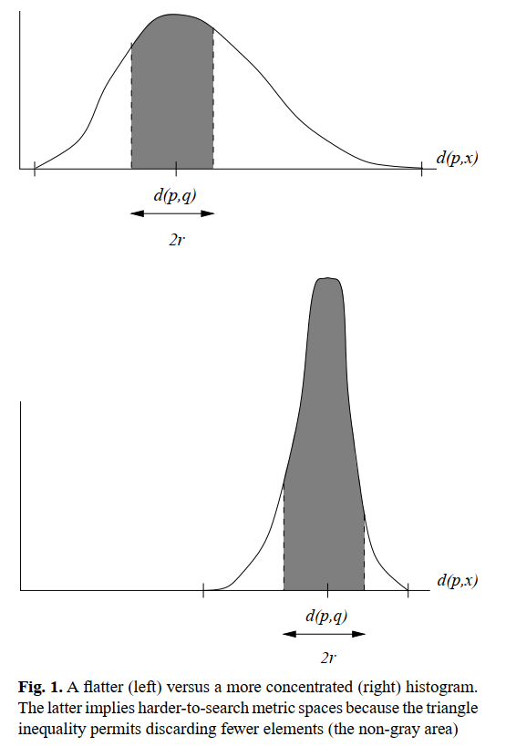

<!-- wp:paragraph -->

Navarro

<!-- /wp:paragraph -->

<!-- wp:heading {"level":3} -->
<h3>背景</h3>
<!-- /wp:heading -->

<!-- wp:heading {"level":4} -->
<h4>近似查询</h4>
<!-- /wp:heading -->

<!-- wp:paragraph -->

与精确查找相对，查找相似的对象。进行文本查询时，数据库中的文本可能存在印刷或拼写错误，我们仍然想要得到这些结果；或者给出一段文本，我们想得到近似的文本。在机器学习和分类中，一个元素根据一个跟它距离比较近的元素对它进行分类。计算生物中，我们需要在数据库中查找DNA和蛋白质序列，但可能因为变异产生一些差异。

<!-- /wp:paragraph -->

<!-- wp:heading {"level":4} -->
<h4>高位数据存取问题</h4>
<!-- /wp:heading -->

<!-- wp:paragraph -->

高维数据距离计算带来的开销成为制约数据库查询性能的一大原因，已有的多维空间索引如kd-tree和R-tree在维度超过20维以后性能就会下降。维度更高的数据之间的概率分布会更加集中，平均值也更大。

<!-- /wp:paragraph -->

<!-- wp:image -->
<figure class="wp-block-image"></figure>
<!-- /wp:image -->

<!-- wp:paragraph -->

图中可以看到维度更高的时候，白色区域面积更小，使用三角不等式可以排除的元素也就更小。另一方面，由于数据分布集中，两个随机距离之差会更接近零，难以使用三角不等式<code>|d(q, p) - d(p, x)| > r</code>判断数据点x是否在查询范围以外。

<!-- /wp:paragraph -->

<!-- wp:heading {"level":4} -->
<h4>sa-tree</h4>
<!-- /wp:heading -->

<!-- wp:paragraph -->

采用从空间上逐渐接近查询结果的策略，不同于通常的对候选点进行划分的做法。Navarro提出的sa-tree专门用于空间搜索(spatial searching)，不同于对数据点集进行分割的分治策略，sa-tree从某个随机点开始，逐渐接近查询对象q.

<!-- /wp:paragraph -->

<!-- wp:paragraph -->

sa-tree为了进行空间近似查询，必须满足以下性质：

<!-- /wp:paragraph -->

<!-- wp:paragraph -->

<strong>性质一:</strong> 对于数据点集中的任意一点a，给定查询点q，b是N(a)中的任意一点，如果满足d(q, a) <= d(q, b)，那么数据点集中除a外的任意一点离q都不可能比a更近。 也就是说，对于任一点a都拥有一个可能是解的点集，点集中的点到a比到数据集中其他的点更近。在计算几何中类似与欧式空间中的“维诺区域”（通用度量空间中称为“狄利克雷区域”）。 <strong>如果点a不是所需要的答案，我们需要能够从a区域移动到另一个离q比较近的元素，所以只要连接每个点的维诺邻居中心即可。所谓维诺邻居就是指在维诺图中共享一条边界的两个区域。</strong>

<!-- /wp:paragraph -->

<!-- wp:paragraph -->

维诺邻居中心点相互连接后就构成了Delaunay图，这是最理想的结构。<strong>但是在一般度量空间中只给出点与点之间的距离，没有办法计算出Delaunay图，因为给定点之间的距离，在不同的空间中会有不同的图。而且只通过距离没有办法判断一条边是否处于Delaunay图中。</strong>（why?）我们可以通过以下定理将这一点形式化：

<!-- /wp:paragraph -->

<!-- wp:paragraph -->

<strong>定理一:</strong> 给定某未知度量空间U中的有限子集S中每个点对的距离。S中的点对a和b，对于U都存在一种选择，使得a和b在关于S的Delaunay图中互相连接。 证明见论文，没太看懂。

<!-- /wp:paragraph -->

<!-- wp:heading {"level":3} -->
<h3>构建过程</h3>
<!-- /wp:heading -->

<!-- wp:paragraph -->

先随机选择一个点a作为SAT的根节点，然后选择一个合适的邻居集合N(a)，集合中的元素满足

<!-- /wp:paragraph -->

<!-- wp:paragraph -->

<strong>性质二：</strong> N(a)中的任意两个点的距离大于这两个点到a的距离。

<!-- /wp:paragraph -->

<!-- wp:code -->
<pre class="wp-block-code"><code>BuildTree(结点 a, 点集 S)
    N(a) = NULL /*a的邻居集合*/
    R(a) = 0    /*a的覆盖半径*/
    根据到a的距离由近到远对S中的点进行排序
    for each v in S:
        R(a) = max(R(a), d(v, a))
        if v到N(a)中任意已有点b的距离大于到a的距离:
            N(a) = N(a) + {v}
    for each b in N(a):
        S(b) = NULL     /*以邻居为根的子树初始化为空*/
    for each v in S-N(a):
        找到N(a)中离v最近的点c
        S(c) += {c}
    for each b in N(a):
        BuildTree(b, S(b))</code></pre>
<!-- /wp:code -->

<!-- wp:paragraph -->

论文[57]给出的构建算法并没有递归出口，构建完成的条件是什么呢？

<!-- /wp:paragraph -->

<!-- wp:paragraph -->

SAT结点中保存

<!-- /wp:paragraph -->

<!-- wp:heading {"level":3} -->
<h3>参考资料</h3>
<!-- /wp:heading -->

<!-- wp:paragraph -->

[57]Navarro. Searching in metric spaces by spatial approximation.

<!-- /wp:paragraph -->
