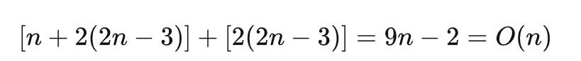
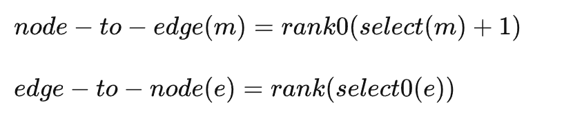

<!-- wp:paragraph -->

Succinct 数据结构是一类使用非常少量的空间来存储数据的结构。与压缩不同的是，Succinct在减少空间存储开销的同时可以进行非常高效的访问操作。

<!-- /wp:paragraph -->

<!-- wp:paragraph -->

Jacobson的这篇论文提出了针对树和图的Succinct数据结构。树这部分我看到<a href="https://www.zhihu.com/people/wang-ting-zheng-45">@一只硬核少年</a>在<a href="https://zhuanlan.zhihu.com/p/546567867">Space-efficient Static Trees and Graphs</a>这篇文章中做了非常详细的解读。

<!-- /wp:paragraph -->

<!-- wp:paragraph -->

图的部分这两天边读边做了些笔记，发出来和大家分享一下。如果有错漏的地方欢迎指正。

<!-- /wp:paragraph -->

<!-- wp:heading -->
<h2 class="wp-block-heading">4. 线性空间复杂度的可平面图（Planar Graph）</h2>
<!-- /wp:heading -->

<!-- wp:paragraph -->

Turan等人提出一种使用12个bit表示一个结点的平面图存储方法，证明平面图可以以线性空间复杂度存储；Kannan等人基于Nash-Williams定理，将可平面图分解成三个边不相接的生成树。

<!-- /wp:paragraph -->

<!-- wp:paragraph -->

论文中提出一种方法，将可平面图分解成<strong>页（pages）</strong>，从而在线性空间复杂度的表示之上实现高效的搜索和邻接判定。

<!-- /wp:paragraph -->

<!-- wp:paragraph -->

首先介绍一下<strong>括号平衡器（Parentheses Blancer）</strong>这个结构。

<!-- /wp:paragraph -->

<!-- wp:heading {"level":3} -->
<h3 class="wp-block-heading">4.1 括号平衡问题</h3>
<!-- /wp:heading -->

<!-- wp:paragraph -->

问题定义：

<!-- /wp:paragraph -->

<!-- wp:quote -->
<blockquote class="wp-block-quote"><!-- wp:paragraph -->

给定一个由n个括号构成的静态平衡字符串（静态指字符串不会改变），通过构建一个空间占用O(n)的字典来优化下面这个操作：

<!-- /wp:paragraph --></blockquote>
<!-- /wp:quote -->

<!-- wp:list -->
<ul><!-- wp:list-item -->
<li>在字符串中找到与位置p上的左括号 <code>(</code> 匹配的右括号 <code>)</code></li>
<!-- /wp:list-item -->

<!-- wp:list-item -->
<li>反过来，在位置p上找到与右括号 <code>)</code> 匹配的左括号 <code>(</code> 。</li>
<!-- /wp:list-item --></ul>
<!-- /wp:list -->

<!-- wp:paragraph -->

这个问题可以简化为给定左括号找匹配的右括号的问题，因为两种操作是对称的。

<!-- /wp:paragraph -->

<!-- wp:paragraph -->

首先将字符串分割为 <code>log n</code> 大小的等长块，每个块从 <code>1</code> 开始编号，有以下定义：

<!-- /wp:paragraph -->

<!-- wp:list -->
<ul><!-- wp:list-item -->
<li>括号p被称为<strong>远括号（Far Parenthesis）</strong>，当且仅当p的匹配括号位于其自己所在的块之外。</li>
<!-- /wp:list-item -->

<!-- wp:list-item -->
<li>远括号被称为<strong>先锋括号（Pionneer）</strong>，当且仅当其匹配括号位于字符串中前一个远括号所在块的不同块中。</li>
<!-- /wp:list-item --></ul>
<!-- /wp:list -->

<!-- wp:paragraph -->

维护以下两个数据结构：

<!-- /wp:paragraph -->

<!-- wp:list -->
<ul><!-- wp:list-item -->
<li>一个大小为 <code>n</code> 用于记录第 <code>i</code> 个括号是否为先锋括号的位图；</li>
<!-- /wp:list-item -->

<!-- wp:list-item -->
<li>位图对应的rank表；</li>
<!-- /wp:list-item -->

<!-- wp:list-item -->
<li>一个记录每个先锋括号的匹配括号所在块号的表格；</li>
<!-- /wp:list-item --></ul>
<!-- /wp:list -->

<!-- wp:image -->
<figure class="wp-block-image"><figcaption class="wp-element-caption">Figure 4: A structure to balance parentheses.</figcaption></figure>
<!-- /wp:image -->

<!-- wp:paragraph -->

如果下标 <code>p</code> 的括号不是远括号，可以在所属块中做上界为 <code>log n</code> 线性扫描。否则可以通过索引计算得到匹配括号 <code>q</code> 所在的块号：

<!-- /wp:paragraph -->

<!-- wp:list -->
<ul><!-- wp:list-item -->
<li>计算下标为 <code>p</code> 的括号在先锋括号位图中的 <code>rank</code> 值 <code>rank(p)</code> ；</li>
<!-- /wp:list-item -->

<!-- wp:list-item -->
<li>块号表第 <code>rank(p)</code> 个元素即 <code>q</code> 所在的块号。</li>
<!-- /wp:list-item --></ul>
<!-- /wp:list -->

<!-- wp:paragraph -->

为了在块中更快地找到 <code>q</code> 的准确位置，另外维护一个<strong>记录每个块的嵌套深度（Nesting Depth：字符串前缀中开括号数量超过闭括号数量的总和）的表</strong>。

<!-- /wp:paragraph -->

<!-- wp:image -->
<figure class="wp-block-image"><figcaption class="wp-element-caption">Figure 4: A structure to balance parentheses.</figcaption></figure>
<!-- /wp:image -->

<!-- wp:paragraph -->

在这些索引的帮助下我们可以以 <code>O(log n)</code> 时间复杂度搜索匹配括号，而且位图、rank表以及嵌套深度表这三个辅助数据结构增加的额外空间开销仅仅是 <code>2n+o(n)</code> 个bits。

<!-- /wp:paragraph -->

<!-- wp:paragraph -->

块号表空间开销和先锋括号的数量有关。每个块号长度为 <code>log n</code> 个bits，当先锋括号的数量超过 <code>n/log n</code> 时，块号表的空间开销将超过 <code>O(n)</code> 。但下面的证明说明在一个划分为 <code>b</code> 个块的字符串中，先锋括号的数量不会超过 <code>2b-3</code>：

<!-- /wp:paragraph -->

<!-- wp:paragraph -->

证明如下：

<!-- /wp:paragraph -->

<!-- wp:list {"ordered":true} -->
<ol><!-- wp:list-item -->
<li>首先，假设我们构建一个图，图中的每个节点代表字符串的一个块。将这些节点按顺序排成一条直线，对应着块的顺序。如果一个块中有一个远括号指向另一个块，就在这两个节点之间添加一条边。</li>
<!-- /wp:list-item -->

<!-- wp:list-item -->
<li>在这样构建的图中，边的数量至少等于字符串中先锋括号的数量，因为每个先锋括号可以映射到不同的边上。</li>
<!-- /wp:list-item -->

<!-- wp:list-item -->
<li>由于这个括号字符串是平衡的，意味着任意两个块之间的括号匹配是正确的，因此在图中没有边会交叉。</li>
<!-- /wp:list-item -->

<!-- wp:list-item -->
<li>这样得到的图是一个外平面图（outer-planar），也就是说可以在平面上嵌入这个图，使得所有的节点都在一个面上。</li>
<!-- /wp:list-item -->

<!-- wp:list-item -->
<li>外平面图的一个已知性质是，其边的数量最多为2b - 3。</li>
<!-- /wp:list-item --></ol>
<!-- /wp:list -->

<!-- wp:paragraph -->

由于块号表中的每个元素都只有 <code>lg n</code> 个bit长，因此整张表的长度最多 <code>[2(n/lg n)-3]*lg n=2n+o(n)</code> 个bit.

<!-- /wp:paragraph -->

<!-- wp:heading {"level":3} -->
<h3 class="wp-block-heading">4.2 有界页数图</h3>
<!-- /wp:heading -->

<!-- wp:paragraph -->

在图论中，<strong>有界页数图（Bounded pagenumber graphs）</strong> 是一种比平面图抽象程度更高的图，书嵌入是图的平面嵌入到书嵌入的推广。

<!-- /wp:paragraph -->

<!-- wp:paragraph -->

<strong>定义一：图的k页书嵌入（k-page book embedding）：</strong>

<!-- /wp:paragraph -->

<!-- wp:quote -->
<blockquote class="wp-block-quote"><!-- wp:paragraph -->

给定一个图G=<V, E>，图的k页书嵌入是点集V的一个<strong>打印排列（点在书脊线上按不同顺序排列的一个排序）</strong>，该排列对应的一种将 <code>E</code> 划归到 <code>k</code> 页中的划分，同一页中的任意两边不能相交，且所有划分出的页共享同一个打印排列。（详细请看：[4]）

<!-- /wp:paragraph --></blockquote>
<!-- /wp:quote -->

<!-- wp:paragraph -->

<strong>定义二：页数/书厚度（pagenumber/book-thickness）：</strong>

<!-- /wp:paragraph -->

<!-- wp:quote -->
<blockquote class="wp-block-quote"><!-- wp:paragraph -->

图的所有书嵌入中最小的页数

<!-- /wp:paragraph --></blockquote>
<!-- /wp:quote -->

<!-- wp:paragraph -->

设��是所有页数上界为 <code>k</code> 的图集合，给定任意图 �∈��以及一个该图的k页嵌入，下面会展示以一个在图G中访问邻居和判断是否邻接的方法。

<!-- /wp:paragraph -->

<!-- wp:paragraph -->

对于一个n个结点的图G，每次操作只需要访问 <code>O(log n)</code> 个比特，图的表示使用的比特数是 <code>O(kn)</code> .

<!-- /wp:paragraph -->

<!-- wp:paragraph -->

简单起见下面先讲解单页图（外平面图）的线性空间表示方法，然后再进行扩展。

<!-- /wp:paragraph -->

<!-- wp:heading {"level":3} -->
<h3 class="wp-block-heading">4.2.1 单页图的线性空间表示法</h3>
<!-- /wp:heading -->

<!-- wp:paragraph -->

单页图中所有边都可以放到沿着某个点排列构成的书脊线的一侧，且任何两条边都不相交。

<!-- /wp:paragraph -->

<!-- wp:image -->
<figure class="wp-block-image"><figcaption class="wp-element-caption">Figure 5: One-page graphs as balanced parentheses</figcaption></figure>
<!-- /wp:image -->

<!-- wp:paragraph -->

对于一个有n个结点的单页图，每个结点用一个 <code>·</code> 表示。单页图中的每条边 <code><u, v></code> ，在 第<code>(u+1)</code>

<!-- /wp:paragraph -->

<!-- wp:paragraph -->

个结点前插入一个 <code>(</code> 符号，第 <code>v</code> 个结点前插入一个 <code>)</code> 符号。可以发现这样插入左右括号以后就形成了一个平衡括号串，这个平衡括号串包含 <code>·</code> , <code>(</code> 以及 <code>)</code> 三种符号。其中结点数量是 <code>n</code> 个，左右括号最多分别有 <code>2n-3</code> 个。第 <code>m</code> 和 <code>m+1</code> 个结点之间的所有括号都对应节点 <code>m</code> 的一条边。

<!-- /wp:paragraph -->

<!-- wp:paragraph -->

现在将这个3符号串编码成两个位串：

<!-- /wp:paragraph -->

<!-- wp:list -->
<ul><!-- wp:list-item -->
<li>标记所有结点所在位置的位图，称之为<strong>结点位图（node-map）</strong>；</li>
<!-- /wp:list-item -->

<!-- wp:list-item -->
<li>删除结点符号后， 用<code>0</code> 表示左括号， <code>1</code> 表示右括号的位串。</li>
<!-- /wp:list-item --></ul>
<!-- /wp:list -->

<!-- wp:paragraph -->

两个比特串加起来总共最多需要比特数：

<!-- /wp:paragraph -->

<!-- wp:image {"id":509,"sizeSlug":"full","linkDestination":"none"} -->
<figure class="wp-block-image size-full"></figure>
<!-- /wp:image -->

<!-- wp:paragraph -->

这两个位串是图的线性空间表示的关键。

<!-- /wp:paragraph -->

<!-- wp:paragraph -->

接下来构造两个辅助结构：

<!-- /wp:paragraph -->

<!-- wp:list -->
<ul><!-- wp:list-item -->
<li>括号串的匹配器（matcher for the parentheses string）</li>
<!-- /wp:list-item -->

<!-- wp:list-item -->
<li>结点位图的 <code>rank/select</code> 和 <code>rank0/select0</code> 表</li>
<!-- /wp:list-item --></ul>
<!-- /wp:list -->

<!-- wp:paragraph -->

这两个辅助结构会增加额外的空间开销，但总开销不会超过 <code>O(n)</code> .

<!-- /wp:paragraph -->

<!-- wp:paragraph -->

结点在书脊线上的打印顺序可以作为结点的索引下标，括号字符串中的索引下标可以作为边的索引下标。

<!-- /wp:paragraph -->

<!-- wp:heading {"level":3} -->
<h3 class="wp-block-heading">4.2.2 查找与邻接判断</h3>
<!-- /wp:heading -->

<!-- wp:paragraph -->

有了上面这些数据结构，我们在图G中进行查找比起前面的括号匹配要稍微麻烦一点。

<!-- /wp:paragraph -->

<!-- wp:paragraph -->

图G中的每条边都和一对括号对应，沿着一条边走等价于给定左括号的下标查找对应的右括号。

<!-- /wp:paragraph -->

<!-- wp:paragraph -->

为了方便我们定义两个函数：

<!-- /wp:paragraph -->

<!-- wp:image {"id":507,"width":"652px","height":"auto","sizeSlug":"full","linkDestination":"none"} -->
<figure class="wp-block-image size-full is-resized"></figure>
<!-- /wp:image -->

<!-- wp:list -->
<ul><!-- wp:list-item -->
<li><code>node-to-edge</code> ：给定结点编号 <code>m</code>，求该从结点出去的第一条边的下标；</li>
<!-- /wp:list-item -->

<!-- wp:list-item -->
<li><code>edge-to-node</code> ：给定括号串中的一个边下标，找到这条边对应的顶点编号.</li>
<!-- /wp:list-item --></ul>
<!-- /wp:list -->

<!-- wp:list {"ordered":true} -->
<ol><!-- wp:list-item -->
<li>访问结点 <code>m</code> 邻居结点的算法如下：</li>
<!-- /wp:list-item --></ol>
<!-- /wp:list -->

<!-- wp:code -->
<pre class="wp-block-code"><code>e = node-to-edge(m)
while(edge-to-node(e) == m) {
	next_node = paren-match(e)  //找到与e匹配的括号位置
	visit(edge-to-node(next_node))
	e = e+1
}</code></pre>
<!-- /wp:code -->

<!-- wp:paragraph -->

这个算法只需要常数次数的 <code>rank/select</code> 以及括号匹配操作，因此每次访问邻居只需要 <code>O(log n)</code> 次比特访问。

<!-- /wp:paragraph -->

<!-- wp:paragraph -->

2. 邻接判断（给定结点 <code>u</code> 和 <code>v</code> ，判断是否存在一条边 <code><u, v></code> 连接这两个节点）的操作也可以以 <code>O(log n)</code> 的时间复杂度进行。详细过程在作者的博士论文[2]中。

<!-- /wp:paragraph -->

<!-- wp:heading {"level":3} -->
<h3 class="wp-block-heading">4.2.3 多页图</h3>
<!-- /wp:heading -->

<!-- wp:paragraph -->

将单页图的线性空间表示法扩展到多页图的方法非常简单：

<!-- /wp:paragraph -->

<!-- wp:list -->
<ul><!-- wp:list-item -->
<li>如果一个图G是 <code>k-page</code> 图，将k页分别作为一个单页图表示即可。</li>
<!-- /wp:list-item -->

<!-- wp:list-item -->
<li>要访问给定节点 <code>m</code> 的所有邻居只需要分别在 <code>k</code> 页中执行上面的邻居访问算法即可，判断邻接也是类似。</li>
<!-- /wp:list-item --></ul>
<!-- /wp:list -->

<!-- wp:paragraph -->

可见，任何 <code>k-page</code> 图都可以在 <code>O(kn)</code> 空间复杂度下表示，以 <code>O(klog n)</code> 的时间复杂度搜索和判断邻接。

<!-- /wp:paragraph -->

<!-- wp:paragraph -->

Yannakakis[3]提出过一个线性时间复杂度的算法，可将任意平面图嵌入到4页以内的书中。

<!-- /wp:paragraph -->

<!-- wp:paragraph -->

本论文展示了任意类型的有界页数图都可以通过线性空间表示，这个结论也适用于平面图。

<!-- /wp:paragraph -->

<!-- wp:heading {"level":3} -->
<h3 class="wp-block-heading">参考资料</h3>
<!-- /wp:heading -->

<!-- wp:paragraph -->

[1] Jacobson, G. (1989, October). Space-efficient static trees and graphs. In <em>30th annual symposium on foundations of computer science</em> (pp. 549-554). IEEE Computer Society.

<!-- /wp:paragraph -->

<!-- wp:paragraph -->

[2] Jacobson, G. J. (1988). <em>Succinct static data structures</em>. Carnegie Mellon University.(<a href="https://link.zhihu.com/?target=https%3A//www.proquest.com/docview/303540527%3Fpq-origsite%3Dgscholar%26fromopenview%3Dtrue" target="_blank" rel="noreferrer noopener">PDF</a>)

<!-- /wp:paragraph -->

<!-- wp:paragraph -->

[3] Yannakakis, M. (1986, November). Four pages are necessary and sufficient for planar graphs. In <em>Proceedings of the eighteenth annual ACM symposium on theory of computing</em> (pp. 104-108).

<!-- /wp:paragraph -->

<!-- wp:paragraph -->

[4] <a href="https://zhuanlan.zhihu.com/p/429222973">图的书嵌入摘录 - 知乎 (zhihu.com)</a>

<!-- /wp:paragraph -->
