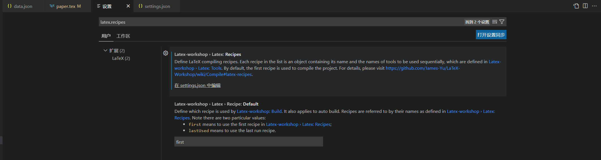
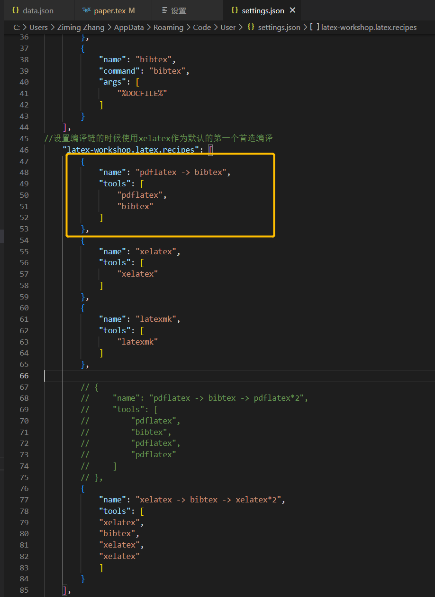
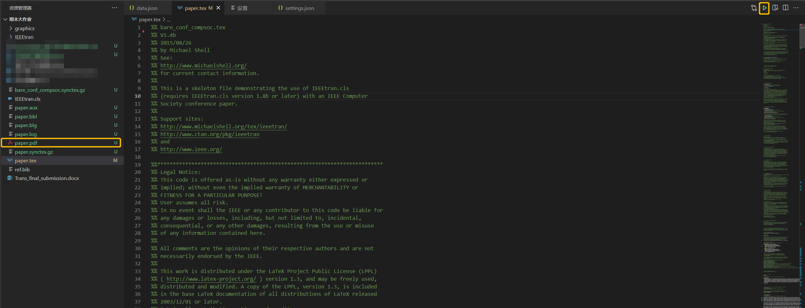

<!-- wp:heading -->
<h2>前言</h2>
<!-- /wp:heading -->

<!-- wp:paragraph -->

Bibtex以特殊格式记录文献的基本信息，在模板中引用参考文献时，就可以根据指定的格式自动生成参考文献引用。

<!-- /wp:paragraph -->

<!-- wp:paragraph -->

最近在做论文写作指导的期末作业，研究了一下在latex中添加Bibtex引用。在latex中插入引用的详细步骤参考：<a href="https://zhuanlan.zhihu.com/p/114733612?from_voters_page=true">仙人球仙女：Latex参考文献管理：Bibtex教程</a>。本文主要记录在VSCode下使用时遇到的一些坑，默认已经安装<code>tex live</code>环境和<code>latex workshop</code>插件。

<!-- /wp:paragraph -->

<!-- wp:heading -->
<h2>编译问题</h2>
<!-- /wp:heading -->

<!-- wp:paragraph -->

将参考文献引用插入到正文后，在编译<code>.tex</code>文件之前需要先用<code>bibtex</code>对<code>.bib</code>文件进行编译，<code>bibtex</code>会生成一个<code>.bbl</code>文件。而workshop默认的编译链并不会调用bibtex，需要修改配置文件。

<!-- /wp:paragraph -->

<!-- wp:list {"ordered":true} -->
<ol><li>点击<code>文件->首选项->设置</code>，在搜索栏中搜索<code>latex.recipes</code>，选择<code>在settings.json中编辑</code>。</li></ol>
<!-- /wp:list -->

<!-- wp:image {"linkDestination":"media"} -->
<figure class="wp-block-image"></figure>
<!-- /wp:image -->

<!-- wp:list {"ordered":true,"start":2} -->
<ol start="2"><li>将下图框中的几行调整到最上面。</li></ol>
<!-- /wp:list -->

<!-- wp:image {"linkDestination":"media"} -->
<figure class="wp-block-image"></figure>
<!-- /wp:image -->

<!-- wp:list {"ordered":true,"start":3} -->
<ol start="3"><li>保存设置并退出，点击右上角编译<code>.tex</code>文件，应该就能生成<code>.pdf</code>文件。</li></ol>
<!-- /wp:list -->

<!-- wp:image {"linkDestination":"media"} -->
<figure class="wp-block-image"></figure>
<!-- /wp:image -->
