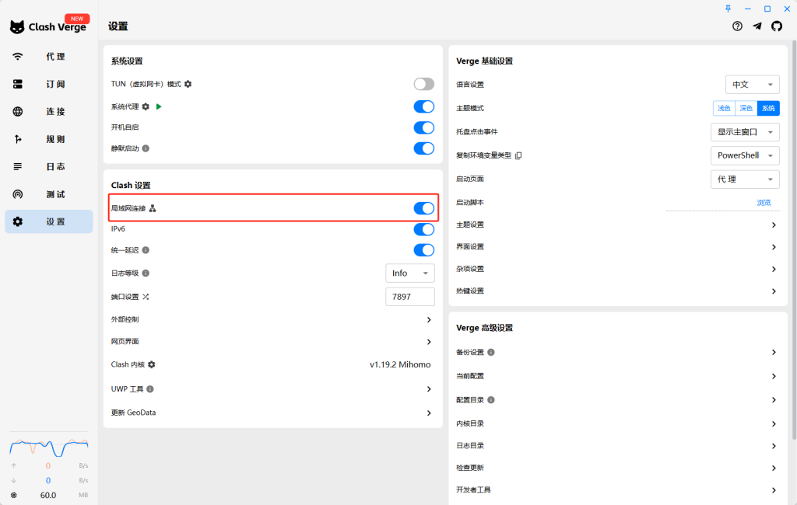
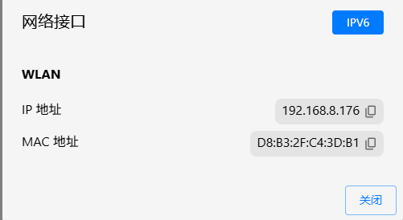
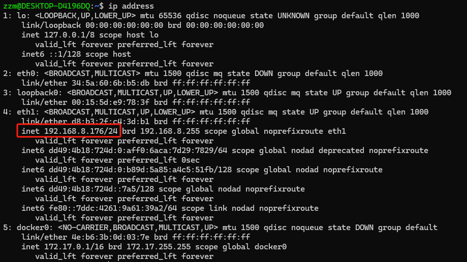

<!-- wp:paragraph -->

本文主要介绍以 WSL 形式运行的Ubuntu 22.04 LTS 下安装 docker 并通过宿主机的 clash 代理访问外网的配置流程。 

<!-- /wp:paragraph -->

<!-- wp:heading -->
<h2 class="wp-block-heading">WSL 网络配置</h2>
<!-- /wp:heading -->

<!-- wp:paragraph -->

首先编辑 <code>~/.wslconfig</code> ，将网络模式设置为 <code>mirrored</code> ，并关闭 <code>dnsTunneling</code> 。

<!-- /wp:paragraph -->

<!-- wp:preformatted -->
<pre class="wp-block-preformatted">[wsl2] networkingMode=mirrored dnsTunneling=false firewall=true autoProxy=true</pre>
<!-- /wp:preformatted -->

<!-- wp:heading -->
<h2 class="wp-block-heading">Clash-verge 配置</h2>
<!-- /wp:heading -->

<!-- wp:paragraph -->

在 clash 的设置中启用局域网连接，点击 <code>局域网连接</code> 旁边的小图标可以看到宿主机的本地 IP ，本文以 <code>192.168.8.176</code> 这个 IP 为例，在其他环境下设置时注意替换为自己的本地 IP. 在下面端口一栏可以看到 clash 代理的默认服务端口 <code>7897</code> 。

<!-- /wp:paragraph -->

<!-- wp:image -->
<figure class="wp-block-image"></figure>
<!-- /wp:image -->

<!-- wp:image {"id":515,"sizeSlug":"large","linkDestination":"none"} -->
<figure class="wp-block-image size-large"></figure>
<!-- /wp:image -->

<!-- wp:image {"id":519,"sizeSlug":"full","linkDestination":"none"} -->
<figure class="wp-block-image size-full"></figure>
<!-- /wp:image -->

<!-- wp:paragraph -->

开启 <code>mirrored</code> 模式后，进入 WSL 中查看到的IP和宿主机IP相同

<!-- /wp:paragraph -->

<!-- wp:image {"id":518,"sizeSlug":"full","linkDestination":"none"} -->
<figure class="wp-block-image size-full"></figure>
<!-- /wp:image -->

<!-- wp:paragraph -->

使用这个 IP ，以及 clash 的服务端口 <code>7897</code> ，编辑 <code>~/.bashrc</code> 添加环境变量：

<!-- /wp:paragraph -->

<!-- wp:preformatted -->
<pre class="wp-block-preformatted">host_ip=192.168.8.176 export http_proxy="http://$host_ip:7897" export https_proxy="http://$host_ip:7897"</pre>
<!-- /wp:preformatted -->

<!-- wp:paragraph -->

保存后执行 <code>source ~/.bashrc</code> 使环境变量设置生效。

<!-- /wp:paragraph -->

<!-- wp:heading -->
<h2 class="wp-block-heading">APT 安装 Docker</h2>
<!-- /wp:heading -->

<!-- wp:paragraph -->

接下来准备安装 Docker 相关组件。在正式安装 Docker 引擎之前，需要卸载任何可能冲突的软件包。

<!-- /wp:paragraph -->

<!-- wp:preformatted -->
<pre class="wp-block-preformatted">for pkg in docker.io docker-doc docker-compose docker-compose-v2 podman-docker containerd runc; do sudo apt-get remove $pkg; done</pre>
<!-- /wp:preformatted -->

<!-- wp:heading {"level":3} -->
<h3 class="wp-block-heading"><strong>设置 Docker 的 APT 仓库</strong></h3>
<!-- /wp:heading -->

<!-- wp:paragraph -->

然后，需要设置 Docker 的 APT 仓库。之后，可以从该仓库安装和更新 Docker。

<!-- /wp:paragraph -->

<!-- wp:preformatted -->
<pre class="wp-block-preformatted"># 添加 Docker 的官方 GPG 密钥： sudo apt-get update sudo apt-get install ca-certificates curl sudo install -m 0755 -d /etc/apt/keyrings sudo curl -fsSL https://download.docker.com/linux/ubuntu/gpg -o /etc/apt/keyrings/docker.asc sudo chmod a+r /etc/apt/keyrings/docker.asc ​ # 将仓库添加到 Apt 源列表： echo \   "deb [arch=$(dpkg --print-architecture) signed-by=/etc/apt/keyrings/docker.asc] https://download.docker.com/linux/ubuntu \   $(lsb_release -cs) stable" | \   sudo tee /etc/apt/sources.list.d/docker.list > /dev/null sudo apt-get update</pre>
<!-- /wp:preformatted -->

<!-- wp:heading {"level":3} -->
<h3 class="wp-block-heading">安装 Docker</h3>
<!-- /wp:heading -->

<!-- wp:preformatted -->
<pre class="wp-block-preformatted">sudo apt-get install docker-ce docker-ce-cli containerd.io docker-buildx-plugin docker-compose-plugin</pre>
<!-- /wp:preformatted -->

<!-- wp:paragraph -->

安装完成后拉取并运行 <code>hello-world</code> 镜像验证安装是否成功：

<!-- /wp:paragraph -->

<!-- wp:preformatted -->
<pre class="wp-block-preformatted">sudo docker run hello-world</pre>
<!-- /wp:preformatted -->

<!-- wp:heading -->
<h2 class="wp-block-heading">Dockerd 代理配置</h2>
<!-- /wp:heading -->

<!-- wp:paragraph -->

如果拉取镜像时报错，说明需要给 docker daemon 另外配置代理：

<!-- /wp:paragraph -->

<!-- wp:preformatted -->
<pre class="wp-block-preformatted">zzm@DESKTOP-D4196DQ:~$ sudo docker run hello-world Unable to find image 'hello-world:latest' locally docker: Error response from daemon: Get "https://registry-1.docker.io/v2/": net/http: request canceled while waiting for connection (Client.Timeout exceeded while awaiting headers)</pre>
<!-- /wp:preformatted -->

<!-- wp:list {"ordered":true} -->
<ol class="wp-block-list"><!-- wp:list-item -->
<li>创建目录 <code>sudo mkdir -p /etc/systemd/system/docker.service.d</code></li>
<!-- /wp:list-item -->

<!-- wp:list-item -->
<li>新建配置文件 <code>/etc/systemd/system/docker.service.d/http-proxy.conf</code>，这个文件中将包含环境变量：</li>
<!-- /wp:list-item --></ol>
<!-- /wp:list -->

<!-- wp:preformatted -->
<pre class="wp-block-preformatted">[Service] Environment="HTTP_PROXY=http://192.168.8.176:7897" Environment="HTTPS_PROXY=http://192.168.8.176:7897"</pre>
<!-- /wp:preformatted -->

<!-- wp:paragraph -->

重启服务使新配置生效：

<!-- /wp:paragraph -->

<!-- wp:preformatted -->
<pre class="wp-block-preformatted">sudo systemctl daemon-reload sudo systemctl restart docker</pre>
<!-- /wp:preformatted -->

<!-- wp:paragraph -->

检查确认环境变量已经正确配置：

<!-- /wp:paragraph -->

<!-- wp:preformatted -->
<pre class="wp-block-preformatted">sudo systemctl show --property=Environment docker</pre>
<!-- /wp:preformatted -->

<!-- wp:heading -->
<h2 class="wp-block-heading">容器代理配置</h2>
<!-- /wp:heading -->

<!-- wp:paragraph -->

镜像启动后如果要在容器中使用代理，需要在启动时通过 <code>--env</code> 选项指定 <code>HTTP_PROXY</code> 环境变量或者在 <code>~/.docker/config.json</code> 中添加默认的代理设置。

<!-- /wp:paragraph -->

<!-- wp:list {"ordered":true} -->
<ol class="wp-block-list"><!-- wp:list-item -->
<li><code>--env</code> 选项</li>
<!-- /wp:list-item --></ol>
<!-- /wp:list -->

<!-- wp:preformatted -->
<pre class="wp-block-preformatted">docker run --env HTTP_PROXY="http://<user>:<password>@<domain>:<port>" <some-image></pre>
<!-- /wp:preformatted -->

<!-- wp:list {"ordered":true} -->
<ol class="wp-block-list"><!-- wp:list-item -->
<li><code>config.json</code> 配置</li>
<!-- /wp:list-item --></ol>
<!-- /wp:list -->

<!-- wp:preformatted -->
<pre class="wp-block-preformatted">{   "auths": {     "..."   },   "proxies": {     # 通用配置，会对当前客户端连接的所有Docker服务生效     "default": {       "httpProxy": "http://192.168.8.176:7897",       "httpsProxy": "http://192.168.8.176:7897",       "noProxy": "*.test.example.com,.example.org,127.0.0.0/8"     }   } }</pre>
<!-- /wp:preformatted -->

<!-- wp:paragraph -->

运行成功后通过下面的命令验证相关环境变量是否符合预期：

<!-- /wp:paragraph -->

<!-- wp:preformatted -->
<pre class="wp-block-preformatted">docker run --rm alpine sh -c 'env | grep -i  _PROXY'</pre>
<!-- /wp:preformatted -->

<!-- wp:heading -->
<h2 class="wp-block-heading">参考资料</h2>
<!-- /wp:heading -->

<!-- wp:paragraph -->

<a href="https://docs.docker.com/engine/install/ubuntu/#install-using-the-repository">Ubuntu | Docker Docs</a>

<!-- /wp:paragraph -->

<!-- wp:paragraph -->

<a href="https://www.cnblogs.com/Chary/p/18096678">如何优雅的给 Docker 配置网络代理 - CharyGao - 博客园</a>

<!-- /wp:paragraph -->

<!-- wp:paragraph -->

<!-- /wp:paragraph -->
