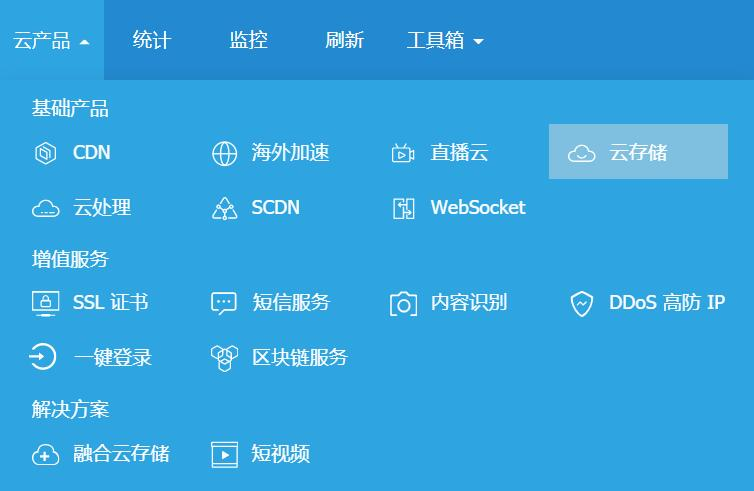
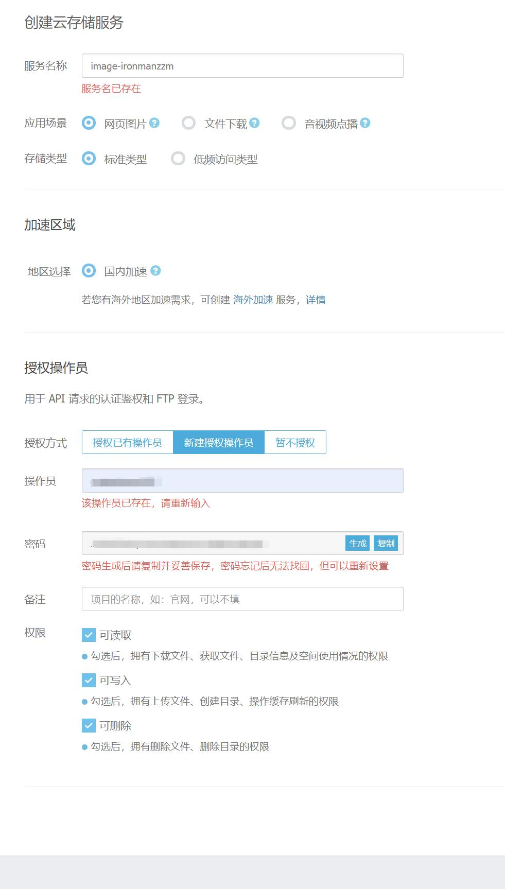
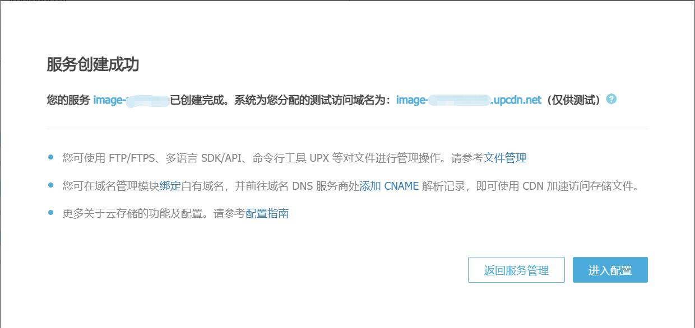
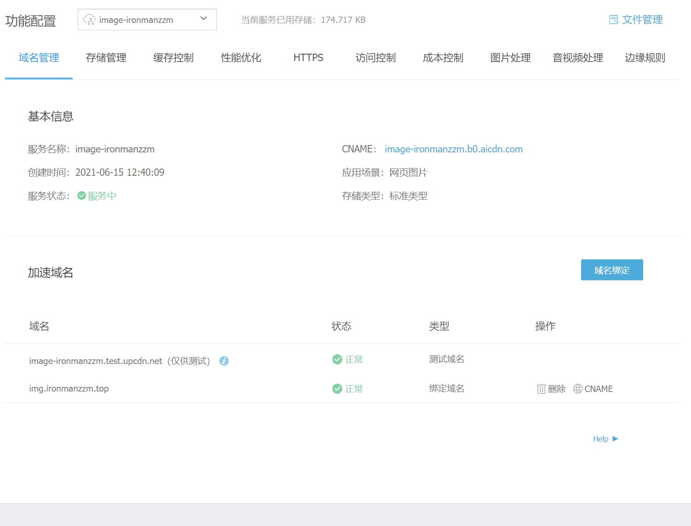
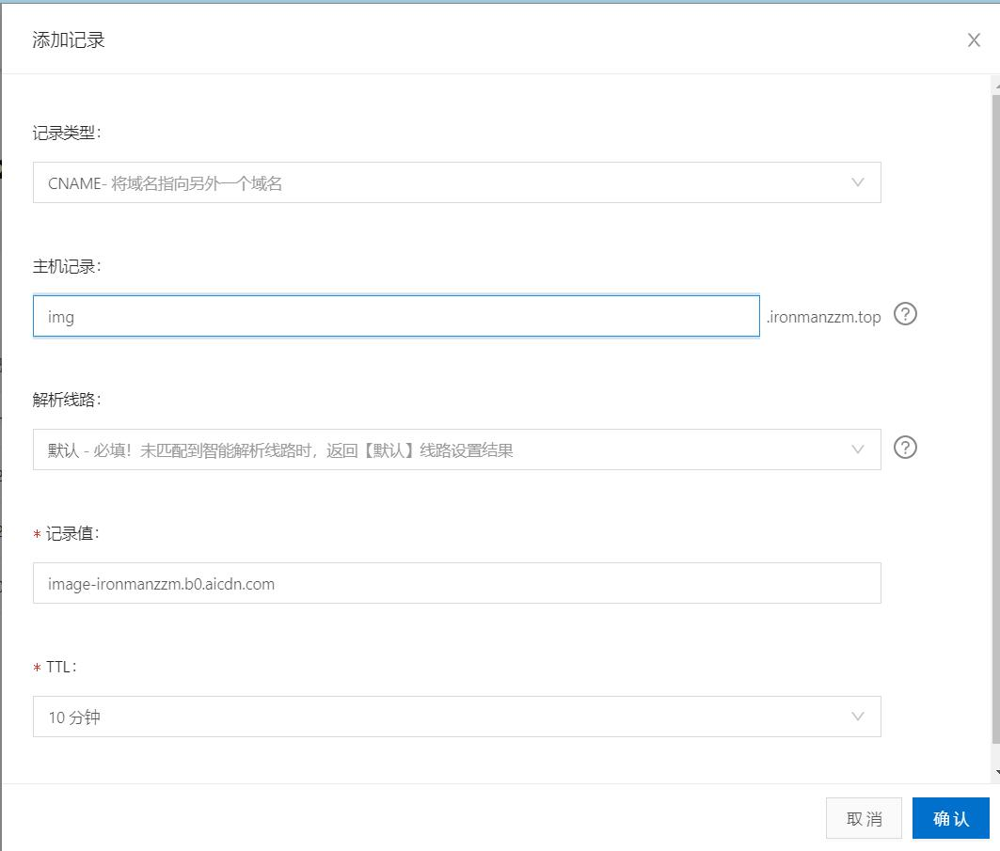
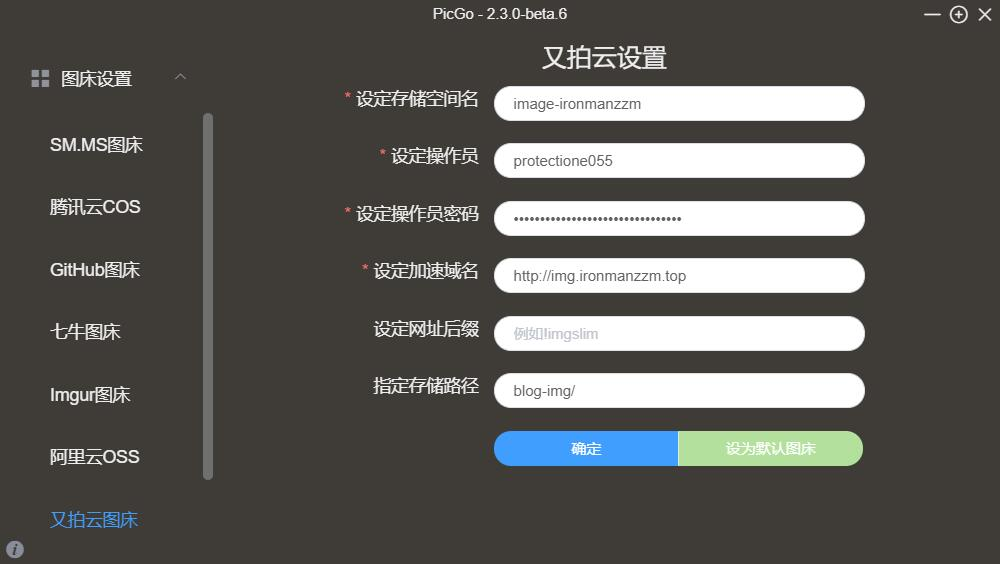

<!-- wp:list -->
<ul><li>前言</li><li>图床搭建</li><li>使用PicGo管理图床</li></ul>
<!-- /wp:list -->

<!-- wp:heading -->
<h2>前言</h2>
<!-- /wp:heading -->

<!-- wp:paragraph -->

使用markdown写文章的时候可以在文章中插入图片。如果引用的图片存储在本地，将文章发布到其他地方的时候就要将所有图片上传到部署的服务器上，然后文章中的引用路径也要全部修改一遍，非常麻烦。如果搭建一个可以在公网访问的图床，就可以从同一个地方引用资源，不用每次发布都重复修改路径。

<!-- /wp:paragraph -->

<!-- wp:paragraph -->

公用的免费图床有 https://sm.ms，之前使用了一段时间，发现放到博客的图片时不时会挂掉。听说又拍云推出了白嫖活动，赶紧研究一下怎么样用他们家的云存储服务搭一个私有图床。

<!-- /wp:paragraph -->

<!-- wp:heading -->
<h2>图床搭建</h2>
<!-- /wp:heading -->

<!-- wp:heading {"level":3} -->
<h3>第一步 申请加入又拍云联盟</h3>
<!-- /wp:heading -->

<!-- wp:paragraph -->

又拍云每个月为加入又拍云联盟的开发者提供10GB存储空间和15GB流量，对于我们的小破站来说绰绰有余了。

<!-- /wp:paragraph -->

<!-- wp:list {"ordered":true} -->
<ol><li>首先点击--><a href="https://www.upyun.com/league">又拍云联盟</a>，注册账号。</li><li>申请加入前需要在网站页脚加一个又拍云的logo。wordpress博客进入后台，找到<code>外观->主题编辑器->footer.php</code>，在页脚版权信息对应的标签后插入以下代码</li></ol>
<!-- /wp:list -->

<!-- wp:code -->
<pre class="wp-block-code"><code><!--             Upyun logo               -->

    本网站由
    
    提供 CDN 加速/云存储服务

</code></pre>
<!-- /wp:code -->

<!-- wp:list {"ordered":true,"start":3} -->
<ol start="3"><li>确认Logo样式没问题以后回去填写申请表，工作日不到三分钟就能批下来。申请成功后会一次性发放12个月的代金券。</li></ol>
<!-- /wp:list -->

<!-- wp:heading {"level":3} -->
<h3>第二步 创建云存储服务</h3>
<!-- /wp:heading -->

<!-- wp:list {"ordered":true} -->
<ol><li>找到云存储入口 </li><li>点击创建服务，填写服务名称。输入操作员名称后保存好密钥，勾选所有权限。点击创建。 </li></ol>
<!-- /wp:list -->

<!-- wp:heading {"level":3} -->
<h3>第三步 域名绑定到服务器</h3>
<!-- /wp:heading -->

<!-- wp:list {"ordered":true} -->
<ol><li>创建成功后可以看到如下信息框，点进入配置。 </li><li>服务创建好以后又拍云自动为我们的云存储服务器生成了CNAME，我们把图床域名绑定到他给的CNAME才能正常访问。点击域名绑定，输入<code>img.你自己的域名</code>，比如我绑定的就是<code>img.ironmanzzm.top</code>。 </li><li>绑定好域名后要到DNS服务商添加CNAME解析记录。以阿里为例，进入<code>控制台->云解析DNS->解析设置</code>。点击添加记录后选择记录类型为CNAME，将<code>img.你的域名</code>解析到又拍云给的CNAME. 做完这步以后去ping这个二级域名，就会发现可以收到来自图片服务器的响应了，大功告成。 </li></ol>
<!-- /wp:list -->

<!-- wp:heading -->
<h2>图床使用</h2>
<!-- /wp:heading -->

<!-- wp:paragraph -->

云存储服务器创建好以后，虽然又拍云提供网页端的文件管理服务，但每次进去都要登录，用起来不太方便。

<!-- /wp:paragraph -->

<!-- wp:paragraph -->

图床工具PicGo让我们可以通过桌面客户端管理云存储器，目前支持微博，七牛云，腾讯云COS，又拍云，GitHub，阿里云OSS，SM.MS，imgur 等常用图床。

<!-- /wp:paragraph -->

<!-- wp:paragraph -->

下载地址：https://github.com/Molunerfinn/PicGo/releases

<!-- /wp:paragraph -->

<!-- wp:paragraph -->

安装好后进入<code>图床设置->又拍云图床</code>，填入云存储服务器信息，设为默认图库。通过PicGo上传的图片会存储到指定的路径中，从相册可以复制不同格式的图片路径。需要注意的是在PicGo中点删除图片只是从相册中隐藏了，云存储服务器上还会保留，有洁癖的同学需要自行到网页端文件管理里面删除。 

<!-- /wp:paragraph -->
